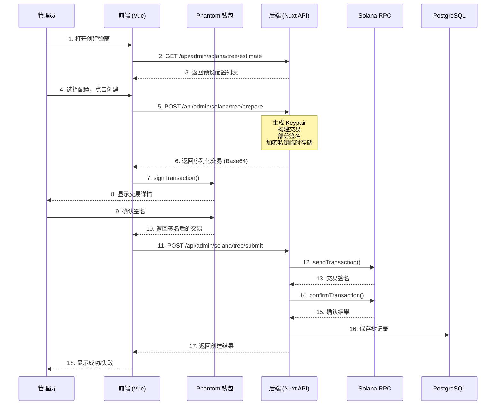

# Design Document: cNFT Merkle Tree 创建流程重构

## Overview

本设计重构 cNFT Merkle Tree 的创建流程，将复杂的链上交易构建逻辑从前端移至后端。核心变化是：

1. **后端负责**：生成树 Keypair、构建交易、部分签名、发送交易、保存数据
2. **前端负责**：选择配置、调用钱包签名、显示状态

这种架构确保私钥安全（永不暴露到前端），同时简化前端代码复杂度。

## Architecture



## Components and Interfaces

### 1. 后端 API 接口

#### 1.1 预估配置 API
```typescript
// GET /api/admin/solana/tree/estimate
// Query: { network: 'mainnet' | 'devnet' }

interface EstimateResponse {
  code: number
  data: {
    presets: TreePreset[]
    network: string
    isEstimate: boolean
  }
}

interface TreePreset {
  label: string           // '小型 (1K)'
  maxDepth: number        // 10
  maxBufferSize: number   // 8
  canopyDepth: number     // 0
  capacity: number        // 1024
  spaceBytes: number      // 账户空间
  rentLamports: number    // 租金 (lamports)
  rentSol: string         // 租金 (SOL)
}
```

#### 1.2 准备交易 API
```typescript
// POST /api/admin/solana/tree/prepare

interface PrepareRequest {
  name: string            // 树名称
  maxDepth: number
  maxBufferSize: number
  canopyDepth: number
  payerAddress: string    // 支付者钱包地址
  network: 'mainnet' | 'devnet'
}

interface PrepareResponse {
  code: number
  data: {
    transactionBase64: string  // 序列化的交易 (已部分签名)
    treeAddress: string        // 树地址 (公钥)
    sessionId: string          // 会话 ID (用于关联临时存储的私钥)
    rentLamports: number       // 租金
    expiresAt: number          // 会话过期时间戳
  }
}
```

#### 1.3 提交交易 API
```typescript
// POST /api/admin/solana/tree/submit

interface SubmitRequest {
  sessionId: string              // 会话 ID
  signedTransactionBase64: string // 用户签名后的交易
}

interface SubmitResponse {
  code: number
  data: {
    id: string              // 数据库记录 ID
    treeAddress: string
    txSignature: string
    status: number          // 0=创建中, 1=正常, -1=失败
  }
  message: string
}
```

### 2. 前端组件

#### 2.1 CreateTreeDialog.vue
```
位置: app/components/admin/mm/solana/CreateTreeDialog.vue

Props:
  - modelValue: boolean (v-model 控制显示)
  - network: 'mainnet' | 'devnet'

Emits:
  - update:modelValue: (value: boolean)
  - success: (tree: TreeRecord)

State:
  - step: 'config' | 'signing' | 'confirming' | 'done' | 'error'
  - presets: TreePreset[]
  - selectedPreset: number
  - treeName: string
  - error: string
```

### 3. 后端工具函数

#### 3.1 Solana 工具 (server/utils/solana.ts)
```typescript
// 已有函数
export function getConnection(network: SolanaNetwork): Connection
export function getRpcUrl(network: SolanaNetwork): string

// 新增函数
export function calculateTreeSpace(
  maxDepth: number,
  maxBufferSize: number,
  canopyDepth: number
): number

export async function buildCreateTreeTransaction(
  connection: Connection,
  payer: PublicKey,
  treeKeypair: Keypair,
  maxDepth: number,
  maxBufferSize: number,
  canopyDepth: number
): Promise<{ transaction: Transaction; rentLamports: number }>
```

#### 3.2 会话存储 (server/utils/treeSession.ts)
```typescript
// 临时存储树创建会话（内存 Map，带过期清理）
interface TreeSession {
  treeKeypair: Keypair
  encryptedKey: string
  name: string
  maxDepth: number
  maxBufferSize: number
  canopyDepth: number
  network: string
  payerAddress: string
  createdAt: number
  expiresAt: number
}

export function createSession(data: Omit<TreeSession, 'createdAt' | 'expiresAt'>): string
export function getSession(sessionId: string): TreeSession | null
export function deleteSession(sessionId: string): void
export function cleanExpiredSessions(): void
```

## Data Models

### MerkleTree 表 (已存在)
```prisma
model MerkleTree {
  id               BigInt   @id @default(autoincrement())
  name             String   @db.VarChar(128)
  treeAddress      String   @unique @db.VarChar(64)
  treeAuthority    String   @db.VarChar(64)
  encryptedKey     String   @db.Text          // AES-256-GCM 加密的私钥
  creatorAddress   String   @db.VarChar(64)
  maxDepth         Int      @db.SmallInt
  maxBufferSize    Int      @db.SmallInt
  canopyDepth      Int      @db.SmallInt
  network          String   @db.VarChar(20)
  totalMinted      Int      @default(0)
  maxCapacity      BigInt
  creationCost     BigInt                     // 租金 (lamports)
  txSignature      String?  @db.VarChar(128)
  priority         Int      @default(0)
  status           Int      @default(0)       // 0=创建中, 1=正常, 2=已满, -1=失败
  createdAt        DateTime @default(now())
  updatedAt        DateTime @default(now())
  isDeleted        Boolean  @default(false)
}
```

## Correctness Properties

*A property is a characteristic or behavior that should hold true across all valid executions of a system—essentially, a formal statement about what the system should do. Properties serve as the bridge between human-readable specifications and machine-verifiable correctness guarantees.*

### Property 1: 容量计算正确性
*For any* maxDepth 值，计算的 maxCapacity 应等于 2^maxDepth
**Validates: Requirements 6.3**

### Property 2: 私钥加密往返一致性
*For any* 有效的私钥字符串，加密后解密应得到原始值
**Validates: Requirements 6.6, 3.7**

### Property 3: API 返回不包含私钥
*For any* prepare API 的响应，返回数据中不应包含私钥或 secretKey 字段
**Validates: Requirements 3.2, 3.6**

### Property 4: 预设配置完整性
*For any* estimate API 的响应，应包含 4 个预设配置，每个配置包含 label、maxDepth、maxBufferSize、canopyDepth、capacity、rentSol 字段
**Validates: Requirements 1.1, 1.2**

### Property 5: 空间计算公式正确性
*For any* maxDepth、maxBufferSize、canopyDepth 组合，计算的空间应符合 SPL Account Compression 的公式
**Validates: Requirements 3.3**

### Property 6: 数据库记录完整性
*For any* 成功创建的树，数据库记录应包含所有必要字段：treeAddress、treeAuthority、encryptedKey、creatorAddress、maxDepth、maxBufferSize、canopyDepth、maxCapacity、txSignature
**Validates: Requirements 6.1, 6.2, 6.4**

### Property 7: 优先级递增
*For any* 新创建的树，其 priority 应大于同网络下所有现有树的 priority
**Validates: Requirements 6.5**

### Property 8: 网络 RPC 映射正确性
*For any* 网络类型（mainnet/devnet），应使用对应的 RPC 端点
**Validates: Requirements 11.3**

### Property 9: 容量警告阈值
*For any* 系统状态，当剩余容量小于 1000 或无可用树时，needMoreTrees 应为 true
**Validates: Requirements 9.3**

### Property 10: 网络筛选正确性
*For any* 树列表查询，返回的树应全部属于指定的网络类型
**Validates: Requirements 9.4**

## Error Handling

### 错误码定义
```typescript
enum ErrorCode {
  WALLET_NOT_CONNECTED = 'WALLET_NOT_CONNECTED',
  INVALID_PARAMS = 'INVALID_PARAMS',
  RPC_CONNECTION_FAILED = 'RPC_CONNECTION_FAILED',
  INSUFFICIENT_BALANCE = 'INSUFFICIENT_BALANCE',
  TRANSACTION_BUILD_FAILED = 'TRANSACTION_BUILD_FAILED',
  SIGNATURE_INVALID = 'SIGNATURE_INVALID',
  TRANSACTION_FAILED = 'TRANSACTION_FAILED',
  SESSION_EXPIRED = 'SESSION_EXPIRED',
  SESSION_NOT_FOUND = 'SESSION_NOT_FOUND',
}
```

### 错误处理策略
1. **RPC 连接失败**：返回友好提示，建议稍后重试
2. **余额不足**：返回所需金额，提示用户充值
3. **会话过期**：提示用户重新发起创建
4. **交易确认超时**：保存记录为"创建中"状态，支持后续验证

## Testing Strategy

### 单元测试
- 空间计算函数 `calculateTreeSpace`
- 加密解密函数 `encryptPrivateKey` / `decryptPrivateKey`
- 容量计算 `2^maxDepth`
- 会话管理函数

### 属性测试
- 使用 fast-check 进行属性测试
- 每个属性测试运行 100 次迭代
- 测试文件位置：`server/utils/__tests__/`

### 集成测试
- API 端点测试（使用 devnet）
- 数据库操作测试
- 完整创建流程测试（需要测试钱包）
