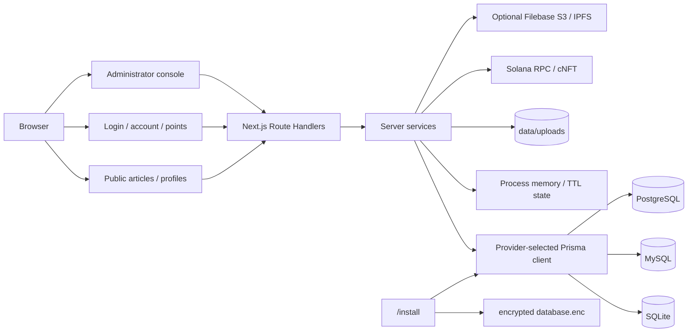

<div align="center">
  

# SlothVault

面向个人写作与公开分享的 Web2 文章系统：管理员发布、访客自由阅读、普通用户拥有个人主页与积分账户，Solana cNFT 仅作为可选的文章版权凭证。

</div>

SlothVault 基于 Next.js 16 App Router、React 19 和 Prisma 7。应用支持 SQLite、MySQL、PostgreSQL 三种主数据库，并通过网页安装器完成首次配置。普通账户默认使用用户名/邮箱和密码登录，也可以选择通过 Solana 钱包地址签名登录；钱包不参与阅读权限判断。

## 核心能力

- 公开文章：管理员创建项目、版本、分类、文章与 Markdown 内容，所有已发布内容无需钱包即可阅读。
- 用户体系：注册、登录、退出、资料编辑、密码设置/修改、钱包地址绑定与钱包签名登录。
- 个人主页：每个活跃用户都有 `/u/<username>` 分享地址；管理员主页展示其发布文章。
- 积分与卡密：积分余额、不可变流水、管理员增减积分、批量发卡、一次性卡密兑换。
- 版权凭证：管理员可为已发布文章制作 cNFT，记录文章、版权归属、链上资产与交易信息。
- 管理后台：文章目录、首页、文件、用户、积分、卡密、备份、系统配置与版权凭证管理。
- 多数据库安装：SQLite、MySQL 8.0+、PostgreSQL 14+ 使用一致的逻辑模型和独立迁移。
- 受控文件与备份：上传文件不进入 `public/`；数据库 JSON 和上传 ZIP 支持严格校验与恢复。

## 快速开始

### 本地开发

要求：Node.js `>=24.18.1`（当前 LTS）、npm `>=11.16.0`。SQLite 本地开发不需要 Docker。

```bash
npm ci
APP_DATA_PATH=./data UPLOAD_STORAGE_PATH=./data/uploads npm run dev
```

`npm run dev` 直接启动 Next.js。钱包挑战与接口限流使用当前 Node.js 进程中的短期内存状态，不需要额外服务。

打开 `http://localhost:3000/install`，选择 SQLite、MySQL 或 PostgreSQL，完成空库检查、迁移和首位管理员创建。

### Docker 部署

默认 Compose 只启动 SlothVault，主数据库在网页安装器中选择：

```bash
cp .env.docker.example .env.docker
docker compose --env-file .env.docker up -d --build
```

默认 SQLite 数据保存在 `./docker-data/database`，上传文件保存在 `./docker-data/uploads`。

可选 PostgreSQL 16：

```bash
docker compose --env-file .env.docker --profile postgres up -d --build
```

可选 MySQL 8.0：

```bash
docker compose --env-file .env.docker --profile mysql up -d --build
```

网页安装时使用以下容器主机名：

| Provider | Host | Port | 凭据来源 |
| --- | --- | --- | --- |
| SQLite | 无需填写 | 无需填写 | 应用管理本地文件 |
| PostgreSQL | `postgres` | `5432` | `.env.docker` 的 `POSTGRES_*` |
| MySQL | `mysql` | `3306` | `.env.docker` 的 `MYSQL_*` |

MySQL/PostgreSQL profile 只初始化数据库容器；数据库连接仍由 `/install` 输入并加密保存在应用配置目录中。

## 身份与权限

权限边界保持简单：

| 身份 | 能力 |
| --- | --- |
| 访客 | 阅读全部已发布文章、访问公开个人主页 |
| 普通用户 | 访客能力 + 账户资料、钱包绑定、积分查询、卡密兑换 |
| 管理员 | 普通用户能力 + 发布文章、管理内容/用户/积分/卡密、制作版权凭证 |

管理员发布文章时，`NoteInfo.authorId` 自动绑定当前管理员。旧版本文章在第二版迁移中绑定到首位管理员。`Project.requireAuth` 仅为旧数据兼容保留，读取服务和界面不再使用它。

普通密码登录与钱包登录最终都签发同一种 HttpOnly 数据库 Session。钱包流程只验证地址所有权：

1. 服务端在当前进程内存中写入五分钟一次性挑战。
2. 浏览器钱包签署固定消息，不发送交易，也不暴露私钥。
3. 服务端原子消费挑战并验证 Ed25519 签名。
4. 地址绑定已有账户，或创建一个普通钱包账户。

## 积分与卡密

- `auth_user.points_balance` 保存当前余额。
- `points_transaction` 保存每次变动、变动后余额、类型、引用和说明。
- 管理员可按批次生成最多 500 张卡密；明文只在发行响应中出现一次。
- 数据库只保存卡密 SHA-256 哈希和脱敏提示。
- 兑换在可序列化事务中完成：消费卡密、增加余额、写入流水必须同时成功。
- 进程内存对注册、登录、钱包挑战和卡密兑换执行短窗口限流；重启后计数自动清空，不作为余额或流水权威数据源。

## 文章版权凭证

cNFT 不再是阅读凭证。新建 cNFT 时必须选择已发布文章，服务端同时记录：

- `projectId`：文章所属公开集合；
- `noteInfoId`：具体文章；
- `copyrightOwnerId`：发起操作的管理员账户；
- `ownerAddress`：链上资产接收地址；
- `assetId`、交易签名、Metadata URI 与 Merkle Tree 信息。

Tree 创建、容量预留、prepare/sign/submit、签名持久化和链上事件对账仍沿用原有安全流程。链上写入会产生真实 SOL 费用，默认应先在 devnet 验证。

## 架构



应用只加载安装时选定的一套 Prisma Client。进程内存只承载短期挑战与限流；账户、文章、积分、卡密和版权记录均以 SQL 数据库为权威。该内存状态适用于单应用实例，不在多个实例之间共享。

## 数据库安装与升级

首次安装状态：

```text
UNCONFIGURED → CONFIGURING → SCHEMA_READY → INSTALLED
```

安装器只接受空数据库。安装完成后，服务启动阶段会执行当前 provider 已提交的 `prisma migrate deploy`，全部迁移成功后才提升 `system_installation.schema_revision`。当前 schema revision 为 `2`。

SQLite 仅支持单应用实例和本地磁盘，不支持 NFS/SMB 等网络共享文件系统。详细规则见 [数据库安装与迁移指南](docs/DATABASE_INSTALLATION.md)。

## 配置

| 变量 | 必需 | 默认值 / 说明 |
| --- | --- | --- |
| `APP_DATA_PATH` | 否 | 本地默认 `<cwd>/data`；Docker 为 `/app/data` |
| `UPLOAD_STORAGE_PATH` | 否 | 本地默认 `<cwd>/data/uploads`；Docker 为 `/app/data/uploads` |
| `ENCRYPTION_KEY` | 否 | 未设置时在配置目录生成持久化 `master.key` |
| `SOLANA_RPC_URL` | 否 | 主网 RPC fallback |
| `SOLANA_DEVNET_RPC_URL` | 否 | devnet RPC fallback |
| `NEXT_PUBLIC_SOLANA_RPC_URL` | 否 | 浏览器钱包与版权交易连接地址 |
| `FILEBASE_ACCESS_KEY` | 否 | 可选 Filebase S3 Access Key |
| `FILEBASE_SECRET_KEY` | 否 | 可选 Filebase S3 Secret Key |
| `FILEBASE_BUCKET` | 否 | 可选 Filebase bucket |
| `FILEBASE_ENDPOINT` | 否 | 默认 `https://s3.filebase.com` |

数据库连接不接受 `DATABASE_URL` 或旧 `DB_*` 环境变量绕过安装器。

## 备份与恢复

数据库 JSON 备份包含：

- 用户账户与密码哈希（不包含 Session）；
- 用户资料、角色、钱包绑定与积分余额；
- 积分流水、卡密批次、卡密哈希与兑换关系；
- 项目、版本、分类、文章、内容版本与文章作者；
- 文件记录、系统配置、首页、Merkle Tree 与文章版权 cNFT。

因此数据库备份属于敏感数据，必须按密钥材料管理。跨 provider 恢复会重新映射所有整数 ID；活跃 Session 不迁移。上传 ZIP 独立导出，并执行路径 containment、ZIP Slip、符号链接、特殊文件、加密 ZIP 和大小限制检查。

## 技术栈

| 层 | 实现 |
| --- | --- |
| Web | Next.js 16.2、React 19.2、TypeScript 5.9 |
| UI | Ant Design 6、Lucide React、黑白 CSS token system |
| 数据获取 | TanStack Query 5 |
| 主题 / 国际化 | next-themes、next-intl 4 |
| Markdown | `@uiw/react-md-editor`、react-markdown、remark/rehype |
| 主数据库 | SQLite、MySQL 8.0+ InnoDB、PostgreSQL 14+；Prisma 7 adapters |
| 短期状态 | Node.js 进程内存、TTL 清理与容量上限 |
| 认证 | Argon2id、HttpOnly 数据库 Session、可选 Ed25519 钱包签名 |
| 版权链 | Solana web3.js、SPL Account Compression、Wallet Adapter |
| 部署 | Next standalone、Docker、Docker Compose |

## 目录结构

```text
src/
├── app/                       # 页面、布局与 Route Handlers
├── components/                # 公共、账户和管理端 React 组件
├── lib/                       # 浏览器共享契约
├── server/
│   ├── auth/                  # Session、角色与密码
│   ├── database/              # 多 provider、安装与迁移
│   └── services/              # 用户、积分、内容、备份与版权业务
└── types/                     # 浏览器安全 DTO

prisma/providers/              # PostgreSQL / MySQL / SQLite schema 与迁移
messages/                      # 中英文消息
data/                          # 本地配置、SQLite 与上传数据（git ignored）
```

## 开发与验证

```bash
npm run prisma:validate
npm run prisma:generate
npm run typecheck
npm run lint
npm test
npm run build
```

默认测试会跳过需要真实 Filebase、SQL 服务或 Solana RPC/凭据的 opt-in 集成用例。不要把静态检查结果表述为真实链上写入或跨数据库恢复已经完成。

更多资料：

- [数据库安装与迁移指南](docs/DATABASE_INSTALLATION.md)

## 许可证

当前仓库未包含 `LICENSE` 文件。公开分发前需要明确许可证。
