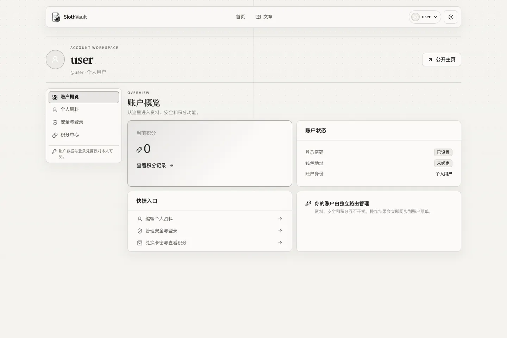
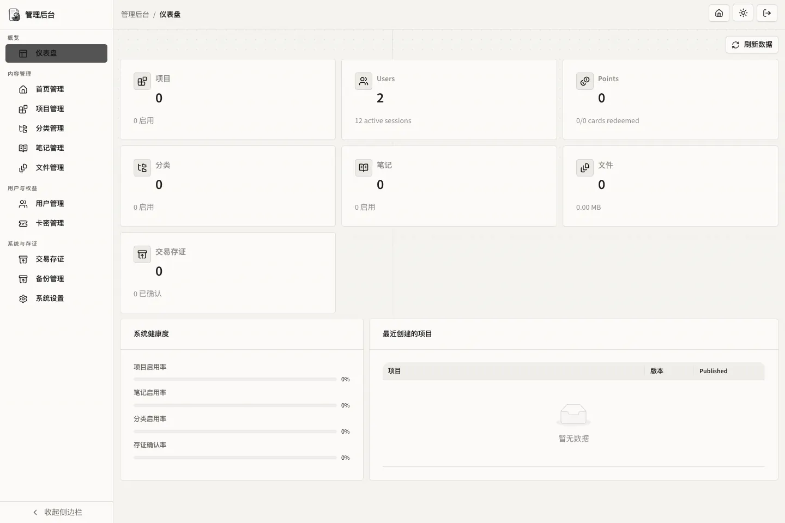
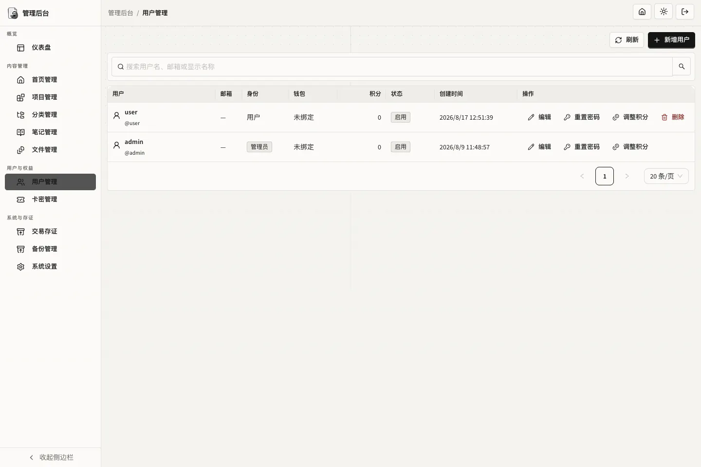
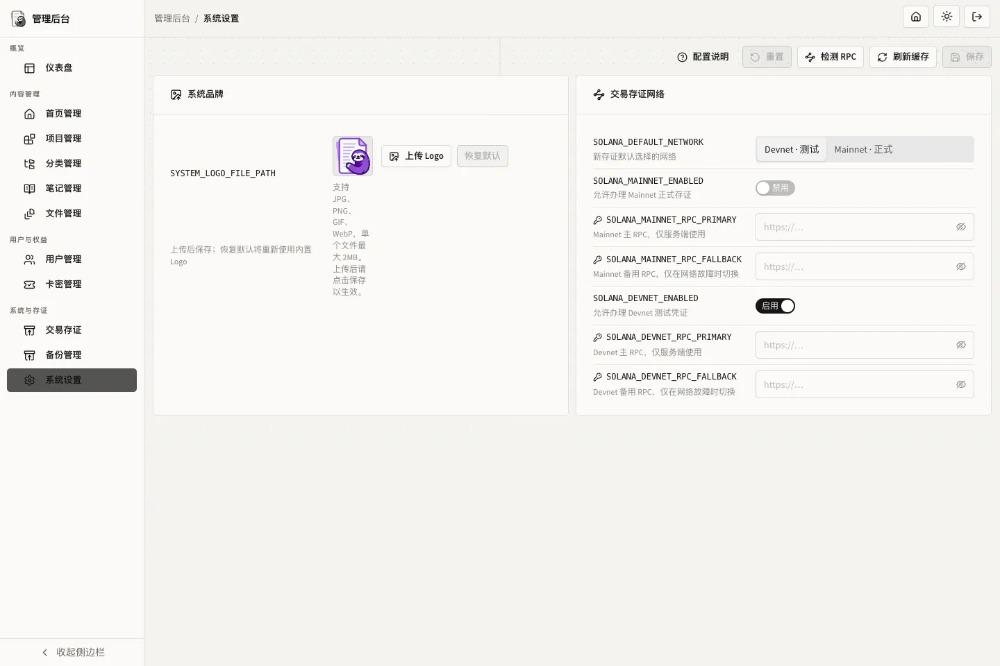
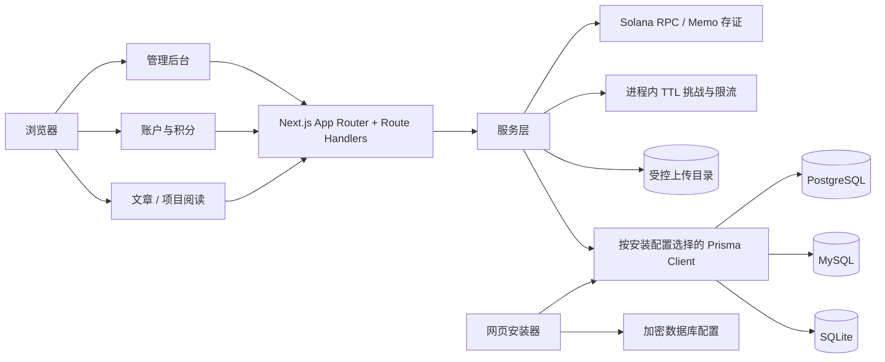

<div align="center">
  

# SlothVault

面向独立写作、项目发布与版本存证的自托管内容系统。

管理员分别管理站点文章与项目版本内容；访客可直接阅读；注册用户拥有资料、安全、合同与积分工作区。已发布项目版本可选择写入 Solana Memo 交易，形成可公开核验的版本凭证。

</div>

## 项目概述

SlothVault 基于 Next.js 16 App Router、React 19 和 Prisma 7，支持 SQLite、MySQL 与 PostgreSQL，并通过网页安装器完成首次配置。

## 界面预览

> 截图于 2026-08-17 的本地实例，均已压缩为 WebP。资源按日期归档在 [`docs/assets/screenshots/2026-08-17/`](./docs/assets/screenshots/2026-08-17/)；示例数据不代表生产环境默认内容。

<p align="center">
  
</p>

<table>
  <tr>
    <td width="50%"></td>
    <td width="50%"></td>
  </tr>
  <tr>
    <td align="center">账户概览：资料、安全与积分入口</td>
    <td align="center">管理后台：内容、用户与系统状态概览</td>
  </tr>
  <tr>
    <td width="50%"></td>
    <td width="50%"></td>
  </tr>
  <tr>
    <td align="center">用户管理：创建、编辑、密码重置与积分调整</td>
    <td align="center">系统设置：品牌与 Solana 网络配置</td>
  </tr>
</table>

## 核心功能

| 范围 | 已实现能力 |
| --- | --- |
| 内容发布 | 独立 Markdown 文章，以及项目、版本、分类、项目文档、首页内容与受控文件管理。 |
| 阅读体验 | 无需钱包即可阅读已发布文章和公开项目；文章详情、项目版本文档与存证凭证可直接分享。 |
| 用户系统 | 用户名/邮箱密码登录、可选 Solana 钱包签名登录、账户资料、密码、钱包绑定与积分工作区。 |
| 用户权益 | 不可变积分流水、管理员积分调整、批量生成卡密与一次性兑换。 |
| 管理后台 | 内容、文件、用户、卡密、备份、系统设置及版本交易存证的集中管理。 |
| 版本存证 | 为已发布版本生成 manifest 哈希；可在 Solana Mainnet 或 Devnet 写入 Memo，并提供公开凭证页。 |
| 数据库与部署 | 网页安装器支持 SQLite、MySQL 8.0+ 与 PostgreSQL 14+；提供 Docker Compose 部署。 |

## 安装与快速开始

### 本地开发

前置条件：Node.js `>=24.18.1`、npm `>=11.16.0`。使用 SQLite 本地开发无需 Docker。

```bash
npm ci
APP_DATA_PATH=./data UPLOAD_STORAGE_PATH=./data/uploads npm run dev
```

访问 [http://localhost:3000/install](http://localhost:3000/install)，在安装器中选择数据库、完成空库检查、初始化表结构并创建首位管理员。安装状态由系统维护，数据库连接不会通过 `DATABASE_URL` 或旧 `DB_*` 环境变量绕过安装器。

### Docker Compose

正式 Linux 部署使用 Release 附件中的纯标准库宿主机脚本 `install.py`。它不需要源码目录、Node.js 或额外 Python 包：交互选择 SQLite、MySQL 或 PostgreSQL 后，会在部署根目录生成私有的 `/data/slothvault/compose.yml`，创建所选模式的持久化目录，拉取发布镜像并启动服务。首次 schema 初始化由应用自动完成；随后访问 [http://localhost:3000/install](http://localhost:3000/install) 创建首位管理员。

前置条件：Linux 已安装 Docker Engine、Docker Compose v2 与 Python 3.8+。`install.py` 不会尝试根据发行版自动安装 Docker。若默认 `/data` 目录不可写，请使用 `sudo` 运行脚本，后续 Docker 命令也使用同一权限级别。

```bash
curl -fL https://github.com/holic512/SlothVault/releases/latest/download/install.py -o install.py
python3 install.py
```

脚本的默认路径如下；输入时可按需改为其他绝对路径。生成的 `compose.yml` 包含数据库凭据（若选择 MySQL/PostgreSQL），因此脚本会将其权限设为 `0600`；所有持久化目录为 `0700`。

| 模式 | 应用数据目录（映射至 `/app/data`） | 数据库数据目录 |
| --- | --- | --- |
| SQLite | `/data/slothvault/data` | `/data/slothvault/data/database/slothvault.db` |
| MySQL 8.0 | `/data/slothvault/data` | `/data/slothvault/mysql` |
| PostgreSQL 16 | `/data/slothvault/data` | `/data/slothvault/postgresql` |

MySQL 与 PostgreSQL Compose 配置会等待数据库健康检查成功，再启动应用。应用目录保存加密数据库配置、上传文件和仅 SQLite 使用的数据库文件；服务器数据库始终存放在独立目录，不能与应用数据目录交叠。Docker 本地模式固定使用 Compose 内部网络的非 TLS 连接。

未来更新不需要重新生成配置或迁移数据目录：再次运行脚本并选择“更新”，或执行：

```bash
docker compose -f /data/slothvault/compose.yml pull
docker compose -f /data/slothvault/compose.yml up -d
```

仓库仍保留三份 `docker-compose*.yml` 和示例环境文件，供从源码构建或本地开发使用；生产服务器推荐使用 Release 中的 `install.py`。远程 MySQL/PostgreSQL、TLS 或自定义 CA 的部署，继续使用网页安装器手工配置，详见[数据库安装与迁移指南](./docs/DATABASE_INSTALLATION.md)。

## 使用模型

| 身份 | 可执行操作 |
| --- | --- |
| 访客 | 阅读已发布的独立文章与公开项目，访问版本存证凭证。 |
| 普通用户 | 访客能力，以及资料维护、密码与钱包设置、积分查询和卡密兑换。 |
| 管理员 | 普通用户能力，以及内容发布、用户/积分/卡密/文件/备份管理和版本存证。 |

普通密码与钱包签名登录都会签发同一种 HttpOnly 数据库 Session。钱包流程仅验证地址所有权：浏览器签署一次性挑战消息，服务端验证 Ed25519 签名；不会发送钱包交易，也不会保存私钥。

## 版本交易存证

发布内容和区块链存证彼此独立：版本可先公开，后续再由管理员钱包进行存证。每条凭证绑定一个 `ProjectVersion.releaseHash`，使用 Solana 官方 Memo Program，不表示 NFT 所有权、版权归属或可转移资产。

- Mainnet 凭证用于正式存证，Devnet 用于测试；同一版本在每个网络最多保留一条最终凭证。
- 办理前会重新计算 manifest、展示网络与费用信息；提交后保留交易签名，并可继续对账最终状态。
- 公开凭证路由为 `/evidence/<transactionSignature>`；来源版本被隐藏后，正文、版本名和 manifest 不再公开。

## 架构



账户、文章、积分、卡密和存证索引均以 SQL 数据库为权威来源。短期内存仅用于登录/注册限流与钱包一次性挑战，不承担余额或持久化业务状态。

## 配置与数据安全

| 配置 | 用途 |
| --- | --- |
| `APP_DATA_PATH` | 应用配置和本地数据库目录；本地默认 `<cwd>/data`，容器默认 `/app/data`。 |
| `UPLOAD_STORAGE_PATH` | 受控上传目录；本地默认 `<cwd>/data/uploads`，容器默认 `/app/data/uploads`。 |
| `ENCRYPTION_KEY` | 配置加密主密钥；未提供时系统会在配置目录生成持久化密钥。 |
| `SOLANA_RPC_URL` | Mainnet 主 RPC 的环境回退值；建议在后台敏感设置中维护实际地址。 |
| `SOLANA_MAINNET_RPC_FALLBACK` | Mainnet 备用 RPC。 |
| `SOLANA_DEVNET_RPC_URL` | Devnet 主 RPC 的环境回退值。 |
| `SOLANA_DEVNET_RPC_FALLBACK` | Devnet 备用 RPC。 |
| `NEXT_PUBLIC_SOLANA_RPC_URL` | 浏览器 Wallet Adapter 使用的公共集群地址。 |

浏览器钱包通过 Solana Wallet Standard 自动发现，不需要为每个扩展单独引入 SDK。安装且启用 Solana 账户的兼容钱包（例如 OKX Wallet）会出现在钱包选择器中；当前签名、登录和存证协议均为 Solana，尚不包含 EVM/OKB Chain 地址或交易支持。

上传文件不进入 `public/`。数据库 JSON 与上传 ZIP 可独立导出、严格校验并恢复；备份包含账户、密码哈希、内容、积分、卡密哈希和存证索引，应按敏感数据管理。

## 项目结构

```text
src/
├── app/                       # 页面、布局与 Route Handlers
├── components/                # 公开、账户、管理端 React 组件
├── i18n/                      # 语言请求解析与本地化元数据
├── server/
│   ├── auth/                  # Session、角色与密码
│   ├── database/              # 多数据库、安装与迁移
│   └── services/              # 内容、用户、积分、备份与存证业务
└── types/                     # 浏览器安全 DTO

prisma/providers/              # SQLite / MySQL / PostgreSQL schema 与迁移
messages/                      # 中英文消息目录
docs/assets/screenshots/        # README 截图，按日期归档
data/                           # 本地配置、数据库与上传数据（已忽略）
```

## 开发与验证

```bash
npm run prisma:validate
npm run prisma:generate
npm run typecheck
npm run lint
npm run lint:styles
npm test
npm run build
```

默认测试不会替代真实 Solana 钱包写入或跨数据库恢复验证。涉及真实 SQL 服务、RPC 或钱包的集成验证，应在隔离环境中显式执行。

## 文档

- [数据库安装与迁移指南](./docs/DATABASE_INSTALLATION.md)
- [发布 manifest 规范](./docs/RELEASE_MANIFEST_V1.md)

## 许可证

仓库当前未包含 `LICENSE` 文件。对外分发前请先明确许可证与使用条款。
