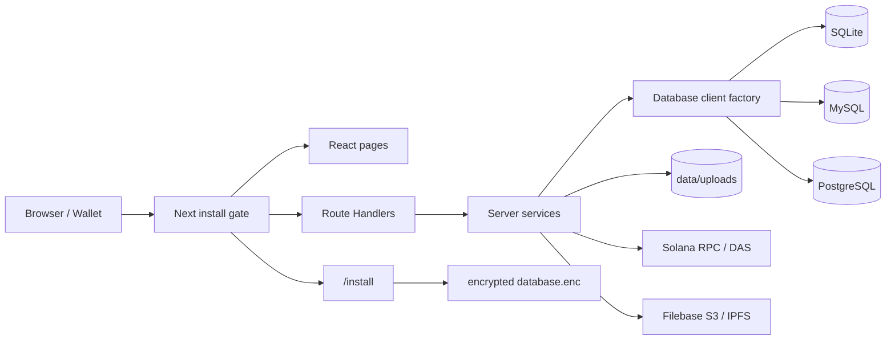

<div align="center">
  

# SlothVault

支持 SQLite、MySQL 与 PostgreSQL 首次安装的多项目 Markdown 文档系统。

[](https://nextjs.org/)
[](https://react.dev/)
[](docs/DATABASE_INSTALLATION.md)
[](https://solana.com/)

</div>

当前运行版本基于 Next.js 16 App Router 与 React 19，提供公开文档站、单管理员后台、版本化 Markdown 内容、受控文件存储、逻辑备份恢复，以及可选的 Solana cNFT 项目访问凭证。新部署不需要预先注入数据库连接串：应用先启动，再通过 `/install` 选择并初始化一种数据库。

## 快速开始

### 默认 Docker 部署（SQLite）

默认 Compose 只启动 SlothVault，不依赖外部数据库：

```bash
cp .env.docker.example .env.docker
docker compose --env-file .env.docker up -d --build
```

打开 `http://localhost:3000/install`，选择 SQLite，完成连接检查、表结构初始化和首个管理员创建。SQLite 文件固定保存在容器 `/app/data/database/slothvault.db`，对应主机默认目录 `./docker-data/database`。

SQLite 仅支持单应用实例和本地磁盘。不要把数据库目录挂载到 NFS、SMB 等网络共享文件系统，也不要横向扩展多个 SlothVault 容器。

### 可选 PostgreSQL 或 MySQL

Compose 提供两个独立 profile。先修改 `.env.docker` 中对应数据库密码，再启动其中一个：

PostgreSQL 16：

```bash
docker compose --env-file .env.docker --profile postgres up -d --build
```

MySQL 8.0：

```bash
docker compose --env-file .env.docker --profile mysql up -d --build
```

随后在 `/install` 中填写：

| Provider | 主机 | 端口 | 数据库、用户与密码 |
| --- | --- | --- | --- |
| PostgreSQL | `postgres` | `5432` | 对应 `.env.docker` 的 `POSTGRES_*` |
| MySQL | `mysql` | `3306` | 对应 `.env.docker` 的 `MYSQL_*`（不要使用 root） |

这两个 profile 只负责创建可选数据库容器，不会把凭据注入 SlothVault。应用容器也不会等待数据库或在启动时自动执行迁移；表结构只由网页安装流程在用户确认后初始化。

### 首次安装规则

安装状态依次为 `UNCONFIGURED → CONFIGURING → SCHEMA_READY → INSTALLED`：

1. 选择 SQLite、MySQL 或 PostgreSQL。
2. MySQL/PostgreSQL 填写主机、端口、已创建的数据库、用户名和密码；需要时启用 TLS 并粘贴 CA PEM。
3. 测试连接。目标数据库必须完全没有用户表；非空数据库会在执行任何 DDL 前被拒绝。
4. 初始化三方一致的扁平表结构。
5. 创建唯一的首个管理员，完成安装。

安装完成后 provider 固定，不能在线切换。配置损坏、主密钥不匹配或已安装数据库不可用时，系统进入维护状态，不会重新开放安装入口。详细操作与故障恢复见 [数据库安装与迁移指南](docs/DATABASE_INSTALLATION.md)。

### 持久化目录与主密钥

Docker 默认分别挂载以下目录：

| 主机目录 | 容器目录 | 内容 |
| --- | --- | --- |
| `./docker-data/config` | `/app/data/config` | `database.enc`、`installation.state`、自动生成的 `master.key`、安装锁 |
| `./docker-data/database` | `/app/data/database` | SQLite 数据库及其本地运行文件 |
| `./docker-data/uploads` | `/app/data/uploads` | 受控上传文件 |

数据库配置使用 AES-256-GCM 加密写入 `database.enc`。`ENCRYPTION_KEY` 可选：不设置时，应用在配置卷中生成并持久化 `master.key`。必须把配置目录与数据库、上传目录一起备份；更换或丢失主密钥后，数据库配置和已有 Solana Tree Authority 私钥都无法解密。

## 本地开发

要求 Node.js `>=22.12` 与 npm 11。无需在启动前配置 `DATABASE_URL` 或执行迁移：

```bash
npm ci
APP_DATA_PATH=./data UPLOAD_STORAGE_PATH=./data/uploads npm run dev
```

打开 `http://localhost:3000/install` 完成首次安装。MySQL/PostgreSQL 数据库需要提前创建并授权；SQLite 会使用 `./data/database/slothvault.db`。

生产检查与构建：

```bash
npm run prisma:validate
npm run typecheck
npm run lint
npm test
npm run build
```

`npm run prisma:generate` 和生产构建会生成 PostgreSQL、MySQL、SQLite 三套 Prisma Client。不要使用单一 `DATABASE_URL` 绕过安装器，也不要对安装目标执行 `prisma db push`。

## 功能

- 多项目文档：项目、版本、分类、笔记与多内容版本。
- Markdown：管理端编辑、自动保存、前台安全渲染与目录导航。
- 项目展示：首页 Markdown、两级项目菜单、版本切换和响应式阅读页面。
- 管理后台：项目、版本、分类、笔记、文件、首页、菜单与系统配置管理。
- 文件存储：文件位于非公开目录，通过受控 `/uploads/[...path]` 路由读取。
- 主题与语言：浅色/深色主题，中英文界面。
- 管理会话：HttpOnly Cookie、数据库会话、过期与撤销支持。
- 项目访问：短期 Ed25519 钱包签名证明，本地 cNFT 记录与可选 DAS 链上复核。
- Solana 管理：devnet/mainnet、Merkle Tree 估算/创建/验证、cNFT prepare/sign/submit。
- 备份恢复：数据库 JSON、上传 ZIP、严格导入校验、staging/rollback 与系统重置。

## 技术栈

| 层 | 实现 |
| --- | --- |
| Web | Next.js 16 App Router、React 19、TypeScript 5.9 |
| UI | Ant Design 6、Lucide React、CSS variables |
| 数据获取 | TanStack Query 5 |
| 客户端状态 | Zustand 5、next-themes |
| 国际化 | next-intl 4 |
| Markdown | `@uiw/react-md-editor`、react-markdown、remark/rehype |
| 数据库 | SQLite、MySQL 8.0+ InnoDB 或 PostgreSQL 14+；Prisma 7 driver adapters |
| 认证 | Argon2、数据库会话、Ed25519 钱包证明 |
| Solana | `@solana/web3.js` 1.98、SPL Account Compression 0.1.10、Wallet Adapter |
| 对象存储 | 本地受控上传目录；可选 Filebase S3/IPFS 元数据 |
| 部署 | Next standalone、Docker、Docker Compose |

## 架构



三种数据库使用相同的逻辑模型与小写领域前缀表名，例如 `auth_user`、`docs_note_info`、`collections_project`。每个运行实例只加载安装时选定的一套 Prisma Client；SQLite 额外启用单实例保护。

## 配置

数据库连接不接受环境变量，`DATABASE_URL` 和 `DB_*` 不能代替网页安装配置。Docker entrypoint 会忽略并移除这些变量，防止旧部署参数意外绕过安装状态。

| 变量 | 必需 | 说明 |
| --- | --- | --- |
| `APP_DATA_PATH` | 否 | 配置、SQLite 和锁文件根目录；Docker 固定为 `/app/data`，本地默认 `<cwd>/data` |
| `ENCRYPTION_KEY` | 否 | 稳定主密钥；未设置时在 `APP_DATA_PATH/config/master.key` 自动生成 |
| `UPLOAD_STORAGE_PATH` | 否 | 上传根目录；Docker 为 `/app/data/uploads`，本地默认 `<cwd>/data/uploads` |
| `SOLANA_RPC_URL` | 否 | 主网 RPC fallback |
| `SOLANA_DEVNET_RPC_URL` | 否 | devnet RPC fallback |
| `NEXT_PUBLIC_SOLANA_RPC_URL` | 否 | 浏览器 Wallet Adapter endpoint；未设置时使用公共 devnet |
| `FILEBASE_ACCESS_KEY` | 否 | Filebase S3 Access Key fallback |
| `FILEBASE_SECRET_KEY` | 否 | Filebase S3 Secret Key fallback |
| `FILEBASE_BUCKET` | 否 | Filebase bucket fallback |
| `FILEBASE_ENDPOINT` | 否 | 默认 `https://s3.filebase.com` |

Compose 中的 `POSTGRES_*` 与 `MYSQL_*` 仅初始化可选数据库服务；应用数据库连接仍必须在 `/install` 中输入。公网数据库建议启用 TLS；启用后必须验证服务端证书，可按部署方要求提供 CA PEM。

## 上传、备份与跨数据库迁移

上传文件不放在 `public/uploads`。数据库保存 `/uploads/...` URL，文件由 Next Route Handler 从 `UPLOAD_STORAGE_PATH` 读取，并执行路径 containment、隐藏路径拒绝、MIME 与下载头控制。

数据库逻辑备份不包含管理员和 Session，可恢复到任一已完成空库安装的 provider。切换 provider 或迁移旧 PostgreSQL 的流程是：

1. 在旧系统上导出数据库 JSON 和上传 ZIP；不要直接把旧数据库连接到新安装器。
2. 以目标 provider 部署新实例，并在严格空库上完成安装和新管理员创建。
3. 登录新实例，先恢复数据库 JSON，再恢复上传 ZIP，并执行页面抽查。
4. 验证完成前保留旧实例和备份；不要复用旧 Session。

若旧系统包含加密的 Solana Tree Authority，请为新实例安全复用原 `ENCRYPTION_KEY`，否则恢复后的密文无法解密。旧 PostgreSQL 若尚未应用 cNFT attempt 对账迁移，应先在旧版本代码/镜像中按其原有部署方式执行 `npx prisma migrate deploy`，再导出逻辑备份。

恢复流程还具有以下安全限制：

- 数据库 JSON 最大请求体 50 MiB、最多 100,000 条业务记录。
- 上传 ZIP 最大 250 MiB、最多 10,000 个条目。
- 拒绝 ZIP Slip、符号链接、特殊文件、加密 ZIP、ZIP64 与校验失败条目。
- 数据库导出使用 provider 对应的一致性事务生成关系闭包；恢复在单一事务中完成。
- overwrite 在 staging 完整校验后提交，失败时尝试恢复旧上传目录。
- 单个进程内读请求可并行，写请求串行；文件导出持有共享锁直到 ZIP 流关闭。
- 系统重置保留管理员和会话；跨数据库逻辑恢复不导入管理员和 Session。

## Solana 安全流程

管理员发起 Tree/cNFT 操作时：

1. 服务端构建交易，并用服务端持有的 Tree/Authority Keypair 部分签名。
2. 服务端返回交易和 5 分钟加密 HMAC prepare 令牌；令牌不包含明文私钥。
3. 浏览器钱包补充 fee payer 签名。
4. submit 校验 prepare 消息哈希、fee payer、程序 ID、树/owner、全部 signer 与密码学签名。
5. submit 在广播前持久化确定性的 payer 交易签名、令牌到期时间和 `lastValidBlockHeight`，断线后仍可对账。
6. prepare 通过 provider-neutral 原子更新预留树容量；最终 `leafIndex` 与 asset PDA 仅从 confirmed 交易的 SPL Account Compression change-log 事件取得。
7. 待确认 attempt 在列表刷新或下次 prepare 时按签名继续对账；失败只释放一次容量，只有明确失败或过期的 attempt 可删除。

链上创建和 mint 会产生真实 SOL 费用。请先在 devnet 验证 RPC、钱包、Tree 参数和 DAS 服务，再切换 mainnet；mainnet 写入必须单独授权。

## API 与迁移状态

首次安装新增 `/api/install/status`、`/api/install/test-connection`、`/api/install/initialize`、`/api/install/admin` 和 `/api/install/reset`。完整 Nuxt → Next.js 页面/API 对应关系与安全修正见：

- [Nuxt → Next.js 迁移矩阵](docs/NUXT_TO_NEXT_MIGRATION.md)
- [数据库安装与迁移指南](docs/DATABASE_INSTALLATION.md)

旧实现保存在 `legacy-nuxt/` 与根目录旧 `server/` 中，仅用于迁移核对，不参与 Next 构建。外部链上写入和真实 Filebase 验收完成且获得明确清理授权前，不应删除这些参考文件。

## 目录结构

```text
src/
├── app/                       # Next pages、layouts、Route Handlers
├── components/                # React UI 与业务组件
├── i18n/                      # next-intl 请求配置
├── lib/                       # API client、钱包消息等共享逻辑
├── server/                    # 安装、数据库、认证、HTTP 与业务服务
└── types/                     # 客户端/服务端共享类型

messages/                      # Next 中英文消息
prisma/providers/              # 三种 provider 的 schema 与独立迁移
generated/prisma-{provider}/   # 构建时生成的三套 Prisma Client
data/config/                   # 加密数据库配置与主密钥（被 git 忽略）
data/database/                 # SQLite 数据库（被 git 忽略）
data/uploads/                  # 当前运行上传目录（被 git 忽略）
legacy-nuxt/                   # 保留的 Nuxt 页面与组件
server/                        # 保留的 Nuxt API 与旧服务
```

## 开发检查

```bash
npm run prisma:validate  # 三套 Prisma schema
npm run typecheck        # TypeScript
npm run lint             # ESLint
npm test                 # Vitest
npm run build            # 三套 client + Next standalone
```

需要额外验证 S3 协议或 Solana devnet 只读链路时，可显式启用 opt-in 测试：

```bash
RUN_FILEBASE_S3_SMOKE=1 npx vitest run src/server/services/filebase.test.ts
RUN_SOLANA_DEVNET_SMOKE=1 npx vitest run src/server/services/solana-devnet.integration.test.ts
```

默认测试会跳过依赖外部凭据或 RPC 的用例。真实 Filebase 凭据、Solana devnet 写交易/DAS 与任何 mainnet 写入都必须在对应环境单独授权验收。

## 许可证

当前仓库未包含 `LICENSE` 文件。若计划公开分发，请在发布前明确许可证。
