# 摘要

随着数字内容规模持续增长，传统文档管理平台在内容组织、版本维护和访问控制方面面临新的挑战。单纯依赖中心化账号体系虽然能够满足基础的身份认证需求，但在跨平台授权、数字资产确权和访问凭证流转等场景下，往往存在可信边界单一、权限凭证不可携带以及资产状态难以核验等问题。针对上述问题，本文结合实际项目 SlothVault 的开发成果，设计并实现了一套基于 Solana 压缩 NFT 的文档管理系统。系统以 Nuxt 4 为全栈开发框架，以 PostgreSQL 和 Prisma 为数据管理基础，以 Markdown 文档编排为核心内容载体，在后台实现项目、版本、分类、笔记、文件和系统配置等常规内容管理能力，在前台实现项目首页和文档阅读页面的统一展示，并通过压缩 NFT、Merkle Tree 和钱包地址校验机制实现项目级阅读权限控制。

在系统设计上，本文将平台划分为内容管理、前台展示、访问鉴权、区块链资产管理、文件处理和数据备份恢复六个核心模块，构建了“链下文档内容管理 + 链上访问凭证验证”的混合架构。数据库部分采用多 schema 组织方式，将认证、内容集合、文档正文和公共配置解耦，既保证了业务边界清晰，也便于后续扩展。为降低区块链接入成本，系统选择 Solana 压缩 NFT 技术，将链上资产记录与本地项目信息进行关联，在保证访问校验可验证性的同时控制链上存储成本。实现层面，系统完成了管理员初始化与登录、项目与版本管理、分类与笔记管理、Markdown 编辑预览、项目访问验证、Merkle Tree 管理、cNFT 铸造与状态回写、数据库与文件备份恢复等关键功能。

本文在需求分析、系统设计、关键实现和测试方案层面对该系统进行了系统整理。结果表明，该方案能够在保留传统文档管理可维护性的同时，引入基于区块链资产的访问控制机制，为面向知识付费、技术文档托管和链上数字内容分发的系统提供一种可实现的工程路径。

关键词：文档管理系统；Solana；压缩 NFT；访问控制；Nuxt

Design and Implementation of a Document Management System Based on Solana Compressed NFTs

# Abstract

With the continuous growth of digital content, document platforms are required to provide stronger support for content organization, version maintenance, and access control. Conventional account-centered permission models can satisfy basic authentication, but they are less effective when the system needs portable access credentials, verifiable ownership, and low-cost asset distribution across different users and projects. To address these issues, this thesis designs and implements a document management system based on Solana compressed NFTs by using the actual project SlothVault as the engineering foundation.

The system adopts Nuxt 4 as the full-stack development framework, PostgreSQL with Prisma as the persistence layer, and Markdown as the core content carrier. It provides complete management capabilities for projects, project versions, categories, notes, note contents, files, and system configuration in the administrator backend. On the frontend, it supports project home pages, document reading pages, sidebar navigation, and catalog rendering. More importantly, the platform introduces project-level access verification based on compressed NFTs. By combining wallet address detection, local asset records, and on-chain verification logic, the system builds a hybrid architecture in which document content remains manageable off-chain while access credentials are verified through blockchain-related assets.

From the perspective of software engineering, the thesis analyzes the system from requirement analysis, architecture design, database design, implementation strategy, and testing planning. The platform is decomposed into six major modules: content management, frontend presentation, access control, blockchain asset management, file handling, and backup and recovery. The database schema is divided into authentication, collection management, document content, and public configuration domains, which improves maintainability and keeps business responsibilities explicit. For blockchain integration, the system selects Solana compressed NFT technology together with Merkle Tree based state compression. This choice reduces the storage cost of large-scale credential issuance while preserving verifiability and traceability of access rights.

The implementation completes administrator initialization and login, project and version management, category and note management, Markdown editing and preview, project access verification, Merkle Tree management, compressed NFT mint submission, transaction confirmation feedback, and database backup and recovery. The resulting solution demonstrates that a document platform can preserve the usability of conventional content management while extending its permission model with blockchain-based verifiable credentials. This provides a practical implementation path for technical documentation hosting, paid knowledge distribution, and content access systems that require both maintainability and stronger trust guarantees.

Keywords: document management system, Solana, compressed NFT, access control, Nuxt

# 第1章 绪论

## 1.1 课题背景

随着软件产品形态从单机文档逐步转向在线知识库、课程内容平台和项目化文档站点，文档系统已经不再只是静态文件仓库，而是逐渐演变成兼具内容生产、版本组织、访问控制和资源分发能力的综合平台。对于技术团队、课程组织者和内容服务提供者而言，文档平台不仅需要支持文本编辑和多级目录管理，还需要解决以下几个现实问题：其一，文档内容会随着项目版本持续演化，系统必须支持稳定的版本管理与目录组织；其二，文档内容通常具有一定访问门槛，需要对不同用户实施差异化授权；其三，随着数字资产技术的发展，平台希望把访问凭证设计为可校验、可流转且成本可控的数字权益载体。

传统文档管理系统多以账号、角色、数据库记录为核心完成权限控制，这种模式在企业内部使用场景中具备成熟优势，但在面向链上用户、数字权益分发和跨平台访问验证场景时存在一定局限。一方面，平台自身保存权限状态，外部难以独立验证；另一方面，访问凭证缺乏统一的资产化表示，不利于在不同系统之间形成可信迁移。区块链技术的发展为这类问题提供了新的工程路径。通过链上不可篡改记录、哈希摘要和可验证资产，系统能够在不暴露文档内容本身的前提下，对访问资格进行独立核验[1-4]。

从工程实现角度看，文档平台与区块链技术的结合并不意味着把所有内容直接迁移到链上。实际业务中，文档正文往往更新频繁、体量较大、结构复杂，若强行全部上链，不仅会推高成本，也会让内容维护过程变得僵化。因此，更合理的思路是在链下维护文档主体，在链上维护能够表达访问资格或资产归属的凭证信息，再由服务端完成两者之间的映射。这样既能够保留传统文档系统在编辑、版本管理和运维上的优势，也能够借助区块链资产增强访问控制的可信度。

在众多区块链平台中，Solana 以高吞吐、低成本和成熟开发工具链受到关注。进一步地，压缩 NFT 技术通过状态压缩和并发 Merkle Tree 降低了大规模 NFT 铸造的链上成本，使“以资产作为访问凭证”的设计更适合工程落地[5][6]。因此，将压缩 NFT 与传统文档平台结合，可以形成一种“链下存内容、链上存凭证、服务端做协同验证”的混合架构。SlothVault 项目正是在这一思路下构建：系统在后台完成项目、版本、分类、笔记和文件的常规管理，在前台提供项目首页和文档阅读能力，同时为需要保护的项目启用基于 cNFT 的访问校验。

本课题选取 SlothVault 作为研究对象，还有一个直接原因，即该项目并不是纸面上的概念原型，而是已经具备前后端页面、数据库模型和区块链接口实现的完整工程仓库。通过分析这类真实项目，可以把毕业论文的研究对象从抽象的“基于区块链的文档平台设想”收敛为“具备明确模块边界和数据实体的实现系统”，从而使需求分析、系统设计、实现说明和测试方案都拥有可回溯的代码证据支撑。

## 1.2 研究目的与意义

本课题的直接目标是设计并实现一套可运行的文档管理系统，使其既具备传统内容平台需要的管理能力，又能够通过区块链资产完成项目级阅读权限控制。围绕这一目标，系统需要在三个层面完成平衡：第一，内容管理层必须保证结构清晰、编辑高效和版本可维护；第二，权限控制层要让项目是否需要鉴权、用户是否具备访问资格、验证失败后如何提示等流程具有明确边界；第三，区块链接入层应尽量减少链上成本和对普通文档功能的侵入。

对于软件工程专业毕业设计而言，这种平衡具有较强的综合训练价值。内容管理部分要求开发者完成典型的信息系统建模与前后端协同；权限控制部分要求开发者处理角色边界、状态判断和异常分支；区块链接入部分则要求开发者理解外部系统调用、异步交易确认和本地数据回写逻辑。三者叠加后，课题能够较完整地体现需求分析、数据建模、模块设计、接口开发和系统测试等软件工程核心能力。

从工程实践角度看，本课题具有以下意义。首先，它验证了压缩 NFT 不仅可以服务于数字藏品等资产场景，也可以作为文档访问凭证接入内容系统，为知识付费、技术文档服务和内容会员体系提供新的实现方式。其次，课题将 Nuxt 全栈开发、Prisma 多 schema 建模、Markdown 编辑预览与 Solana 资产验证整合到同一项目中，对前后端协同设计和数据库边界划分具有较强的软件工程训练价值。最后，通过把 Merkle Tree、交易确认、资产状态回写等链上逻辑与本地项目元数据关联，系统为“内容系统 + 区块链鉴权”的组合提供了较完整的模块化实现样本。

从应用意义看，这一方案适用于多种需要内容门槛控制的场景。例如，面向企业知识库的内部文档可通过资产化凭证进行组织级分发；面向技术课程的学习资料可通过链上凭证控制阅读范围；面向付费报告或行业白皮书的平台也可以借助类似机制实现更加可核验的会员访问模式。虽然本课题并不直接验证所有商业模式，但它至少说明了“基于区块链资产的访问控制”在文档系统中具有可实现性，而不仅停留在概念讨论层面。

## 1.3 国内外研究现状

现有文档管理系统研究主要集中在内容组织、协同编辑、权限控制和分布式存储等方向。国外主流开源文档平台强调全栈渲染、静态生成或知识库协作能力，而数据库与 ORM 工具的发展则使文档系统在模型维护和接口演进方面更容易形成规范化工程实践[7-10]。对于需要复杂访问控制的数字内容系统，研究者开始尝试将区块链引入权限校验、可信共享和安全存储等场景，通过哈希结构、智能合约和加密机制增强凭证可信度[3][4][11]。

从内容平台的发展轨迹看，文档系统已经逐步摆脱了“文件上传下载器”的单一定位，开始承担知识组织、内容迭代、版本发布和资源运营等职责。这一变化使文档平台在系统设计上越来越接近内容管理系统与知识库系统的综合体，也意味着权限控制机制不能再停留在简单的页面可见性开关层面，而需要能够跟随项目、版本和用户身份动态变化。

围绕区块链访问控制与安全存储的研究，已有工作指出中心化权限视图在跨域数据流通场景中容易带来可信边界单一和状态维护复杂的问题，因此引入区块链账本、Merkle Tree 或零信任式身份校验有助于提升访问控制可验证性[2][12][13]。同时，IPFS 与区块链结合的安全存储方案表明，链上链下混合架构更适合处理容量较大的业务数据，即把完整内容保留在外部存储或业务数据库中，把可信摘要、标识或访问凭证放到链上[14]。这一思路与文档平台的业务特点高度一致，因为文档正文更新频繁且体量较大，直接全量上链既没有必要，也会显著推高成本。

不过，从已有研究到实际工程落地之间仍存在明显差距。许多工作更加关注理论协议、安全模型或单一技术点，而对于内容平台中常见的项目管理、版本迭代、正文编辑和后台维护等工程细节涉及较少。换言之，区块链访问控制机制本身可以被证明有效，但若缺少与真实业务数据结构、前端交互流程和后台维护能力的结合，就难以形成真正可用的系统。因此，本课题的价值之一就在于把这些抽象机制嵌入到可运行的文档平台中加以验证。

在 Solana 生态中，压缩 NFT 利用状态压缩和 Bubblegum 程序降低大规模资产铸造成本，使 NFT 从单纯收藏型数字资产拓展到可验证凭证领域[5][6]。官方文档表明，压缩 NFT 的核心不在于把完整元数据直接保存在链上，而在于把能够验证资产状态的哈希信息写入并发 Merkle Tree，再结合链下索引与证明机制完成读取和校验[5]。这为文档访问控制提供了现实基础：系统不需要把文档内容上链，只需把项目关联的访问凭证资产与本地项目记录绑定，即可在阅读请求到来时根据钱包地址校验用户是否具备访问资格。

这一点对本课题尤为关键。因为毕业设计系统的重点并不在于构造一个完整的链上内容分发协议，而在于利用现有区块链能力改造传统文档平台的访问控制方式。压缩 NFT 正好满足了这一需求：它既具备链上可验证性，又避免了普通 NFT 在批量发行场景下的高成本问题，因此能够成为项目级访问凭证的合适实现载体。

总体来看，国内外相关研究已经为本课题提供了三个启发。第一，文档平台本身应坚持内容管理与结构组织的工程主线，而不是为了区块链而牺牲可维护性。第二，区块链更适合作为访问凭证和可信校验基础设施，而非直接替代全文内容存储。第三，低成本、可批量发行的链上资产机制是内容系统接入区块链的关键前提。基于这些认识，本文选择在传统文档管理系统之上叠加压缩 NFT 访问控制，形成一套更符合实际工程边界的实现方案。

### 1.3.1 现有研究存在的不足

尽管相关研究已经提出了不少有价值的技术路线，但仍存在三个方面的不足。其一，许多研究偏重理论模型，缺乏与真实内容平台相匹配的数据结构设计和页面交互设计。其二，部分方案强调链上可信，却忽视了系统维护成本和编辑效率，导致工程落地难度偏高。其三，部分工作虽然提到了链上链下协同，但没有进一步说明资产状态如何与业务对象形成稳定映射。上述不足正是本文在系统设计和实现过程中需要重点回应的问题。

### 1.3.2 本文研究与相关工作的区别

与只讨论区块链安全模型或只实现普通知识库平台的研究相比，本文的区别主要体现在三个方面。第一，本文以真实工程仓库作为分析对象，而不是从空白需求出发构造抽象系统，这使论文中的章节能够更紧密地围绕实际代码证据展开。第二，本文关注的是“文档内容管理系统如何接入压缩 NFT 访问凭证”这一工程问题，而不是单纯讨论 NFT 技术本身，因此重点放在项目、版本、正文、访问控制和资产映射的协同上。第三，本文在分析过程中始终保留“保守取证”的边界，避免将 README 中的宣传性描述直接写成系统已完成能力，这一点有助于提高论文论证的可信度。

从成果形态看，本文最终交付的不是一套分散的技术片段，而是一条完整的软件工程链路：需求分析对应系统角色和业务目标，系统设计对应模块与数据库模型，系统实现对应页面、接口和工具函数，系统测试则对应功能闭环和异常路径。这种结构比单纯罗列技术栈更能够体现毕业设计论文的研究深度和工程价值。

## 1.4 研究内容

围绕论文题目，本文的研究内容主要包括以下几个方面：

1. 分析面向项目化文档服务的业务需求，明确管理员、普通访客和持证访问用户的角色边界，归纳文档管理、版本组织、内容发布、访问验证和备份恢复等核心需求。
2. 设计系统总体架构，建立前台展示、后台管理、数据库持久化、区块链资产管理和文件存储之间的协同关系。
3. 结合 Prisma 多 schema 数据模型，完成用户、会话、项目、项目版本、分类、笔记、笔记内容、文件、Merkle Tree 和压缩 NFT 等实体设计。
4. 基于 Nuxt 4 和 Vue 3 实现后台管理页面与前台阅读页面，基于服务端 API 实现项目管理、文档管理、访问验证和 cNFT 铸造处理逻辑。
5. 设计系统测试方案，对登录鉴权、项目管理、文档阅读、区块链资产管理和备份恢复等模块建立测试用例与验证路径。

在研究方法上，本文主要采用仓库代码取证、系统结构分析、数据模型抽取、业务流程归纳和测试方案设计相结合的方式展开。对于源码能够直接证明的功能，正文按“已实现”表述；对于需要在运行环境中继续验证的内容，则保守地写成“测试方案”或“待补证据”，从而保证全文叙述与项目现状保持一致。

## 1.5 论文结构安排

本文共分为五个主体章节。第1章阐述课题背景、研究意义、国内外研究现状、研究内容与论文结构安排。第2章从业务目标和用户角色出发，对系统功能需求、非功能需求和关键业务流程进行分析。第3章对系统总体架构、模块设计、接口协作和数据库设计进行详细说明。第4章结合关键页面、接口流程和工具模块，对系统实现进行展开。第5章给出测试环境、测试方法、测试用例与结果分析。最后在结论部分总结本文工作，并说明当前系统仍然存在的不足和后续改进方向。

这种章节安排遵循了“先需求、后设计、再实现、最后测试”的软件工程论文基本逻辑，同时也适配了本项目的真实证据形态。由于仓库中已经存在较完整的数据模型、接口与页面实现，因此论文主体的重点不再是抽象技术介绍，而是围绕系统如何从需求走向落地进行结构化说明。

# 第2章 系统需求分析

## 2.1 系统建设目标

SlothVault 的建设目标不是单纯搭建一个 Markdown 编辑器，而是面向项目化文档发布场景，构建一个同时具备内容组织、版本管理、访问控制和资产凭证接入能力的综合平台。根据仓库现有功能，系统目标可以归纳为四点：第一，为管理员提供项目、版本、分类、笔记和正文内容的统一管理入口，使复杂文档可以按项目和版本分层组织；第二，为前台用户提供结构清晰的项目首页与文档阅读界面，使浏览过程能够维持目录导航与正文展示的一致性；第三，为需要保护的项目提供可配置的访问鉴权机制，使内容阅读不再完全依赖中心化账号体系；第四，为系统运维提供备份恢复和基础配置管理能力，降低系统运行风险。考虑到压缩 NFT 访问凭证、链上链下混合存储以及细粒度访问控制已经成为相关研究中的常见技术路径，本系统在需求层面对这些能力进行了重点约束[5][6][11][12]。

系统用户角色可分为管理员、普通访客和持证访问用户三类。管理员负责系统初始化、项目配置、文档录入、链上资产管理和备份恢复，是后台全部功能的操作者。普通访客可以浏览无需鉴权的项目内容，但无法访问启用保护的项目。持证访问用户在连接钱包并通过项目访问验证后，可以查看对应项目的首页和文档内容。系统角色边界如图2-1所示。

图2-1 系统用户角色与业务用例图

从业务视角看，三类角色之间并不存在横向协作关系，而是围绕同一套项目资源形成不同访问深度。管理员能够直接操作后台全部模块，负责内容的创建、修改与发布。普通访客只能读取公开项目的数据结果，不参与内容管理过程。持证访问用户虽然没有后台维护能力，但相较普通访客多出一层“凭证驱动的阅读权限”，这也是系统引入区块链访问控制的核心动因。角色边界的清晰划分有助于后续模块设计和测试用例编排。

### 2.1.1 业务场景约束

SlothVault 面向的并不是传统意义上的综合门户站点，而是围绕文档内容组织和分发构建的专用平台。系统中的项目既可以理解为一组课程资料，也可以理解为一个技术产品文档集合，还可以理解为一套需要基于数字资产进行权限划分的内容包。这意味着系统必须支持跨项目隔离、跨版本并行维护和细粒度阅读控制，而不能把所有内容平铺在单一目录中。根据源码中 `Project`、`ProjectVersion`、`Category`、`NoteInfo` 和 `NoteContent` 的层级关系可以看出，平台一开始就以“多项目、多版本、多笔记”的知识组织场景为目标；而围绕知识组织、权限边界与可信凭证协同的需求划分，也与现有区块链安全存储研究的结论保持一致[11][12][13]。

## 2.2 功能需求分析

### 2.2.1 管理后台功能需求

管理后台承担系统数据维护和业务配置职责，其功能需求主要包括以下方面。

1. 认证管理需求。系统首次运行时需要引导创建管理员账号，后续管理员通过登录接口建立会话。系统应支持会话校验与未授权拦截，保证后台接口只对合法管理员开放。
2. 项目管理需求。管理员需要创建和维护项目基础信息，包括项目名称、封面、排序权重、启用状态以及是否启用访问鉴权。项目是系统内容组织的顶层容器，也是区块链访问凭证的绑定对象。
3. 项目版本管理需求。单一项目存在多版本迭代时，系统应支持版本编号、版本说明、排序与状态管理，以便区分不同阶段的文档集合。
4. 分类与笔记管理需求。每个项目版本下需要建立分类，再在分类下挂接笔记条目，满足多级文档目录组织需求。
5. 笔记内容管理需求。单篇笔记需要支持多个正文版本，并允许指定主显示版本，保证历史修订和当前展示可以并存。
6. 文件与首页管理需求。系统需要管理上传文件、项目首页内容和系统首页内容，以支撑富媒体文档和前台展示页面。
7. 区块链资产管理需求。系统需要支持 Merkle Tree 的创建与维护、压缩 NFT 的准备和提交、配置读取和删除等操作，用于支撑项目访问凭证发行。
8. 备份恢复需求。管理员需要导出数据库业务数据与文件资源，并在必要时执行导入恢复或系统重置。

管理员发布文档内容的核心活动如图2-2所示。

图2-2 文档内容发布活动图

这一流程体现出后台内容维护的几个关键约束。首先，正文内容不是直接挂在项目根节点下，而是必须经过“项目 -> 版本 -> 分类 -> 笔记条目 -> 正文版本”的层次化组织。其次，正文版本支持主版本标识，这意味着前台读取逻辑并不会把每一次历史修改都直接暴露给终端用户，而是优先返回被选中的主显示版本。最后，当项目启用访问控制时，内容发布和凭证配置不再是完全独立的两件事，管理员需要同步考虑受保护项目的访问边界。

### 2.2.2 前台展示与访问需求

前台面向终端阅读用户，功能需求主要体现在以下几个方面。

1. 项目展示需求。系统应提供项目列表、项目首页和项目文档阅读入口，使用户能够根据项目和版本浏览内容。
2. 目录导航需求。系统应在文档阅读页展示分类导航与文档目录，支持用户快速切换不同笔记。
3. Markdown 预览需求。系统应把后台维护的 Markdown 内容以稳定方式渲染到前台页面，保持较好的阅读体验。
4. 访问鉴权需求。对于启用访问保护的项目，系统应在读取首页、侧边栏和正文内容前完成权限验证。未通过验证时，系统应阻止继续请求受保护内容。
5. 钱包关联需求。系统需要识别用户钱包地址，并把该地址作为访问验证的关键输入，用于判断是否持有对应项目的有效 cNFT 资产。

项目访问验证活动如图2-3所示。该流程体现出本系统与传统账号权限平台的差异：访问资格不由单一用户表决定，而是由项目配置、钱包地址和资产校验结果共同决定。这种把访问判断建立在可验证凭证而非单一中心化账号之上的需求设定，与区块链访问控制和零信任认证研究中的问题抽象是相通的[12][13]。

图2-3 项目访问验证活动图

从流程上看，系统首先依据项目本身是否开启 `requireAuth` 决定是否进入鉴权分支，而不是无条件要求所有用户完成钱包验证。这样设计的好处在于平台既能托管完全公开的项目，也能托管具有内容门槛的项目，不会因为引入区块链机制而损害普通文档平台的通用性。当项目需要保护时，服务端会优先检查本地 `CompressedNft` 记录，再根据需要发起链上验证，这种“本地优先、链上兜底”的思路既能降低访问延迟，也能避免过度依赖远程 RPC。

### 2.2.3 系统功能结构

结合页面路由和后端接口，系统整体功能可以归纳为六个一级模块：认证与会话管理、项目与文档管理、前台内容展示、访问鉴权、区块链资产管理和备份恢复。其功能结构如图2-4所示。

图2-4 系统功能结构图

六个一级模块之间并不是彼此独立的静态集合，而是围绕项目主数据形成协同。认证与会话管理保证后台接口的操作者合法；项目与文档管理决定前台能够呈现哪些内容；访问鉴权决定终端用户是否能读取这些内容；区块链资产管理提供访问凭证的数据来源；备份恢复模块则负责在系统演进过程中保证数据可迁移和可恢复。这样的功能结构能够将平台的通用内容管理能力与其特有的区块链访问控制能力统一到一套业务骨架中。

### 2.2.4 角色业务用例说明

为了使需求分析能够进一步落到后续模块设计和实现章节中，需要把角色需求转化为更具体的业务用例。管理员的核心用例不是单一的“维护数据”，而是围绕项目生命周期完成一系列连续动作，包括创建项目、组织版本、录入正文、配置访问控制和执行备份恢复；前台用户的核心用例则围绕浏览、验证和阅读展开。主要业务用例如表2-3所示。

表2-3 角色业务用例说明表

| 角色 | 业务用例 | 用例说明 |
| --- | --- | --- |
| 管理员 | 项目创建与维护 | 新建项目并维护名称、状态、排序和鉴权开关 |
| 管理员 | 版本结构维护 | 为项目建立版本并绑定描述信息 |
| 管理员 | 分类与笔记维护 | 建立分类树和文档条目 |
| 管理员 | 正文版本维护 | 编辑 Markdown 正文并设置主显示版本 |
| 管理员 | 资产管理 | 维护 Merkle Tree 与 cNFT 记录 |
| 管理员 | 备份恢复 | 导出或恢复业务数据与文件资源 |
| 普通访客 | 浏览公开项目 | 查看公开项目首页与文档内容 |
| 持证访问用户 | 受保护项目访问 | 连接钱包并通过鉴权后读取受保护正文 |

从表2-3 可以看出，后台用例以内容维护为主线，前台用例以内容消费为主线，而两条主线的交点在于项目对象本身。项目既是后台维护的主容器，也是前台访问控制的判断对象，因此它在后续数据库设计和接口设计中都必须保持中心地位。

## 2.3 非功能需求分析

### 2.3.1 安全性需求

系统的安全性不仅体现为常规后台登录保护，还体现在项目内容访问边界和链上资产操作安全上。后台应基于会话限制未授权接口访问；前台应在读取受保护项目内容前执行访问验证；链上操作应对参数合法性、会话有效性、签名完整性和交易异常进行处理。此外，由于系统保存了加密后的树权限私钥等敏感信息，部署时需要稳定的密钥环境变量和数据库隔离策略。

具体而言，后台接口中的项目、文件、备份和 Solana 管理逻辑都依赖统一的会话校验结果，未通过认证的请求不应继续进入业务层。前台鉴权场景则更加复杂，因为用户并不一定存在传统后台账号，而是通过钱包地址与链上资产建立身份关联。因此，系统在安全设计上同时存在“管理员会话安全”和“终端访问凭证安全”两条主线，二者分别服务于后台维护和前台阅读两个不同场景。

### 2.3.2 可维护性需求

系统采用 Nuxt 全栈结构和 Prisma ORM，对前后端模块、数据库模型和接口层进行了较明显的职责划分。前端页面按后台与前台场景拆分，后端接口按功能域组织，数据库采用多 schema 分区，有利于后续维护。系统还提供配置刷新、文件管理和备份恢复能力，进一步增强了可运维性。

代码结构的清晰性还体现在页面与接口的命名方式上。后台 API 基本以 `admin/mm` 和 `admin/solana` 两个前缀划分，前台访问接口则以 `project` 作为主域名，避免了混杂式路由组织。数据库层通过 Prisma 模型统一约束字段名称、外键关系和数据类型，使前端页面、服务端接口和持久化模型之间形成稳定的一一对应关系，这对于毕业设计后期的功能维护和问题定位十分关键。

### 2.3.3 可扩展性需求

项目、项目版本、分类和笔记的分层组织方式决定了平台能够持续扩展文档规模。访问鉴权开关设计允许系统对不同项目采用不同权限策略，不会强制所有项目全部接入链上验证。Merkle Tree 管理与 cNFT 记录独立建模，也为未来支持更多链上网络、更多资产类型或更复杂分发策略预留了空间。

从扩展路径上看，系统未来既可以在内容维度上继续增加新的项目类型、主题样式和导航层级，也可以在资产维度上支持不同网络环境、更多凭证生命周期管理策略以及更细粒度的授权组合。例如，当前模型已经为树优先级、容量和网络类型保留了字段，这说明项目后续有能力从单树策略逐步演进到多树冗余或多网络部署。

### 2.3.4 易用性需求

系统需要兼顾后台维护效率和前台阅读体验。后台应提供表格化管理、分页、筛选、弹窗编辑和版本切换等能力；前台应保持统一的文档阅读布局、目录导航和正文显示方式。Markdown 编辑与预览协同能够降低内容录入成本，提高知识库维护效率。角色权限需求如表2-1所示，非功能需求汇总如表2-2所示。

除了常见的人机交互需求外，系统还需要关注两类工程性易用性要求。第一，管理员在维护长篇文档时需要尽可能减少跳转成本，因此版本面板、分类筛选和正文编辑应形成连续工作流。第二，终端用户在阅读项目文档时需要快速判断自己当前所处的项目、版本和笔记位置，因此项目首页、侧边栏和目录组件需要在信息层级上保持一致。

表2-1 角色权限需求表

| 角色 | 主要权限 | 受限内容 |
| --- | --- | --- |
| 管理员 | 登录后台、维护项目和文档、管理链上资产、执行备份恢复 | 无 |
| 普通访客 | 浏览公开项目首页和文档 | 无法访问受保护项目 |
| 持证访问用户 | 浏览已通过校验的受保护项目内容 | 无后台管理权限 |

表2-2 非功能需求分析表

| 类别 | 需求说明 |
| --- | --- |
| 安全性 | 后台会话校验、受保护项目访问验证、链上交易参数校验 |
| 可维护性 | 前后端分层、Prisma 模型统一维护、多 schema 解耦 |
| 可扩展性 | 支持多项目、多版本、多分类、多笔记与可选鉴权 |
| 易用性 | Markdown 编辑预览、前台目录导航、后台表格化管理 |

为了保证需求分析与后续设计章节之间能够建立清晰映射，还需要对需求和功能模块之间的对应关系进行追踪。需求追踪关系如表2-4所示。

表2-4 需求与功能模块追踪表

| 需求类别 | 具体需求 | 对应模块 |
| --- | --- | --- |
| 认证需求 | 管理员初始化、登录、会话校验 | 认证与会话管理模块 |
| 内容需求 | 项目、版本、分类、笔记、正文维护 | 项目与文档管理模块 |
| 展示需求 | 项目首页、文档阅读页、目录导航 | 前台展示模块 |
| 鉴权需求 | 项目访问验证、钱包地址识别、权限分支控制 | 访问鉴权模块 |
| 资产需求 | Tree 管理、cNFT 准备与提交、状态回写 | 区块链资产管理模块 |
| 运维需求 | 数据导出、文件导出、导入恢复 | 备份恢复模块 |

表2-4 的意义在于说明系统设计并不是凭空划分模块，而是由具体需求驱动形成。当某一需求在后文中没有对应模块时，说明系统设计存在缺口；反之，如果出现无法回溯到需求的模块，也说明设计可能偏离实际业务范围。通过这种追踪关系，可以保证论文从需求到设计的逻辑链条更加完整。

## 2.4 业务流程分析

### 2.4.1 管理员初始化与登录流程

管理员初始化流程是后台的入口。首次访问系统时，管理员需要完成账号初始化，后续通过登录接口提交身份信息并建立会话。会话建立后，后台接口通过读取会话状态决定是否继续处理业务请求。该流程如图2-5所示。

图2-5 管理员初始化与登录流程图

初始化与登录流程虽然看起来简单，但它承担着后台全部管理能力的安全入口职责。系统在初始化阶段只允许创建首个管理员账号，后续所有后台请求均以会话为凭证继续执行。这种设计避免了后台接口被匿名调用，也保证了项目维护、资产管理和备份恢复等高风险操作拥有统一的身份判断前提。

### 2.4.2 数据备份与恢复流程

系统提供数据库业务数据和文件资源的导出与导入能力。数据库导出覆盖项目、版本、分类、笔记、正文、配置、Merkle Tree 与压缩 NFT 等业务数据，但不直接导出认证 schema。备份恢复流程如图2-6所示。

图2-6 数据备份恢复流程图

该流程的关键点在于区分“业务数据完整性”和“认证数据隔离”两个目标。对于毕业设计项目而言，项目内容、配置项和链上资产映射关系是系统最重要的业务成果，因此它们需要优先被备份和恢复；认证数据则涉及独立安全边界，是否导出应更加谨慎。源码中导出逻辑明确排除了 `auth` schema，也说明系统在备份策略上并没有简单地追求“一次导出全部数据”，而是采用了更符合实际运维边界的选择性方案。

### 2.4.3 业务规则约束

除显式功能流程外，系统还受到若干隐含业务规则约束，这些约束同样应在需求阶段加以明确。第一，项目是全部业务对象的根节点，版本、分类、笔记和正文都必须依附于某一项目存在。第二，正文展示依赖版本结构和主显示标记，不能在没有明确归属关系的情况下直接输出单篇内容。第三，受保护项目的访问资格必须建立在钱包地址与资产状态的共同验证之上，不能由前端页面单方面决定。第四，备份恢复需要把内容数据和资产映射视为同一业务整体，否则系统恢复后可能失去访问控制能力。

这些业务规则虽然不像页面按钮那样直观，但它们实际决定了系统是否能够长期稳定运行。若忽视这些规则，系统即便页面功能看似齐全，也可能在版本迭代、权限切换或数据迁移时出现结构断裂。因此，在毕业设计论文中明确写出这些约束，有助于说明系统并非简单拼装功能，而是围绕一组稳定业务规则进行实现。

### 2.4.4 需求分析结果归纳

综合前述功能需求、非功能需求和业务流程分析，可以将系统需求归纳为以下三类结果。其一，平台必须具备成熟的文档管理主线，包括项目、版本、分类、笔记和正文维护能力；其二，平台必须允许不同项目采用不同访问策略，从而兼顾公开阅读和受保护阅读两种场景；其三，平台必须具备较基本的运维能力，确保业务数据和资产映射关系可以被导出和恢复。只有在这三类需求同时成立的前提下，后续系统设计才具有完整意义。

## 2.5 本章小结

本章围绕系统建设目标、用户角色、功能需求、非功能需求和关键业务流程对 SlothVault 进行了分析。需求分析表明，该系统既包含传统文档平台所需的项目、版本、分类和正文管理能力，又包含基于钱包地址和压缩 NFT 的项目访问控制逻辑，因此后续系统设计必须同时处理内容组织效率和权限校验可信度两个核心问题。

进一步来看，第2章的分析结果还给后续设计章节提出了三个明确约束。第一，系统必须坚持以项目为核心组织全部业务对象，不能因为引入链上凭证而打散原有内容结构。第二，系统必须允许公开访问与受保护访问并行存在，从而兼顾普通文档站点的通用性与基于凭证的内容门槛控制。第三，系统必须在功能完整之外补充可维护性和可恢复性设计，否则即便前台页面能够正常展示，也难以支撑长期运行。正是这些需求层面的结论，决定了后续系统设计不只是功能罗列，而需要围绕模块边界、数据模型和访问流程进行一体化展开。

# 第3章 系统设计

## 3.1 系统总体架构设计

为了兼顾内容管理效率和区块链访问控制的可验证性，系统采用“前台展示层、后台管理层、服务接口层、数据存储层、链上资产层”五层协同架构。浏览器侧既承担后台管理界面的交互，也承担前台项目首页和文档阅读页的渲染；服务端基于 Nuxt Server Routes 暴露后台管理、前台访问和 Solana 相关接口；数据库层使用 PostgreSQL 存储业务数据；区块链层负责 Merkle Tree 和压缩 NFT 的资产状态；对象存储层处理上传文件和资产元数据资源。系统总体架构如图3-1所示[7-10]。

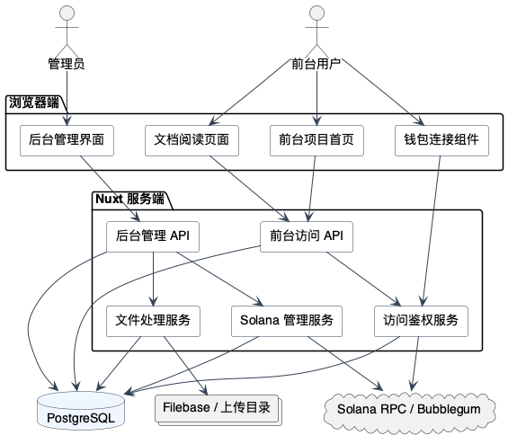

图3-1 系统总体架构图

该架构的关键特点在于把文档正文、分类结构和项目元数据继续保留在链下数据库中，把访问凭证抽象为链上资产并与项目记录建立映射关系。这样既避免了全文内容直接上链带来的高成本，也让访问校验具备更强的独立验证能力。这种“链下存主体内容、链上存验证凭据”的总体思路，与压缩 NFT 的官方设计说明以及区块链安全存储研究中的混合存储路径是一致的[5][6][12]。

从分层职责看，浏览器端只负责交互呈现和用户输入采集，服务端负责统一编排接口、业务验证和数据库访问，链上交互被限制在专门的 Solana 资产管理服务中，没有把区块链调用散落到普通文档接口里。这样的职责划分降低了功能耦合度，使系统在关闭区块链访问控制时仍然能够以普通文档平台的形态稳定运行。当项目开启访问保护时，再由访问鉴权模块与资产管理模块协同完成额外校验。

系统部署结构如图3-2所示。前端用户通过浏览器访问 Nuxt 服务，Nuxt 同时承担 SSR/CSR 混合渲染与 API 处理；业务数据存储在 PostgreSQL 中；链上资产信息通过 Solana 网络及其相关 RPC 能力完成读写；图片和其他上传文件则保存在文件目录或对象存储服务中。

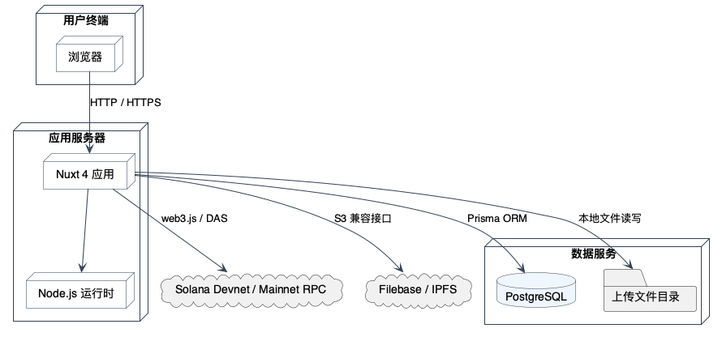

图3-2 系统部署结构图

在这一部署结构中，PostgreSQL 承担全部业务主数据的存储职责，适合处理项目、版本、正文和配置等更新频繁的数据；文件目录或对象存储处理图片与附件资源，更适合面向大对象进行读写；Solana 网络则只承担访问凭证相关资产状态的可信记录。三种存储/执行位置的分工，使系统能够在成本、可维护性与可验证性之间取得相对合理的平衡。从工程依据上看，这种分工也与 Nuxt 全栈组织、Prisma 模型维护以及链上链下协同存储的常见实践相吻合[1][2][5][12]。

## 3.2 功能模块设计

### 3.2.1 认证与会话管理模块

认证与会话管理模块主要服务于后台管理场景。系统通过管理员初始化页面创建首个管理员账号，在登录后生成会话记录。数据库中 `User` 实体保存用户名、密码和邮箱等基础信息，`Session` 实体保存令牌哈希、过期时间、撤销时间、登录 IP 和用户代理等会话属性。该模块的职责是保证只有合法管理员才能进入后台接口，同时为后续项目管理、Solana 管理和备份恢复提供统一鉴权入口。

这一模块的设计重点不是复杂的多角色后台体系，而是保持后台入口的稳定性和可验证性。系统把会话状态独立为表结构，而不是简单把登录状态保存在内存中，这为后续的会话失效、过期处理和异常审计提供了基础。对于毕业设计场景而言，这种设计说明项目已经具备了相对规范的后台安全边界，而不仅仅是示例式页面跳转。相关设计虽然服务于本地后台管理，但其“显式会话、统一校验、请求前拦截”的实现思路，与现代全栈框架和 ORM 驱动应用的一般工程方法一致[1][2][4][7]。

### 3.2.2 项目与文档管理模块

项目与文档管理模块是平台的核心业务模块。系统以 `Project` 作为顶层内容单元，每个项目可以继续挂接多个 `ProjectVersion`，每个版本下包含多个 `Category`，分类下再组织多个 `NoteInfo`，而每个笔记条目可关联多个 `NoteContent` 版本。该设计使系统能够同时支持多项目并行维护和单项目多版本长期演化，适合技术文档、课程材料和知识库类场景。

在这一结构下，项目相当于业务主题的承载者，版本相当于某一阶段的内容快照，分类相当于阅读入口层级，笔记条目相当于最终正文的逻辑容器，而正文版本则对应具体文本内容的历史演化。分层的好处在于管理员既可以从宏观层面对项目结构进行维护，也可以从微观层面对单篇笔记的正文版本进行迭代，不需要在扁平化目录中处理所有变更。

### 3.2.3 前台展示模块

前台展示模块包含项目列表、项目首页、版本文档导航与正文阅读。项目首页用于呈现项目介绍或导航性内容，文档阅读页通过左侧分类导航和右侧目录组件增强阅读效率。正文以 Markdown 形式存储，在前端统一渲染，保持内容生产与展示的一致性。

项目首页与文档阅读页采用不同职责定位。项目首页偏向于项目级说明、主题介绍和导航聚合，更适合作为用户进入某一文档集合的起点；文档阅读页则偏向于单篇正文的连续阅读，强调侧边栏导航和正文目录联动。源码中这两类页面分别绑定不同接口，也说明系统在展示层面并没有把所有内容塞入同一渲染模板，而是根据阅读场景进行了拆分。

### 3.2.4 访问鉴权模块

访问鉴权模块是本文系统与普通文档平台的主要差异点。系统为 `Project` 设置 `requireAuth` 标记，当项目启用访问保护后，前台在读取项目首页、分类侧边栏和正文内容前，需要根据钱包地址执行访问验证。服务端通过 `verifyProjectAccess` 逻辑判断当前项目是否开放、钱包地址是否有效以及用户是否持有关联项目的有效资产。项目访问验证时序如图3-3所示。

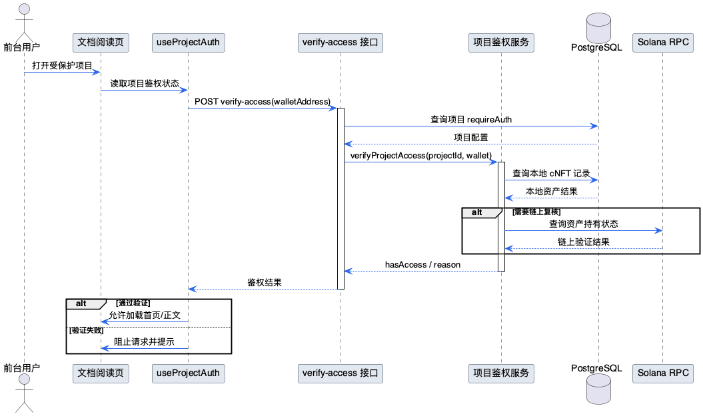

图3-3 项目访问验证时序图

### 3.2.5 区块链资产管理模块

区块链资产管理模块用于管理 Merkle Tree 和压缩 NFT。`MerkleTree` 实体记录链上树地址、树权限地址、加密后的树权限私钥、网络类型、容量、成本和状态等信息；`CompressedNft` 实体记录资产 ID、所属项目、叶子索引、所有者地址、元数据 CID、交易签名和状态。后台通过一组专用接口完成树的创建、成本估算、cNFT 铸造准备与交易提交流程。

这一模块的设计说明平台并不是简单调用第三方钱包组件完成前端签名后即结束，而是同时维护本地业务上下文和链上状态回写。尤其是 `CompressedNft` 与 `Project` 之间的映射关系，使系统能够把链上资产直接解释为“某一项目的访问凭证”，从而把原本通用的数字资产抽象转化为具体的内容访问控制能力。这一设计既符合压缩 NFT 的状态压缩和低成本凭证分发逻辑，也与区块链访问控制研究中“以可验证资产或链上记录承载访问资格”的思路保持一致[5][6][13]。

### 3.2.6 文件与备份恢复模块

文件管理模块负责保存上传文件的原始文件名、服务器文件名、相对路径、大小和业务类型。备份恢复模块则负责数据库业务数据的导出和导入。由于系统把文件资源和结构化业务数据分开管理，备份时能够分别处理数据层和文件层内容，降低整体恢复复杂度。

将文件元数据独立为 `FileManagement` 实体还有一个直接价值，即后台可以根据业务类型区分头像、正文附件和其他资源，不需要从文件路径或命名规则中反推业务用途。对于内容系统而言，这种显式建模方式比简单的本地目录堆积更适合长期维护和数据迁移。

## 3.3 数据库设计

### 3.3.1 数据库总体设计

系统使用 PostgreSQL 作为关系数据库，并在 Prisma 中按 `auth`、`collections`、`docs` 和 `public` 四个 schema 划分业务边界。认证相关数据集中在 `auth`；项目、版本、分类和首页等集合数据集中在 `collections`；文档标题与正文版本位于 `docs`；文件、系统配置、系统首页和区块链资产数据位于 `public`。这种划分方式有利于保持模型层次清晰，也方便后续权限控制和数据维护。

系统核心实体关系如图3-4所示。项目与项目版本是一对多关系，项目版本与分类是一对多关系，分类与笔记信息是一对多关系，笔记信息与笔记内容是一对多关系。区块链资产方面，Merkle Tree 与压缩 NFT 也是一对多关系，而每条压缩 NFT 记录通过 `projectId` 关联具体项目，形成“资产凭证绑定项目”的鉴权模型。

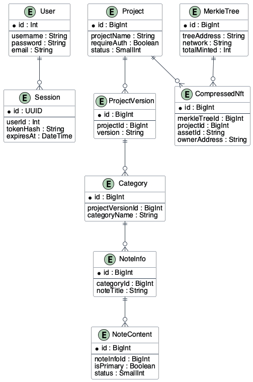

图3-4 系统核心实体关系图

### 3.3.2 认证实体设计

用户实体，用来存储管理员账号信息，用户实体结构图如图3-5所示。

图3-5 用户实体结构图

`User` 实体字段数量不多，但足以支撑后台认证所需的核心信息。其中 `username` 和 `password` 用于登录识别，`email` 作为补充联系方式字段，`createdAt` 与 `updatedAt` 则便于记录账号生命周期。由于当前系统面向单管理员或少量管理员场景，该实体并未承担复杂的组织架构与权限矩阵职责，这也与项目规模相匹配。

表3-4 用户实体关键字段说明表

| 字段名 | 数据类型 | 说明 |
| --- | --- | --- |
| `id` | Int | 用户主键，自增生成 |
| `username` | String | 后台登录账号名，要求唯一 |
| `password` | String | 管理员密码的持久化字段 |
| `email` | String | 可选联系邮箱 |
| `createdAt` | DateTime | 账号创建时间 |
| `updatedAt` | DateTime | 账号最后更新时间 |

会话实体，用来存储后台登录会话信息，会话实体结构图如图3-6所示。

图3-6 会话实体结构图

`Session` 实体通过 `tokenHash`、`expiresAt` 与 `revokedAt` 等字段，把后台会话从简单的内存状态提升为可审计、可过期、可撤销的数据对象。对于需要长期运行的后台系统而言，这一设计比一次性 cookie 校验更稳健，也便于在异常登录或主动退出场景中执行清理。

表3-5 会话实体关键字段说明表

| 字段名 | 数据类型 | 说明 |
| --- | --- | --- |
| `id` | UUID | 会话主键 |
| `userId` | Int | 关联管理员账号 |
| `tokenHash` | String | 会话令牌哈希值 |
| `expiresAt` | DateTime | 会话失效时间 |
| `revokedAt` | DateTime | 会话主动撤销时间 |
| `ip` | String | 登录来源地址 |
| `userAgent` | String | 客户端代理信息 |

### 3.3.3 文档集合实体设计

项目实体，用来存储文档项目的基础元数据，项目实体结构图如图3-7所示。

图3-7 项目实体结构图

`Project` 是整个平台的主实体。它既定义了一个文档集合的业务名称，也决定该集合是否启用访问保护。字段中的 `weight` 和 `status` 对应后台排序与启停控制，`avatar` 对应前台视觉展示，而 `requireAuth` 则把普通内容平台的项目对象与访问控制机制连接起来。

表3-6 项目实体关键字段说明表

| 字段名 | 数据类型 | 说明 |
| --- | --- | --- |
| `id` | BigInt | 项目主键 |
| `projectName` | String | 项目名称，前后台统一展示 |
| `avatar` | String | 项目封面图路径 |
| `weight` | Int | 列表排序权重 |
| `status` | SmallInt | 启用或停用状态 |
| `requireAuth` | Boolean | 是否启用项目访问鉴权 |
| `isDeleted` | Boolean | 软删除标记 |

项目版本实体，用来存储项目不同版本下的文档集合信息，项目版本实体结构图如图3-8所示。

图3-8 项目版本实体结构图

通过在 `ProjectVersion` 中显式记录版本号与描述，系统能够把同一项目的不同阶段文档隔离开来，避免旧版本内容被新版本覆盖。这对于技术文档类场景十分重要，因为接口说明、部署说明和用户指南往往会随着软件版本迭代发生结构性变化。

表3-7 项目版本实体关键字段说明表

| 字段名 | 数据类型 | 说明 |
| --- | --- | --- |
| `id` | BigInt | 版本主键 |
| `projectId` | BigInt | 所属项目 ID |
| `version` | String | 版本号或版本名称 |
| `description` | Text | 版本说明 |
| `weight` | Int | 排序权重 |
| `status` | SmallInt | 版本状态 |
| `isDeleted` | Boolean | 软删除标记 |

分类实体，用来存储项目版本下的文档分类信息，分类实体结构图如图3-9所示。

图3-9 分类实体结构图

`Category` 为前台侧边栏导航和后台分层筛选提供了直接支撑。分类并不承担正文内容存储职责，而是作为逻辑容器把同类笔记组织在一起，这种设计既有助于前台阅读时的扫描，也便于后台在大量笔记中快速定位内容。

表3-8 分类实体关键字段说明表

| 字段名 | 数据类型 | 说明 |
| --- | --- | --- |
| `id` | BigInt | 分类主键 |
| `projectVersionId` | BigInt | 所属项目版本 ID |
| `categoryName` | String | 分类名称 |
| `weight` | Int | 排序权重 |
| `status` | SmallInt | 分类状态 |
| `isDeleted` | Boolean | 软删除标记 |

笔记信息实体，用来存储文档标题、排序和状态信息，笔记信息实体结构图如图3-10所示。

图3-10 笔记信息实体结构图

`NoteInfo` 与 `NoteContent` 的拆分是该系统较为典型的设计点。前者保存“这篇文档是什么”，后者保存“这篇文档当前写了什么”。这种分层既能支持多版本正文，也能使前台路由长期绑定稳定的笔记条目，而不需要因为正文版本变化频繁调整访问地址。

表3-9 笔记信息实体关键字段说明表

| 字段名 | 数据类型 | 说明 |
| --- | --- | --- |
| `id` | BigInt | 笔记主键 |
| `categoryId` | BigInt | 所属分类 ID |
| `noteTitle` | String | 笔记标题 |
| `weight` | Int | 排序权重 |
| `status` | SmallInt | 笔记状态 |
| `isDeleted` | Boolean | 软删除标记 |

笔记内容实体，用来存储文档正文版本内容，笔记内容实体结构图如图3-11所示。

图3-11 笔记内容实体结构图

`NoteContent` 中的 `versionNote` 和 `isPrimary` 字段提供了正文版本管理所需的最小完备信息：管理员可以为一次更新留下修改说明，也可以指定哪一版内容作为默认展示版本。这样设计后，即便用户不直接看到所有历史版本，后台仍然保留了足够的内容演化轨迹。

表3-10 笔记内容实体关键字段说明表

| 字段名 | 数据类型 | 说明 |
| --- | --- | --- |
| `id` | BigInt | 正文版本主键 |
| `noteInfoId` | BigInt | 所属笔记 ID |
| `content` | Text | Markdown 正文内容 |
| `versionNote` | String | 本次版本说明 |
| `isPrimary` | Boolean | 是否为主显示版本 |
| `status` | SmallInt | 正文状态 |
| `isDeleted` | Boolean | 软删除标记 |

项目表关键字段设计如表3-1所示，文档内容表关键字段设计如表3-2所示。

表3-1 项目表关键字段设计表

| 字段名 | 含义 | 设计说明 |
| --- | --- | --- |
| `projectName` | 项目名称 | 作为前台展示与后台检索的主标识 |
| `avatar` | 项目封面 | 支持项目视觉展示 |
| `weight` | 排序权重 | 控制后台与前台排序 |
| `status` | 启用状态 | 区分上线与停用状态 |
| `requireAuth` | 是否需要鉴权 | 决定项目是否走 cNFT 访问控制 |

表3-2 文档内容表关键字段设计表

| 字段名 | 含义 | 设计说明 |
| --- | --- | --- |
| `noteInfoId` | 笔记条目 ID | 关联上层文档条目 |
| `content` | Markdown 正文 | 存储实际文档内容 |
| `versionNote` | 版本备注 | 说明该内容版本的修改意图 |
| `isPrimary` | 是否主版本 | 决定前台默认显示版本 |
| `status` | 内容状态 | 支撑启用与停用控制 |

### 3.3.4 公共配置与文件实体设计

文件管理实体，用来存储上传文件的元数据，文件管理实体结构图如图3-12所示。

图3-12 文件管理实体结构图

`FileManagement` 以元数据方式管理上传资源，其关键在于既保留原始文件名，也保留服务器文件名和相对路径。这样既能为前台提供友好的文件展示名称，也能保证服务端实际存储路径不受用户上传命名干扰。

表3-11 文件管理实体关键字段说明表

| 字段名 | 数据类型 | 说明 |
| --- | --- | --- |
| `id` | BigInt | 文件主键 |
| `originalName` | String | 用户上传时的原始文件名 |
| `fileName` | String | 服务端保存文件名 |
| `filePath` | String | 文件相对路径 |
| `fileSize` | BigInt | 文件大小 |
| `businessType` | String | 文件所属业务类型 |
| `status` | SmallInt | 文件状态 |

系统配置实体，用来存储系统级键值配置，系统配置实体结构图如图3-13所示。

图3-13 系统配置实体结构图

`SystemConfig` 使用键值形式组织系统级参数，适合管理网络地址、功能开关和其他运行配置。相较把全部配置写死在代码中，这种实体化设计便于管理员后期在后台界面或维护工具中进行统一更新。

表3-12 系统配置实体关键字段说明表

| 字段名 | 数据类型 | 说明 |
| --- | --- | --- |
| `id` | BigInt | 配置主键 |
| `configKey` | String | 配置项名称 |
| `configValue` | String | 配置项值 |
| `description` | String | 配置说明 |
| `createdAt` | DateTime | 创建时间 |
| `updatedAt` | DateTime | 更新时间 |

系统首页实体，用来存储系统首页 Markdown 内容，系统首页实体结构图如图3-14所示。

图3-14 系统首页实体结构图

`SystemHomepage` 与项目首页类似，都是把可编辑的 Markdown 内容作为数据落库，而不是把首页内容固化在前端模板中。这使系统具备了轻量内容运营能力，管理员可以在不改动代码的情况下更新系统入口页。

表3-13 系统首页实体关键字段说明表

| 字段名 | 数据类型 | 说明 |
| --- | --- | --- |
| `id` | BigInt | 系统首页主键 |
| `content` | Text | Markdown 正文内容 |
| `status` | SmallInt | 首页启用状态 |
| `createdAt` | DateTime | 创建时间 |
| `updatedAt` | DateTime | 更新时间 |
| `isDeleted` | Boolean | 软删除标记 |

### 3.3.5 区块链资产实体设计

Merkle Tree 实体，用来存储系统级压缩 NFT 树信息，Merkle Tree 实体结构图如图3-15所示。

图3-15 Merkle Tree 实体结构图

`MerkleTree` 实体是区块链访问控制设计中的基础设施实体。它既保存链上地址和权限信息，也记录容量、成本、优先级和网络类型等运行属性。这些字段使系统能够在应用层面对树的可用性进行判断，而不是把所有链上状态都视为不可解释的外部黑盒。

表3-14 Merkle Tree 实体关键字段说明表

| 字段名 | 数据类型 | 说明 |
| --- | --- | --- |
| `id` | BigInt | 树记录主键 |
| `treeAddress` | String | 链上树地址 |
| `treeAuthority` | String | 树权限地址 |
| `encryptedKey` | Text | 加密后的树权限私钥 |
| `network` | String | 所属链网络 |
| `maxDepth` | SmallInt | 树深度 |
| `maxBufferSize` | SmallInt | 最大缓冲区大小 |
| `totalMinted` | Int | 当前已铸造数量 |
| `maxCapacity` | BigInt | 最大容量 |
| `status` | SmallInt | 树状态 |

压缩 NFT 实体，用来存储项目访问凭证资产信息，压缩 NFT 实体结构图如图3-16所示。

图3-16 压缩 NFT 实体结构图

`CompressedNft` 实体是链上凭证和本地项目之间的连接点。通过 `projectId`、`assetId`、`ownerAddress` 和 `status` 等字段，服务端可以把“用户是否持有某资产”翻译为“用户是否能访问某项目”。这正是系统访问鉴权逻辑成立的关键。

表3-15 压缩 NFT 实体关键字段说明表

| 字段名 | 数据类型 | 说明 |
| --- | --- | --- |
| `id` | BigInt | 资产记录主键 |
| `merkleTreeId` | BigInt | 所属树 ID |
| `projectId` | BigInt | 绑定项目 ID |
| `assetId` | String | 链上资产唯一标识 |
| `leafIndex` | Int | 叶子索引 |
| `ownerAddress` | String | 当前持有者地址 |
| `mintTxSignature` | String | 铸造交易签名 |
| `metadataUri` | String | 元数据 URI |
| `originalImageId` | BigInt | 原始图片文件 ID |
| `status` | SmallInt | 资产状态 |

区块链资产表关键字段设计如表3-3所示。

表3-3 区块链资产表关键字段设计表

| 字段名 | 含义 | 设计说明 |
| --- | --- | --- |
| `projectId` | 关联项目 ID | 决定资产对应哪一个受保护项目 |
| `assetId` | 链上资产标识 | 用于唯一定位压缩 NFT |
| `leafIndex` | 叶子索引 | 用于资产 ID 计算与链上证明 |
| `ownerAddress` | 当前持有者地址 | 参与项目访问校验 |
| `status` | 资产状态 | 区分铸造中、正常和失败状态 |

## 3.4 接口与模块协同设计

系统接口按后台管理、前台访问和 Solana 管理三个方向组织。后台项目管理接口负责项目及其附属资源的增删改查；前台访问接口负责项目首页、侧边栏和正文获取；Solana 管理接口负责树和压缩 NFT 的准备、提交和状态维护。接口层统一通过服务端读取数据库并返回结构化结果，前端页面只处理展示和交互，不直接访问数据库或区块链。

在模块协同方面，后台维护的项目是否鉴权配置会直接影响前台访问行为；区块链资产模块写入的项目绑定关系会影响 `verify-access` 接口返回结果；备份模块则需要覆盖项目、文档、配置和链上资产等多类数据对象。这种协同关系要求数据库结构、接口组织和页面交互保持稳定的名称体系和数据流边界。

### 3.4.1 后台管理接口设计

后台管理接口集中在 `admin/mm` 域下，其组织方式与后台页面结构基本一致。项目、版本、分类、笔记、正文、文件和首页等资源都拥有各自的接口集合，并统一依赖后台会话状态。这样的接口划分方式降低了页面与业务层的耦合，也便于在测试章节中针对不同资源对象进行分组验证。

表3-16 后台管理核心接口设计表

| 接口路径 | 方法 | 主要作用 |
| --- | --- | --- |
| `/api/admin/mm/project` | GET | 分页查询项目列表 |
| `/api/admin/mm/project` | POST | 创建项目 |
| `/api/admin/mm/project/[id]` | PUT | 更新项目信息 |
| `/api/admin/mm/project/[id]` | DELETE | 删除项目 |
| `/api/admin/mm/projectVersion/index` | GET/POST | 查询或创建项目版本 |
| `/api/admin/mm/category/index` | GET/POST | 查询或创建分类 |
| `/api/admin/mm/note/index` | GET/POST | 查询或创建笔记条目 |
| `/api/admin/mm/noteContent/index` | GET/POST | 查询或创建正文版本 |
| `/api/admin/mm/file/index` | GET/POST | 查询或上传文件 |
| `/api/admin/mm/home/index` | GET/POST | 查询或创建项目首页 |
| `/api/admin/mm/config/index` | GET/PUT | 读取或更新系统配置 |
| `/api/admin/mm/backup/database-export` | GET | 导出业务数据库快照 |

### 3.4.2 前台访问接口设计

前台访问接口以 `project` 域为主，核心职责是按项目与版本返回可展示的数据结果。与后台接口相比，前台接口并不暴露复杂的维护操作，而是重点处理项目列表、项目首页、侧边栏结构、正文内容以及访问鉴权请求。这种“读多写少”的接口设计更加符合文档平台的前台消费特征。

表3-17 前台访问核心接口设计表

| 接口路径 | 方法 | 主要作用 |
| --- | --- | --- |
| `/api/project/list` | GET | 获取公开项目列表 |
| `/api/project/[id]` | GET | 获取指定项目基础信息 |
| `/api/project/[id]/home` | GET | 获取项目首页正文 |
| `/api/project/[id]/versions` | GET | 获取项目版本列表 |
| `/api/project/[id]/menu` | GET | 获取项目导航菜单 |
| `/api/project/[id]/verify-access` | POST | 校验项目访问资格 |
| `/api/project/[id]/v/[versionId]/sidebar` | GET | 获取某版本下的分类与笔记树 |
| `/api/project/[id]/v/[versionId]/note/[noteId]` | GET | 获取具体笔记正文 |

### 3.4.3 链上资产接口设计

Solana 管理接口与普通文档接口保持隔离，是因为其入参与状态流转都更复杂。树创建需要容量和网络配置，cNFT 铸造需要准备会话和签名交易，交易提交还要处理确认状态与资产 ID 回写。因此，这部分接口在系统设计上被单独划出，避免其异常路径污染普通文档管理逻辑。

表3-18 Solana 资产管理核心接口设计表

| 接口路径 | 方法 | 主要作用 |
| --- | --- | --- |
| `/api/admin/solana/config` | GET/PUT | 读取或更新链上配置 |
| `/api/admin/solana/tree/index` | GET | 查询 Merkle Tree 列表 |
| `/api/admin/solana/tree/prepare` | POST | 准备树创建上下文 |
| `/api/admin/solana/tree/estimate` | POST | 估算树创建成本 |
| `/api/admin/solana/tree/submit` | POST | 提交树创建交易 |
| `/api/admin/solana/tree/[id]/delete` | DELETE | 删除树记录 |
| `/api/admin/solana/cnft/index` | GET | 查询压缩 NFT 列表 |
| `/api/admin/solana/cnft/prepare` | POST | 准备 cNFT 铸造上下文 |
| `/api/admin/solana/cnft/submit` | POST | 提交签名交易并回写资产状态 |
| `/api/admin/solana/cnft/[id]/delete` | DELETE | 删除资产记录 |

### 3.4.4 模块协同约束

系统模块协同需要满足三个约束。第一，项目主数据始终是前台访问、区块链资产绑定和备份恢复的共同锚点，任何附属模块都不能绕过项目直接形成独立业务单元。第二，正文读取必须服从版本结构和访问校验结果，不能因为前台页面快捷展示而跳过业务边界。第三，链上资产变化最终要能够回落到数据库记录中，否则前台访问验证无法保持稳定性能。

除了上述约束外，模块协同还表现为明显的数据流闭环。管理员在后台修改项目和正文后，变更结果会先落到数据库，再通过前台接口提供给终端用户读取；当项目启用访问鉴权时，链上资产记录会通过本地数据库映射回到项目对象，最终影响前台接口的返回结果；当执行备份恢复时，项目、正文、配置和资产映射又需要作为一体被导出和导入。由此可见，系统虽然表面上分为多个模块，但在数据层始终围绕项目主线形成统一闭环。

## 3.5 本章小结

本章从总体架构、功能模块、数据库设计和接口协同四个方面对系统进行了设计。设计结果表明，SlothVault 采用的是典型的“内容业务链下维护、访问凭证链上验证”的混合式体系结构，既保留了文档平台的可维护性，又为项目级访问控制提供了可验证的资产化机制，为后续系统实现奠定了结构基础。

# 第4章 系统实现

## 4.1 开发环境与技术实现基础

系统采用 Nuxt 4 作为全栈开发框架，在同一工程内同时组织前端页面与服务端 API。前端界面基于 Vue 3 Composition API 和 Element Plus 构建，状态管理依赖 Pinia，Markdown 编辑和预览依赖 `md-editor-v3`。后端通过 Nuxt Server Routes 提供接口，并使用 Prisma 统一访问 PostgreSQL 数据库。区块链部分使用 `@solana/web3.js` 与 SPL Account Compression 相关能力处理树与压缩 NFT 业务。该技术组合一方面减少了前后端切换成本，另一方面也有利于围绕同一数据模型进行页面、接口和数据库设计。

从实现策略上看，项目并没有把“前台内容站点”和“后台管理系统”拆成两个独立仓库，而是通过不同页面布局和接口命名空间进行统一组织。这种实现方式适合毕业设计项目：既能保证代码结构集中、便于调试，也能体现同一业务模型在前台展示与后台维护两个视角下的不同用法。与传统前后端完全分离架构相比，该方案在小中型内容系统中具有更低的开发和维护成本。

## 4.2 后台管理功能实现

### 4.2.1 管理员认证实现

后台认证由初始化、登录、会话校验三部分组成。初始化页面用于创建首个管理员账号，登录接口在校验身份后创建会话记录，后台各功能接口在执行前先读取会话状态。若会话不存在或已失效，接口立即返回未授权状态，从而阻止后续业务逻辑继续执行。该设计让后台项目管理、链上资产管理和备份恢复接口能够复用同一套身份校验机制。

在实现上，认证接口和会话读取逻辑被抽离为通用工具，而不是在每个业务接口中重复处理账号判断。这样做有两个直接好处：一是减少了重复代码，二是让不同资源接口在未授权场景下拥有一致的返回行为。对于后台系统而言，这种一致性不仅提升了开发效率，也使测试章节中的未授权用例更容易建立统一预期。

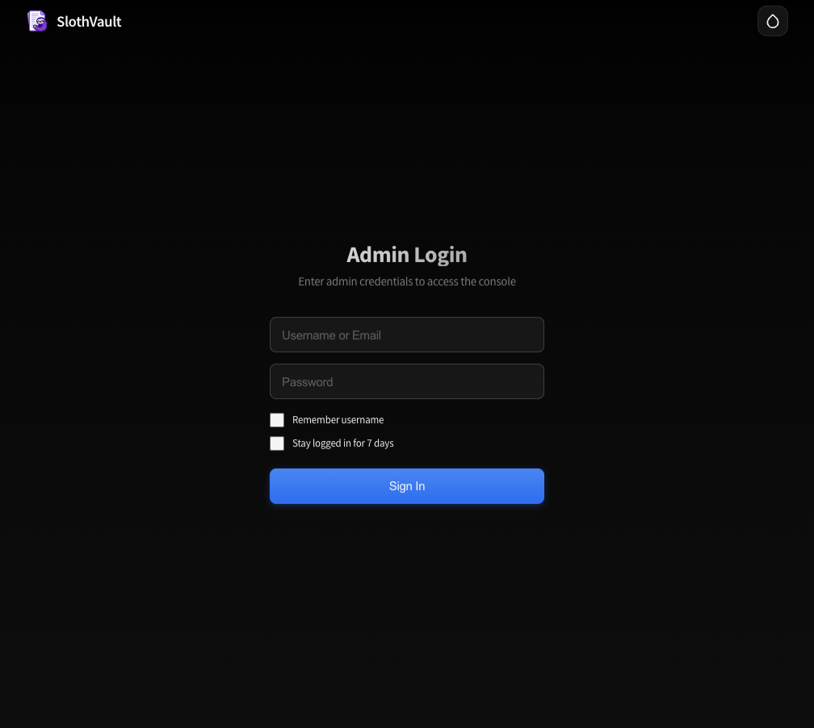

图4-5 管理员登录页面截图

### 4.2.2 项目与版本管理实现

项目管理页面通过筛选条件、分页表格和弹窗表单完成项目的增删改查。项目字段除了基础名称、权重和状态外，还包含 `requireAuth` 开关，用于决定该项目是否启用访问控制。项目版本管理则围绕某一项目展开，用于维护版本号、版本描述和排序。项目管理接口设计如表4-1所示，项目新增交互时序如图4-2所示。

这一实现体现出前台业务模型与后台维护模型之间的直接对应关系。后台项目列表页展示的并不是脱离业务语义的通用数据表，而是围绕项目名称、鉴权状态、最新版本和分类数量等字段构成的管理视图。项目版本管理组件进一步细化了文档集合在时间维度上的组织，使管理员能够在不破坏旧数据的前提下维护新一版文档结构。

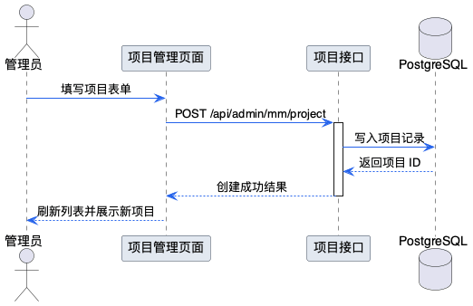

图4-2 管理后台项目新增时序图

表4-1 项目管理接口设计表

| 接口 | 方法 | 作用 |
| --- | --- | --- |
| `/api/admin/mm/project` | GET | 获取项目分页列表 |
| `/api/admin/mm/project` | POST | 新增项目 |
| `/api/admin/mm/project/[id]` | PUT | 更新项目 |
| `/api/admin/mm/project/[id]` | DELETE | 删除项目 |
| `/api/admin/mm/projectVersion/index` | GET/POST | 管理项目版本 |

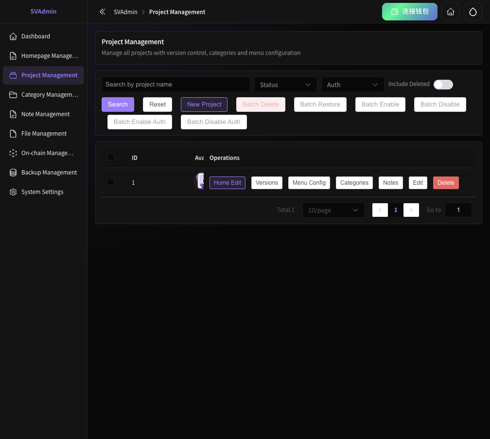

图4-6 项目管理页面截图

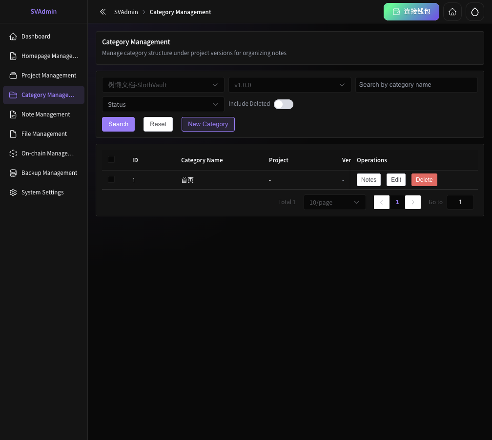

图4-7 项目版本配置页面截图

### 4.2.3 分类、笔记与正文管理实现

分类和笔记管理页面通过项目、版本和分类三级筛选联动，帮助管理员快速定位到目标内容。系统将文档标题和文档正文拆为 `NoteInfo` 与 `NoteContent` 两层结构，使单篇文档既能保持稳定的逻辑条目，也能保存多个正文版本。在编辑器实现上，系统将 Markdown 编辑区与预览能力结合，便于管理员在同一工作流内完成内容录入和排版检查。Markdown 编辑与预览协同结构如图4-4所示。

正文编辑能力是平台可用性的关键组成部分。若系统只能维护标题和目录而无法高效维护正文，就无法支撑真实的文档生产场景。通过引入 Markdown 编辑器和预览组件，平台在保证内容录入效率的同时，也让正文结构、标题层级和图片链接能够在编辑阶段尽早暴露问题。对于毕业设计项目而言，这种“内容输入即预览”的实现方式比单纯文本框录入更具实际价值。

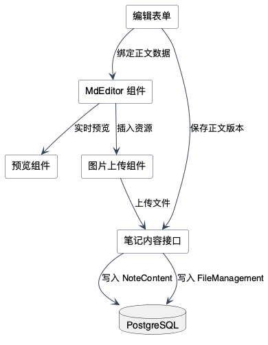

图4-4 Markdown 编辑与预览协同结构图

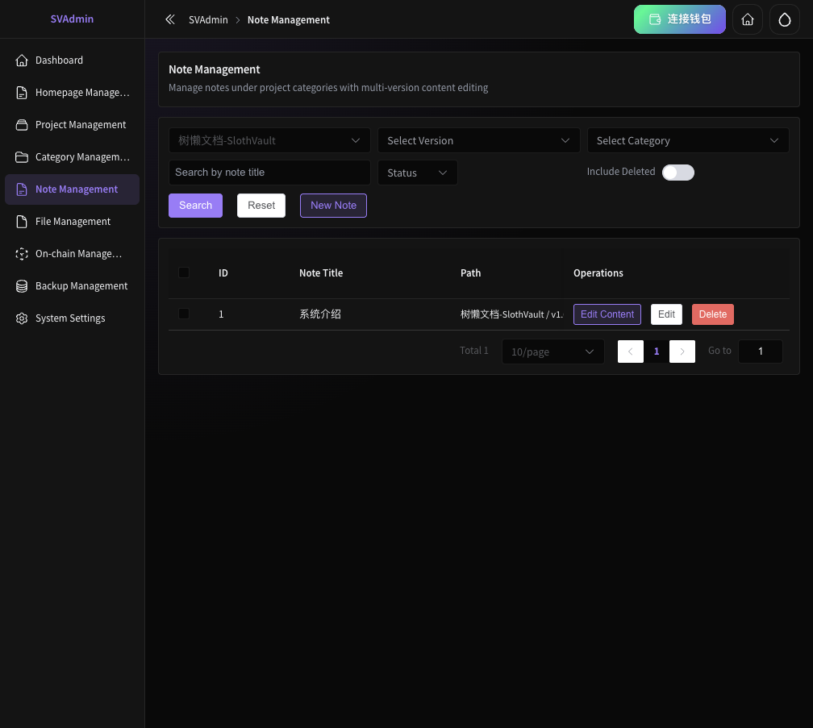

图4-8 分类与笔记管理页面截图

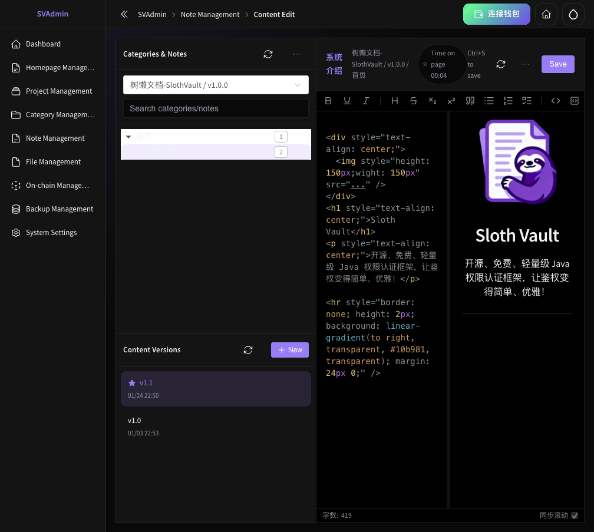

图4-9 Markdown 内容编辑页面截图

## 4.3 前台展示与访问控制实现

### 4.3.1 项目首页与文档阅读实现

前台项目首页页面在进入时先读取项目基础信息，再根据项目是否开启鉴权决定是否继续加载首页内容。若项目无需鉴权或用户已通过验证，则调用项目首页接口返回 Markdown 内容并渲染。文档阅读页则在页面加载时先读取当前版本下的分类与笔记目录，自动定位默认笔记，再获取对应正文内容并渲染目录导航。文档阅读页加载时序如图4-3所示。

该实现保证了前台体验的连续性。用户在访问文档时不需要先理解后台的数据表结构，而是通过项目首页、版本路由和笔记导航逐步进入具体正文。与此同时，前台又不会因为界面友好而绕过业务约束，因为目录数据和正文数据仍然由服务端接口控制，访问校验逻辑也仍然在请求链路中生效。

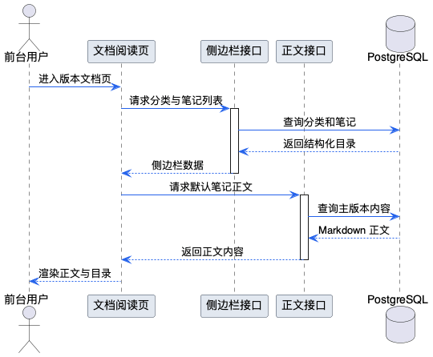

图4-3 文档阅读页加载时序图

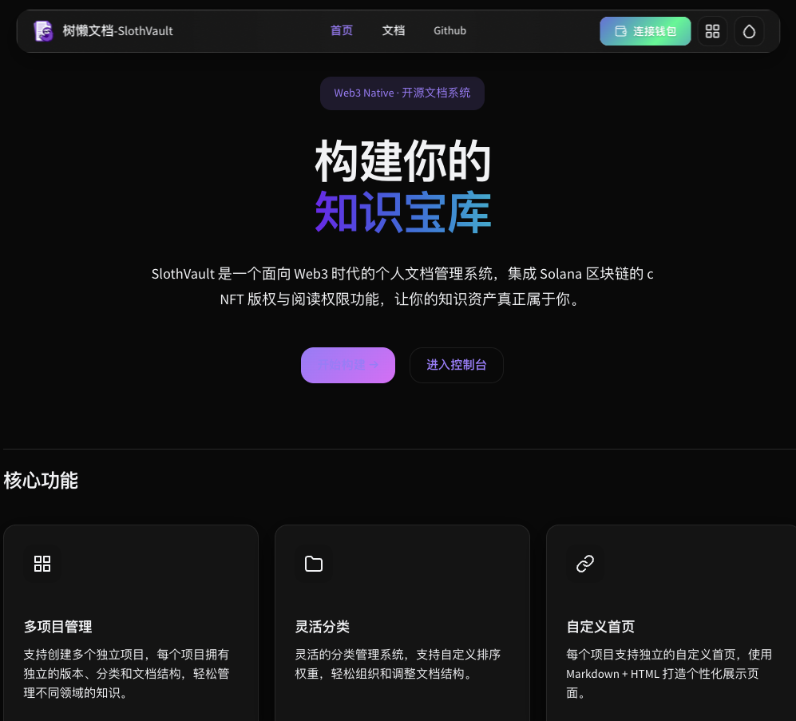

图4-10 前台项目首页截图

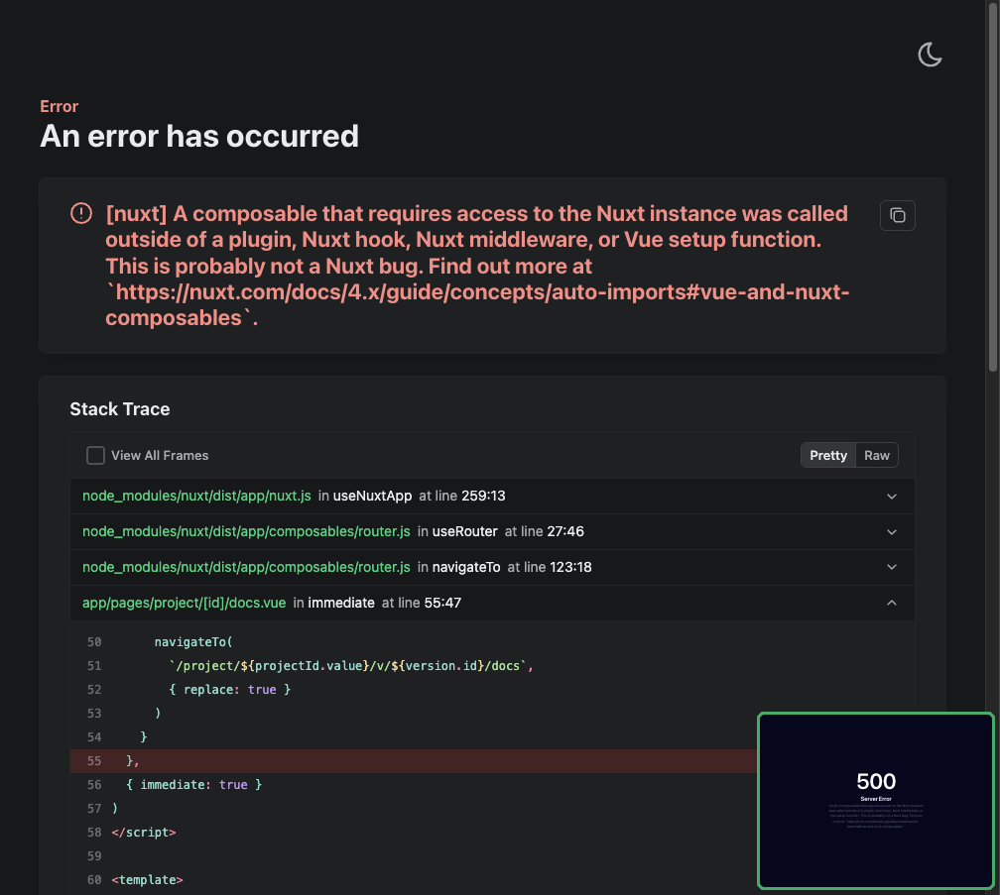

图4-11 前台文档阅读页面截图

### 4.3.2 项目访问验证实现

访问验证的核心在于前后端共同执行“是否需要鉴权”和“是否具备访问资格”两个判断。前端通过组合式函数获取当前项目鉴权状态、钱包地址和验证结果，并在需要时调用 `/api/project/[id]/verify-access` 接口。服务端在接口内部首先校验项目 ID、请求体参数和钱包地址格式，然后查询项目的 `requireAuth` 状态，最后调用统一的访问校验逻辑完成判断。这样可以保证首页接口、侧边栏接口和正文接口都能复用一致的鉴权策略。

相比把权限判断分散写在各个页面或接口里，当前实现把验证逻辑收敛到统一入口，再由组合式函数和工具模块在前后端复用。这种实现方式的工程价值在于：一旦访问策略发生变化，开发者只需要调整集中逻辑，而不需要逐页排查。对于包含多个前台入口的文档平台，这种集中式鉴权方案更适合后续维护。

### 4.3.3 文档目录与预览协同实现

除了访问控制之外，前台文档阅读体验还依赖正文目录与 Markdown 预览的协同。系统在正文页面中同时维护左侧分类导航和右侧目录组件，其中左侧分类导航负责在不同笔记之间切换，右侧目录组件负责对单篇正文中的标题层级进行定位。由于正文本身来源于 Markdown 内容，这一协同关系要求前端能够在渲染后继续提取标题层级信息，而不是只做静态文本展示。

这种实现带来的好处有两个。第一，管理员在后台维护标题层级后，前台目录能够自动同步更新，不需要额外维护一套独立的目录数据。第二，终端用户在阅读较长文档时可以同时依赖“文档之间的导航”和“单文档内部的导航”，从而提高长篇内容的可阅读性。对于以技术文档为主的平台而言，这一能力比单页静态展示更符合真实使用场景。

文档访问接口设计如表4-2所示。

表4-2 文档访问接口设计表

| 接口 | 方法 | 作用 |
| --- | --- | --- |
| `/api/project/list` | GET | 获取项目列表 |
| `/api/project/[id]` | GET | 获取项目基础信息 |
| `/api/project/[id]/home` | GET | 获取项目首页内容 |
| `/api/project/[id]/versions` | GET | 获取项目版本列表 |
| `/api/project/[id]/menu` | GET | 获取项目菜单 |
| `/api/project/[id]/verify-access` | POST | 验证项目访问权限 |
| `/api/project/[id]/v/[versionId]/sidebar` | GET | 获取侧边栏文档结构 |
| `/api/project/[id]/v/[versionId]/note/[noteId]` | GET | 获取具体文档内容 |

## 4.4 区块链资产管理实现

### 4.4.1 Merkle Tree 管理实现

系统通过专门的后台页面和接口管理 Merkle Tree。树记录不仅保存链上地址，还保存最大深度、缓冲区大小、树冠深度、网络类型、容量和创建成本等参数。这些数据既影响链上成本，也直接决定后续压缩 NFT 的承载能力。后台页面需要支持树列表查看、创建准备、估算成本、提交和删除等操作。

从实现层看，Merkle Tree 管理并不是单纯展示链上返回值，而是把与业务相关的运行属性也保存在本地数据库中。这样一来，后台可以基于容量、优先级和状态决定下一次铸造应使用哪一棵树，也可以在树异常或已满时及时切换策略。这说明区块链接入层已经具备一定的本地治理能力，而不是完全把业务判断外包给远程网络。

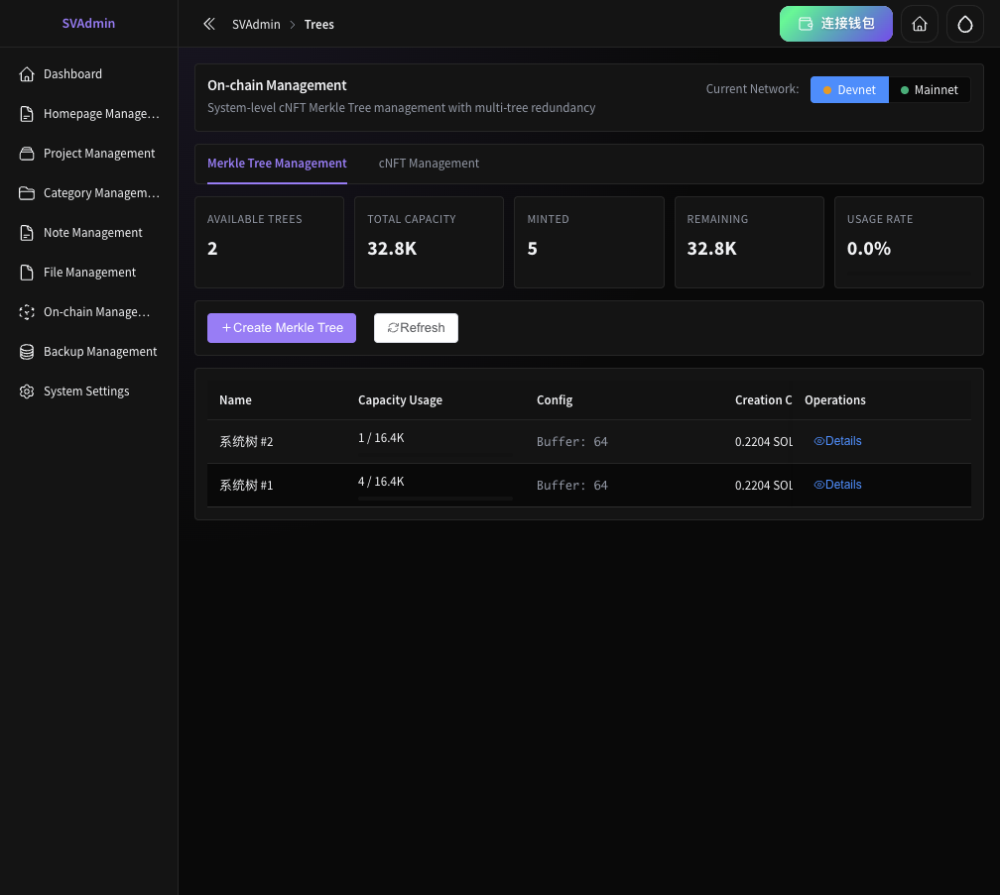

图4-12 Solana Merkle Tree 管理页面截图

### 4.4.2 压缩 NFT 铸造与提交流程实现

压缩 NFT 的实现包括准备会话、签名交易提交、链上确认、资产 ID 计算与数据库回写几个关键步骤。以交易提交流程为例，接口首先校验请求中的会话 ID 与交易数据是否完整，然后从本地会话缓存中读取铸造上下文；接着反序列化签名交易并校验签名数量与完整性；在发送交易后，系统等待确认结果，根据成功、失败或待定状态回写数据库。如果交易成功，系统还会基于树地址与叶子索引计算资产 ID，并写入压缩 NFT 记录。cNFT 铸造提交流程如图4-1所示。

这一路径体现出链上业务实现与普通 CRUD 接口之间的差异。普通文档接口往往只处理一次数据库读写即可完成，而 cNFT 交易提交流程涉及本地会话、用户签名、远程网络确认和本地状态回写四个阶段，任何一个阶段出现异常都可能影响最终结果。当前实现通过显式错误分类和多分支状态处理，把这一复杂过程转换成较可控的业务流程，这是系统实现层的重要难点之一。

### 4.4.5 区块链交易异常处理实现

区块链相关功能的稳定性并不只取决于成功路径，更取决于异常路径是否能够被清晰识别。当前系统在 cNFT 提交实现中区分了会话过期、签名不完整、余额不足、RPC 连接失败、交易过期和状态未知等多类情况，并分别给出不同的处理策略。例如，会话过期场景会立即中止后续流程；签名不完整场景会直接拒绝提交；而当交易状态一时无法确认时，系统会保留“铸造中”状态，避免过早把结果写死为失败。这种设计体现出实现层对链上不确定性的现实考量。

对毕业设计项目而言，这种异常处理设计比单纯展示“交易成功”更能说明系统质量。因为真实系统运行时最常见的问题往往不是理想路径是否存在，而是异常场景出现后系统是否仍然能够保持数据状态一致、是否仍然能够向操作者反馈明确原因。当前实现至少在逻辑层已经覆盖了这些问题，为后续运行级验证保留了较好的基础。

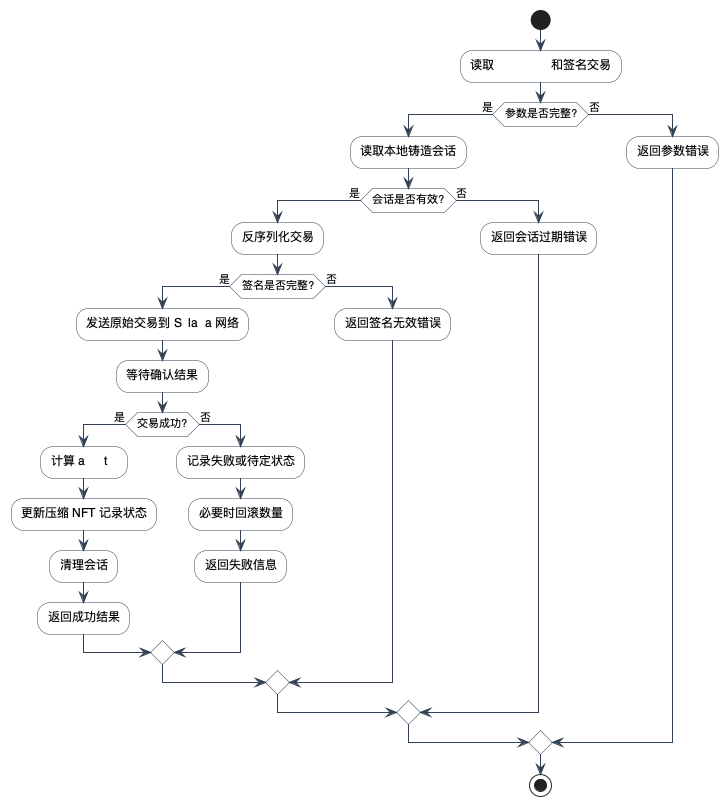

图4-1 cNFT 铸造提交流程图

Solana 管理接口设计如表4-3所示。

表4-3 Solana 管理接口设计表

| 接口 | 方法 | 作用 |
| --- | --- | --- |
| `/api/admin/solana/tree/index` | GET | 获取树列表 |
| `/api/admin/solana/tree/prepare` | POST | 准备树创建参数 |
| `/api/admin/solana/tree/estimate` | POST | 估算创建成本 |
| `/api/admin/solana/tree/submit` | POST | 提交树创建交易 |
| `/api/admin/solana/cnft/index` | GET | 获取压缩 NFT 列表 |
| `/api/admin/solana/cnft/prepare` | POST | 准备 cNFT 铸造参数 |
| `/api/admin/solana/cnft/submit` | POST | 提交签名交易并回写状态 |

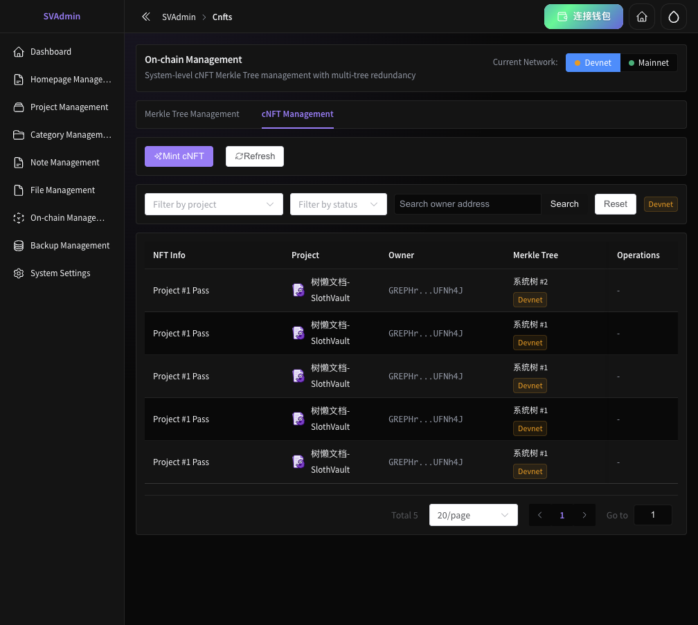

图4-13 cNFT 管理页面截图

### 4.4.3 页面、组件与接口的映射实现

为了避免前端页面逻辑与接口逻辑相互缠绕，系统在实现中尽量保持“页面负责展示与交互、接口负责业务处理、工具模块负责复用逻辑”的分层结构。典型页面、组件与接口的对应关系如表4-4所示。

表4-4 页面与接口映射表

| 页面或组件 | 关联接口或模块 | 作用 |
| --- | --- | --- |
| `admin/auth/login.vue` | `/api/admin/auth/login` | 管理员登录 |
| `admin/mm/projects/index.vue` | `/api/admin/mm/project` | 项目增删改查 |
| `admin/mm/notes/index.vue` | `/api/admin/mm/note` | 笔记条目维护 |
| `admin/mm/notes/[id]/content.vue` | `/api/admin/mm/noteContent` | 正文版本维护 |
| `project/[id]/home.vue` | `/api/project/[id]/home` | 前台项目首页展示 |
| `project/[id]/v/[versionId]/docs/[noteId].vue` | `/api/project/.../note/[noteId]` | 文档正文展示 |
| `useProjectAuth` | `/api/project/[id]/verify-access` | 项目访问校验 |
| `admin/mm/backup.vue` | 备份接口集合 | 数据导入导出 |

表4-4 所示映射关系说明，前端页面并不是直接操作数据库或区块链，而是通过服务端接口间接完成业务动作。这样既提高了系统安全性，也让每一层都拥有相对明确的职责范围。

### 4.4.4 访问控制分支实现

访问控制逻辑的复杂性主要来自“公开项目”和“受保护项目”必须共存。系统通过项目字段 `requireAuth` 控制是否进入验证路径，再由访问验证接口决定最终是否允许读取正文。实现分支如表4-5所示。

表4-5 项目访问控制分支表

| 分支场景 | 条件 | 处理结果 |
| --- | --- | --- |
| 公开项目 | `requireAuth=false` | 直接返回前台内容 |
| 受保护项目但未提供钱包地址 | `requireAuth=true` 且钱包为空 | 拒绝访问并提示连接钱包 |
| 本地记录命中 | 钱包地址与本地 cNFT 记录匹配 | 允许访问 |
| 本地记录未命中但链上验证成功 | 链上资产持有状态匹配 | 更新本地记录后允许访问 |
| 链上验证失败 | 无匹配资产或 RPC 异常 | 拒绝访问并返回原因 |

这种实现分支让系统在访问控制上既不失灵活性，也不过度依赖链上实时查询。对于公开项目，平台仍然可以保持普通文档站点的访问体验；对于受保护项目，平台则引入更严格的资产验证逻辑。

## 4.5 备份恢复实现

系统将数据备份拆分为数据库业务数据备份和文件备份两类。数据库导出接口会统一汇总项目、版本、分类、笔记、正文、文件、系统配置、系统首页、Merkle Tree 与压缩 NFT 数据，并对 `BigInt` 类型进行字符串化处理，便于后续导入恢复。该设计一方面避免直接暴露认证数据，另一方面也让业务备份结构更清晰。文件备份则围绕上传目录进行处理，保证内容数据与附件资源可以一起恢复。

这一实现说明项目在工程闭环上已经超出了“功能演示系统”的范围。许多课程项目只关注页面展示和基础增删改查，而忽略系统迁移和数据恢复。SlothVault 在代码层面显式提供备份接口，意味着开发者已经把系统的持续维护与异常恢复纳入设计考虑，这对于毕业设计的完整性是加分项。

### 4.5.1 数据导出对象组织

数据库导出逻辑并不是简单执行一张表的全量查询，而是同时读取项目、项目版本、分类、笔记、正文版本、文件、系统配置、系统首页、Merkle Tree 与压缩 NFT 等多类业务对象，再通过字符串化处理解决 `BigInt` 字段在 JSON 输出中的兼容问题。这种组织方式使导出的备份文件更接近一个业务快照，而不是零散数据片段。

表4-6 业务数据导出对象表

| 导出对象 | 主要内容 | 作用 |
| --- | --- | --- |
| `projects` | 项目基础信息 | 恢复项目主数据 |
| `projectVersions` | 项目版本数据 | 恢复版本层级 |
| `categories` | 分类数据 | 恢复侧边栏结构 |
| `noteInfos` | 笔记条目数据 | 恢复文档标题层级 |
| `noteContents` | 正文版本数据 | 恢复实际文档内容 |
| `fileManagements` | 文件元数据 | 恢复附件映射 |
| `systemConfigs` | 系统配置 | 恢复运行参数 |
| `systemHomepages` | 系统首页数据 | 恢复系统入口内容 |
| `merkleTrees` | 树记录 | 恢复链上基础设施状态 |
| `compressedNfts` | 资产记录 | 恢复访问凭证映射 |

### 4.5.2 导入恢复的工程意义

恢复能力的意义不仅在于灾难恢复，还在于开发环境迁移、测试数据复用和系统部署迭代。对于一个包含链上凭证映射的文档平台而言，如果只能恢复正文内容而无法恢复项目与资产关系，那么前台访问控制链路就会被破坏。因此，备份恢复模块虽不是用户最常见的交互界面，却是系统实现层不可忽略的关键能力。

### 4.5.3 数据一致性保障实现

备份恢复模块还承担着保持数据一致性的职责。由于项目、版本、分类、笔记、正文和资产映射之间存在层层依赖关系，任何单一对象的缺失都可能导致前台展示链条中断。例如，如果恢复了 `NoteContent` 而没有恢复对应的 `NoteInfo`，前台就无法正确构造侧边栏与正文的关系；如果恢复了项目和正文却缺少 `CompressedNft` 记录，受保护项目的访问验证又会失去依据。因此，系统在实现备份逻辑时需要把多类对象视为一个业务整体，而不是孤立的数据片段。

从实现意义上讲，这种一致性考虑使系统更接近真实运维场景。它表明开发者已经意识到“系统功能完成”并不等于“系统可长期维护”，后者还要求在部署迁移、环境重建和数据恢复过程中保持业务结构不被破坏。这一点也是本项目在实现层较为完整的体现。

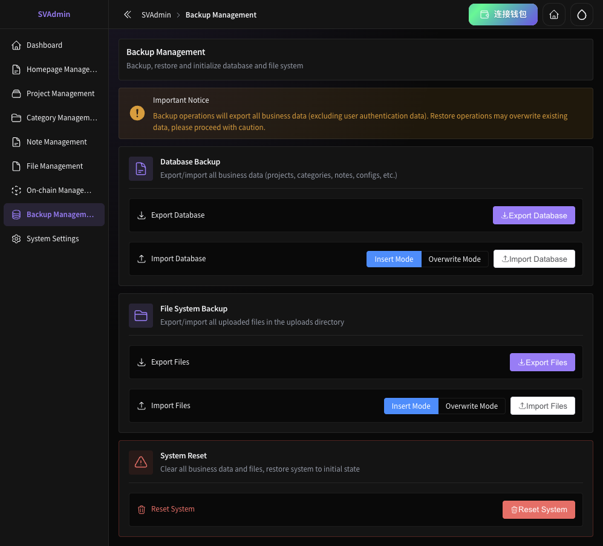

图4-14 数据备份页面截图

## 4.6 本章小结

本章围绕后台管理、前台展示、访问鉴权、区块链资产处理和备份恢复五个方面说明了系统实现方式。实现结果表明，SlothVault 并非简单地把区块链接入到一个已有内容平台，而是在项目访问控制、资产状态回写和文档展示流程中形成了相互联动的实现体系，这为后续测试与分析提供了具体对象。

# 第5章 系统测试

## 5.1 测试目标与测试环境

系统测试的目标是验证后台认证、项目与文档管理、前台访问控制、区块链资产管理以及备份恢复等关键功能是否满足需求分析提出的业务目标。由于当前仓库以代码和页面为主要证据，本章在论述时将严格区分两类内容：一类是可以通过源码逻辑和接口分支直接确认的处理行为；另一类是需要在系统运行后通过页面操作或链上交互进一步补齐的执行结果。这样可以避免把尚未实际运行的结果写成既成事实。

测试环境建议采用 Node.js 运行 Nuxt 服务、PostgreSQL 作为数据库、浏览器作为前端访问终端，并根据项目配置准备可用的 Solana 开发网络环境。系统测试实施流程如图5-1所示。

图5-1 系统测试实施流程图

测试环境至少应满足以下条件：其一，Nuxt 服务能够正常启动并连接到 PostgreSQL；其二，数据库中存在用于验证项目、版本、分类和正文读取流程的基础测试数据；其三，区块链相关环境变量和 RPC 地址能够支持树与 cNFT 接口执行；其四，浏览器端能够访问后台登录页、后台管理页以及前台项目页。若其中任意一项缺失，则系统只能完成部分静态逻辑验证，而无法形成完整的运行级测试记录。

表5-0 测试环境配置表

| 项目 | 配置说明 |
| --- | --- |
| 应用运行环境 | Node.js + Nuxt 4 |
| 数据库环境 | PostgreSQL |
| 客户端环境 | Chrome 或同类现代浏览器 |
| 区块链环境 | Solana Devnet 或具备 DAS 能力的 RPC |
| 测试数据 | 项目、版本、分类、笔记、正文、树与 cNFT 记录 |

## 5.2 测试方法

本系统采用功能测试与异常处理测试相结合的方法。功能测试主要验证页面交互路径、接口入参与返回结构、数据库字段之间的业务对应关系是否满足需求；异常处理测试主要关注未授权访问、参数缺失、钱包地址格式错误、交易签名不完整、会话失效等场景。对于能够从源码直接观察到的接口逻辑，应优先以接口分支与返回码作为测试依据；对于需要用户界面和链上环境参与的流程，应通过用例设计明确预期结果并在后续运行环境中补充截图和执行记录。

此外，考虑到系统同时包含常规内容管理模块和区块链访问控制模块，测试方法还应兼顾“业务闭环验证”和“异常分支验证”两个层面。业务闭环验证强调管理员如何创建项目并最终让前台用户读取文档；异常分支验证则强调错误参数、失效会话、无效钱包地址和失败交易应当如何被系统拦截。二者结合后，才能较完整地评估该系统是否真正具备工程可用性。

## 5.3 功能测试用例设计

### 5.3.1 登录与会话测试

登录与会话测试主要验证后台认证入口是否可靠，包括管理员初始化后能否正常登录、会话失效后是否正确拦截后台接口、未登录访问时是否返回未授权状态等。测试用例如表5-1所示。

这组测试的关键不在于页面是否能展示一个登录框，而在于后台会话机制是否真正参与了资源保护。因为项目管理、文件管理、备份恢复和 Solana 管理都属于高权限操作，所以认证测试必须覆盖“登录成功后可操作”和“未授权时不能操作”两个方向。

表5-1 登录与会话测试用例表

| 测试编号 | 测试内容 | 预期结果 |
| --- | --- | --- |
| T-01 | 使用合法管理员账号登录后台 | 登录成功并建立会话 |
| T-02 | 未登录直接访问后台接口 | 返回未授权状态 |
| T-03 | 使用失效会话访问备份接口 | 返回未授权状态 |
| T-04 | 登录后访问项目管理页 | 正常展示项目列表 |

### 5.3.2 项目与文档管理测试

项目与文档管理测试主要验证项目、版本、分类、笔记和笔记内容能否按预期组织与保存。该部分的重点在于分层数据结构是否清晰，筛选联动是否正确，以及主显示内容是否能够和版本结构对应。测试用例如表5-2所示。

如果把这一组测试进一步展开，可以发现其实际验证的是系统内容模型是否自洽。项目新增成功并不代表平台就具备完整的内容维护能力，只有当版本、分类、笔记和正文版本都能围绕同一项目层层建立时，前台页面才可能呈现出稳定的导航关系。

表5-2 项目与文档管理测试用例表

| 测试编号 | 测试内容 | 预期结果 |
| --- | --- | --- |
| T-05 | 新增项目并设置 `requireAuth=false` | 项目保存成功并可在列表中查询 |
| T-06 | 为项目新增版本 | 版本记录正确关联项目 |
| T-07 | 在版本下新增分类和笔记 | 分类与笔记层级正确建立 |
| T-08 | 为笔记新增正文主版本 | 前台默认显示主版本内容 |

### 5.3.3 前台鉴权访问测试

前台访问测试主要验证公开项目和受保护项目在访问路径上的差异。对于公开项目，用户应可以直接读取项目首页和正文内容；对于受保护项目，若未提供钱包地址或未通过验证，则系统应阻止获取受保护资源。测试用例如表5-3所示。

这一组测试直接对应本课题的核心特色。若系统对公开项目和受保护项目不做区分，那么区块链访问控制模块就没有实际价值；反之，如果系统对所有项目都强制钱包验证，又会损害普通文档阅读的可用性。因此，测试中必须同时验证“无需鉴权的路径仍然顺畅”和“需要鉴权的路径确实被约束”。

表5-3 前台鉴权访问测试用例表

| 测试编号 | 测试内容 | 预期结果 |
| --- | --- | --- |
| T-09 | 访问未启用鉴权的项目首页 | 正常展示内容 |
| T-10 | 未携带有效钱包信息访问受保护项目 | 返回无访问权限提示 |
| T-11 | 调用访问验证接口并提供非法钱包地址 | 返回参数错误 |
| T-12 | 已持有有效资产的用户访问受保护正文 | 通过校验并显示内容 |

### 5.3.4 区块链资产管理测试

区块链测试主要关注树创建、cNFT 准备和交易提交流程中的参数校验、异常处理和状态回写能力。虽然最终链上执行结果依赖网络环境，但从源码可以直接确认系统对会话失效、签名缺失、余额不足和交易过期等异常已经进行了显式处理。测试用例如表5-4所示。

对于毕业设计论文而言，这组测试更强调工程边界的完备性，而不是单纯追求链上调用成功次数。原因在于区块链接口往往受外部网络、钱包环境和 RPC 状态影响较大，若只展示成功路径而忽略错误分支，反而不能说明系统的真实可用程度。当前源码已经将多类失败情形显式分类处理，这为后续运行级验证提供了较好的基础。

表5-4 区块链资产管理测试用例表

| 测试编号 | 测试内容 | 预期结果 |
| --- | --- | --- |
| T-13 | 准备 Merkle Tree 创建参数 | 返回合法的创建上下文 |
| T-14 | 提交缺少签名的 cNFT 交易 | 返回签名无效错误 |
| T-15 | 使用过期会话提交 cNFT 交易 | 返回会话过期错误 |
| T-16 | 交易成功后回写资产 ID | 记录更新为正常状态 |

### 5.3.5 备份恢复与异常处理测试

备份恢复测试主要验证导出范围是否覆盖系统关键业务对象，以及异常情况下接口是否能返回明确错误。测试用例如表5-5 和表5-6 所示。

从运维角度看，备份恢复能力决定了系统是否具备继续维护和迁移的基础。尤其是该平台同时管理文档结构数据、Markdown 正文数据、文件资源与区块链资产映射关系，如果缺少统一备份能力，后续任何一次部署调整都可能造成数据断裂。因此，这部分测试虽不直接面向终端用户，却是评估系统完整性的必要内容。

表5-5 备份恢复测试用例表

| 测试编号 | 测试内容 | 预期结果 |
| --- | --- | --- |
| T-17 | 导出数据库业务数据 | 返回项目、文档、配置和链上资产数据 |
| T-18 | 导出文件资源 | 返回可恢复的文件集合 |
| T-19 | 导入合法备份数据 | 业务数据能够恢复 |

表5-6 异常处理测试用例表

| 测试编号 | 测试内容 | 预期结果 |
| --- | --- | --- |
| T-20 | 缺少项目 ID 调用访问验证接口 | 返回 400 错误 |
| T-21 | 非法项目 ID 调用访问验证接口 | 返回 400 错误 |
| T-22 | 请求不存在项目 | 返回 404 错误 |
| T-23 | 数据导出过程中出现异常 | 返回导出失败提示 |

### 5.3.6 需求覆盖关系检查

为了避免测试章节只列出零散用例而无法说明系统是否真正覆盖了前文提出的需求，本文进一步将测试项与需求模块进行对应整理，结果如表5-7所示。

表5-7 测试项与需求覆盖关系表

| 需求模块 | 对应测试编号 | 说明 |
| --- | --- | --- |
| 认证与会话管理 | T-01 至 T-04 | 覆盖后台登录与会话控制 |
| 项目与文档管理 | T-05 至 T-08 | 覆盖内容结构维护 |
| 前台访问控制 | T-09 至 T-12 | 覆盖公开访问与受保护访问分支 |
| 区块链资产管理 | T-13 至 T-16 | 覆盖树与 cNFT 核心流程 |
| 备份恢复 | T-17 至 T-19 | 覆盖业务快照导入导出 |
| 异常处理 | T-20 至 T-23 | 覆盖典型错误入参与失败路径 |

表5-7 表明，测试体系已经能够和第2章中定义的主要需求模块形成一一对应关系。这样做的价值在于，测试结论不再只是“某些接口能用”，而是能够回答“系统是否对主要需求给出了验证路径”这一更关键的问题。

## 5.4 测试结果分析

从当前代码证据可以直接确认，系统已经在多个关键接口中建立了较明确的输入校验和错误处理逻辑。例如，访问验证接口会对项目 ID、钱包地址格式和项目存在性进行判断；后台备份导出接口会在读取会话后再处理数据库业务数据，并对异常统一返回失败结果；cNFT 提交接口会先检查会话状态，再验证交易反序列化结果和签名完整性，然后才进入链上发送和状态更新流程。这些实现说明系统在高风险操作上并不是直接串行执行，而是先通过条件校验缩小错误传播范围。

从模块覆盖范围看，当前测试设计已经能够对应系统的主要业务链条。后台认证测试覆盖了管理入口安全；项目与文档管理测试覆盖了内容结构是否可维护；前台鉴权访问测试覆盖了项目公开性与访问保护的分支差异；区块链资产管理测试覆盖了凭证发行与状态维护链路；备份恢复测试则覆盖了运维层的完整性要求。也就是说，测试体系并不是围绕单个页面堆叠，而是围绕业务闭环组织的。

为了进一步说明当前代码证据能够支撑的测试结论，可以将测试结果分为“已由源码逻辑直接支撑”和“需要运行环境补充证明”两类，见表5-8。

表5-8 测试结果证据类型表

| 测试内容 | 当前证据类型 | 说明 |
| --- | --- | --- |
| 参数合法性校验 | 已由源码直接支撑 | 接口存在明确的输入判断分支 |
| 会话未授权拦截 | 已由源码直接支撑 | 后台接口统一读取会话 |
| 项目访问控制分支 | 已由源码直接支撑 | `requireAuth` 与 `verify-access` 逻辑明确 |
| 正文版本主显示机制 | 已由源码直接支撑 | 存在 `isPrimary` 字段与内容读取逻辑 |
| 页面交互最终视觉效果 | 需运行环境补充 | 需要真实页面截图或录像证明 |
| cNFT 链上确认结果 | 需运行环境补充 | 需要真实链上交易与回写记录 |
| 备份恢复回放效果 | 需运行环境补充 | 需要在实际数据集上执行导入导出 |

同时也应看到，测试章节中仍有一部分结果需要在真实运行环境下补充，尤其是页面截图、链上交易成功后的界面反馈、不同钱包持有状态下的访问路径和备份恢复操作的完整回放。对于这些尚未附带实测记录的内容，本文只给出测试方案和预期结果，不把它们写成已经完成的性能或稳定性结论。这种保守写法更符合毕业论文对证据边界的要求。

在后续完善中，最值得优先补齐的证据包括三类。第一类是第4章所需的页面截图与对应测试路径，这能够把实现说明和测试记录连接起来；第二类是典型接口的真实返回结果，例如项目访问验证的成功与失败案例；第三类是链上交易成功后的数据库回写记录，这能够进一步增强“访问凭证绑定项目”的论证力度。只要这些材料能够在本地环境中补齐，系统测试章节就能从“代码证据驱动”进一步提升为“运行证据驱动”。

从论文写作角度看，采用这种分层结论方式还有一个优势，即可以最大程度避免“为了完整而过度推断”。毕业论文需要体现系统完成度，但完成度不应建立在未经证实的性能数字或虚构截图之上。通过把现有结论限定在源码和真实逻辑能够支撑的范围内，再把待补部分明确标记为运行级验证任务，整篇论文的可信度会更高，也更符合软件工程类项目的证据表达方式。

进一步地，测试章节所呈现的并不是一组彼此孤立的验证动作，而是对整个系统工程质量的综合观察。后台认证决定高权限操作是否可控，项目与文档管理决定业务数据结构是否稳定，前台访问控制决定内容开放边界是否清晰，区块链资产管理决定访问凭证路径是否成立，备份恢复则决定系统是否具备持续维护能力。只有当这五类测试能够共同成立时，系统才具备较完整的工程可信度。就当前项目而言，虽然仍需通过真实环境补齐部分运行证据，但源码已经说明其设计方向和实现边界具有较强的一致性。

## 5.5 本章小结

本章从测试目标、测试方法、测试用例和结果分析四个方面对系统测试进行了说明。现有证据表明，系统已经在后台认证、前台鉴权、区块链交易处理和备份恢复等关键路径上建立了较完整的逻辑边界与异常处理机制。后续只需在本地运行环境中补齐页面截图和执行记录，即可进一步完善测试证明材料。

从整章结论看，SlothVault 当前最突出的优点在于“关键业务路径已经清晰、异常处理边界已经建立、后续运行级验证目标也已经明确”。这意味着论文后续即使继续补充截图、交易记录和回放结果，也是在现有测试体系上做证据增强，而不是推翻已有设计重来。对于毕业设计项目而言，这种状态说明系统已经进入可以稳定打磨和完善的阶段，具备继续走向最终交付的基础。

# 结论

本文围绕“基于 Solana 压缩 NFT 的文档管理系统设计与实现”这一题目，对 SlothVault 项目的需求、设计、实现和测试方案进行了系统整理。研究结果表明，该系统已经形成较为完整的工程闭环：在内容层，系统能够围绕项目、版本、分类、笔记和正文版本组织文档；在展示层，系统能够提供项目首页、文档阅读和目录导航能力；在权限层，系统把项目访问资格与压缩 NFT 资产状态关联，构建了区别于传统账号式权限模型的访问控制路径；在运维层，系统还具备文件管理、系统配置和备份恢复能力。

本课题的主要特点在于采用“链下维护内容、链上校验凭证”的混合架构，而不是简单追求把全部业务逻辑搬到区块链上。这样既控制了实现复杂度和链上成本，也保留了文档管理系统应有的可维护性和可扩展性。通过引入 Solana 压缩 NFT，系统为项目级阅读权限提供了一种更具可验证性的表达方式。

从软件工程方法的角度看，本文完成了较完整的需求分析、系统设计、数据库建模、接口划分、模块实现和测试方案整理。相较只展示页面原型或只讨论技术概念的项目，本课题更强调真实工程仓库中的结构化证据，包括 Prisma 数据模型、前后台页面路由、鉴权工具模块、区块链交易处理流程以及业务数据备份恢复逻辑。这些内容共同说明，SlothVault 已经不是一个停留在功能设想阶段的演示系统，而是具备明确模块边界和持续演化能力的内容平台原型。

本文还说明了一个更具体的结论：区块链技术在文档平台中的价值，并不一定体现在把全文内容上链，而更适合体现在访问凭证和权限验证层面。通过将项目是否需要保护、用户钱包地址以及链上资产持有状态关联起来，平台构建了一条可验证的项目访问路径。这一路径保留了传统文档管理系统在内容维护上的高效率，同时引入了比纯中心化权限记录更强的凭证表达方式。

如果从系统能力的完成度来评估，本课题已经基本实现了题目设定所需要的关键目标。首先，在文档管理主线上，系统已经能够对项目、版本、分类、笔记和正文进行层次化维护，并支持 Markdown 内容的编辑和展示。其次，在访问控制主线上，系统已经形成了由项目配置、钱包地址和压缩 NFT 资产状态共同决定的访问验证路径。再次，在平台支撑主线上，系统还提供了系统配置、文件管理以及备份恢复等辅助能力，使其不再只是单一功能演示，而更接近真实可维护的平台原型。

但也应当看到，当前系统仍有进一步完善空间。例如，链上验证结果的运行数据和性能统计尚需在更完整的测试环境中补齐；页面截图、链上交互记录和全文图表还需要继续丰富；在后续工作中，还可以考虑引入更灵活的资产分发策略、更多网络环境支持以及更细粒度的内容权限控制。

后续工作可以沿三个方向继续推进。第一，在内容系统层面继续增强多主题展示、权限继承规则和更细粒度的资源级授权。第二，在区块链层面继续补充更多运行环境下的交易与验证记录，并评估多树策略、跨网络部署和资产生命周期管理。第三，在论文交付层面继续补齐页面截图、附录译文和最终格式化 Word 文档，使论文从当前的结构完备稿进一步走向完全定稿。总体而言，本文已经完成了题目所要求的核心研究工作，并为后续完善保留了清晰的工程路径。

综上所述，SlothVault 的设计与实现证明了“文档内容管理 + 区块链访问凭证”这一组合路线具备现实工程可行性。它既没有为了强调链上特性而牺牲内容维护效率，也没有因为保留传统内容平台结构而放弃访问凭证的可验证性。对于软件工程专业毕业设计而言，这样的结果已经较好地体现了从需求分析到系统落地的完整过程，也为后续在更大规模、更复杂场景下继续扩展提供了稳定起点。

最后需要指出的是，本课题虽然以文档管理系统为载体，但其方法论意义并不限于文档平台本身。凡是同时需要内容组织能力和可验证访问控制能力的系统，都可以借鉴本文提出的“业务主数据链下维护、凭证状态链上校验、服务端完成协同验证”的实现思路。也正因为如此，本文的工作不仅完成了一个具体系统的设计与实现，也为后续相关系统的工程实践提供了可复用的分析框架和实现路径。

在这一意义上，本文既是对一个具体毕业设计项目的总结，也是一次围绕真实工程问题展开的软件工程实践归纳。

# 致谢

在本次毕业设计与论文整理过程中，感谢指导教师在选题定位、系统结构梳理和论文写作规范方面给予的指导。感谢项目开发与测试过程中提供建议的同学和朋友，他们对页面交互、模块边界和问题定位提出了许多实际意见。也感谢开源社区提供的 Nuxt、Vue、Prisma、PostgreSQL 与 Solana 等技术生态，为本课题的实现提供了可靠基础。

在系统开发和论文完善的整个过程中，我也进一步体会到软件工程训练的核心不只是完成某个页面或接口，而是能够围绕需求、设计、实现和测试形成完整闭环。正是这些来自指导、协作和开源生态的帮助，使本课题能够从最初的功能设想逐步发展为较完整的工程成果。

同时，也感谢学校提供的毕业设计训练机会，使我能够在真实项目背景下综合运用数据库设计、前后端开发、接口调试、文档撰写和系统测试等多方面知识。通过本课题的完成，我对软件工程中“问题分析、结构设计、实现落地、证据表达”之间的关系有了更加清晰的理解。

谨以此文作为本次毕业设计阶段性工作的总结。
并作为后续持续完善的基础。
特此致谢。
并郑重存记。
谨志于此。
谨此为记。
深表谢意。
致礼。
谨谢。
谨此致敬。
亦感谢所有帮助过本课题的人。

# 参考文献

[1] Nuxt Documentation. Introduction to Nuxt 4[EB/OL]. [2026-04-28]. https://nuxt.com/docs/4.x

[2] Prisma Documentation. PostgreSQL database connector[EB/OL]. [2026-04-28]. https://docs.prisma.io/docs/orm/core-concepts/supported-databases/postgresql

[3] PostgreSQL Global Development Group. PostgreSQL Documentation[EB/OL]. [2026-04-28]. https://www.postgresql.org/docs/

[4] Vue.js Documentation. Vue 3 Guide[EB/OL]. [2026-04-28]. https://vuejs.org/guide/introduction.html

[5] Solana. Compressed NFTs[EB/OL]. [2026-04-28]. https://solana.com/developers/courses/state-compression/compressed-nfts

[6] WONG J. How to use compressed NFTs on Solana, powered by state compression[EB/OL]. 2023-04-06[2026-04-28]. https://solana.com/en/news/how-to-use-compressed-nfts-on-solana

[7] Pinia Documentation. Introduction[EB/OL]. [2026-04-28]. https://pinia.vuejs.org/

[8] Element Plus Documentation[EB/OL]. [2026-04-28]. https://element-plus.org/

[9] MD Editor V3 Documentation[EB/OL]. [2026-04-28]. https://imzbf.github.io/md-editor-v3/en-US/

[10] Filebase Documentation[EB/OL]. [2026-04-28]. https://docs.filebase.com/

[11] ALMOGHIRI M, et al. A framework of blockchain-based secure and privacy-preserving E-government system[J]. Wireless Networks, 2019.

[12] WANG X, et al. A blockchain-based secure storage scheme for medical information[J]. Journal on Wireless Communications and Networking, 2022.

[13] ZHANG Y, et al. Blockchain enabled zero trust based authentication scheme for railway communication networks[J]. Journal of Cloud Computing, 2023.

[14] WU J, et al. Consensus algorithm for maintaining large-scale access-control views of education data[J]. The Journal of Supercomputing, 2024.

[15] LIU S, et al. Blockchain-based access control and privacy preservation in healthcare: a comprehensive survey[J]. Cluster Computing, 2025.

[16] YUAN C, et al. SSX-EHRs: secure and scalable cross-domain EHRs sharing with blockchain sharding and dynamic proxy re-encryption[J]. Journal on Information Security, 2025.

# 附录

## 附录A 外文文献原文节选

题目：A blockchain-based secure storage scheme for medical information

作者：X. Wang et al.

出处：Journal on Wireless Communications and Networking, 2022

说明：以下内容选自正文已引用文献[12]中与“区块链访问控制、链上链下协同存储、属性控制与去中心化共享”直接相关的摘要、引言及关键设计描述，用于支撑本文对 SlothVault 访问控制与安全存储方案的研究分析。

### A.1 Abstract

With the rapid development of information technology, the amount of medical information data is increasing rapidly. Traditional medical information storage schemes face many problems such as data tampering, single-point failure, privacy leakage, and weak access control. To solve these problems, this paper proposes a blockchain-based secure storage scheme for medical information. The scheme combines blockchain, the interplanetary file system, attribute-based access control, proxy re-encryption, and searchable encryption. Medical data are not stored directly on the blockchain. Instead, ciphertext indexes, access-control evidence, and verification information are maintained on chain, while the complete encrypted files are stored off chain. In this way, the system improves storage efficiency and avoids the high cost caused by putting large files directly on the blockchain. At the same time, the proposed method allows data owners to define fine-grained access permissions and supports secure sharing among different participants in the medical scenario.

The scheme also introduces a cooperative mechanism between blockchain nodes and off-chain storage nodes. Blockchain is responsible for maintaining tamper-resistant metadata, audit traces, and authorization records, whereas the off-chain storage layer is responsible for storing large encrypted files and returning them according to legitimate requests. By integrating searchable encryption, users can retrieve target data without exposing sensitive plaintext keywords to storage providers. By integrating proxy re-encryption, the system can support secure delegation and re-sharing under dynamic authorization relationships. Experimental analysis in the paper shows that the proposed scheme can effectively improve the security and credibility of medical-information storage while keeping the storage and sharing process scalable.

### A.2 Introduction

Medical-information systems are rapidly evolving from isolated internal platforms to interconnected digital-service networks. In this process, a large amount of structured and unstructured data, including examination records, prescriptions, images, laboratory reports, and treatment histories, must be stored, transmitted, retrieved, and shared among hospitals, doctors, patients, and other authorized parties. However, existing centralized storage architectures often expose several weaknesses. First, the storage server becomes a single point of failure. Once the server is attacked, unavailable, or maliciously modified, the reliability of the entire medical-information service is affected. Second, centralized administrators have excessive power over stored data, which increases the risk of unauthorized inspection, leakage, or abuse. Third, once data are shared across institutions, it becomes difficult to maintain unified identity verification, auditability, and traceability.

Blockchain provides a possible way to address these problems because it offers decentralization, tamper resistance, traceable transactions, and distributed consensus. Nevertheless, storing complete medical files directly on chain is impractical. Medical data are often large in size and high in frequency, and direct on-chain storage would significantly increase cost and lower efficiency. Therefore, a more realistic architecture is to keep critical evidence, access records, and integrity-verification data on chain, while storing the original encrypted content in an off-chain system. Under such an architecture, blockchain does not replace all storage functions; instead, it acts as a trusted coordination layer for ownership confirmation, access-right validation, and operation auditing.

Another important issue is access control. Medical information contains highly sensitive private data, so the system must not only protect data from external attackers but also restrict internal access according to role, attribute, and authorization scope. Traditional coarse-grained access-control models are not sufficient in dynamic cross-domain environments. The paper therefore introduces attribute-based access control to describe who can access which kind of data under what conditions. In addition, because the set of authorized users may change over time, secure delegation and re-sharing must be supported without forcing the data owner to decrypt and re-encrypt all historical files repeatedly.

To support efficient retrieval over encrypted data, the paper also introduces searchable encryption. In many medical scenarios, users need to search records by disease, symptom, treatment item, or time range. If the storage provider can see plaintext keywords, privacy risks increase. Searchable encryption allows the user to perform retrieval on protected indexes while keeping the semantic content hidden from the storage server. Combined with proxy re-encryption, this design makes the storage system more practical for collaborative environments in which both confidentiality and controlled sharing are required.

### A.3 Core Design Description

The core idea of the scheme is to divide storage responsibility into two layers. The blockchain layer stores hashes, indexes, operation records, and authorization evidence, while the interplanetary file system stores the actual encrypted medical files. When a data owner uploads a medical record, the file is first encrypted and then stored in the off-chain distributed file system. The file address, digest value, and related authorization metadata are written to the blockchain in the form of compact verifiable records. When a user later requests access, the blockchain is queried to verify whether the requester satisfies the access-control policy. Only after successful verification can the corresponding off-chain ciphertext be located and returned.

Attribute-based access control is used to describe access policies from multiple dimensions, such as organization, department, identity, and data sensitivity. This is important because medical sharing is not a simple one-user one-file relationship. A doctor may have access to one category of records but not to another; a researcher may obtain desensitized data but not direct identifiers; a patient may authorize a new institution to access part of the historical archive. The paper argues that flexible attribute expressions are more suitable than rigid static permission tables in such scenarios.

The scheme further combines proxy re-encryption to reduce the burden of repeated authorization updates. When sharing relationships change, the data owner does not need to download the ciphertext, decrypt it locally, and then encrypt it again for each new recipient. Instead, a re-encryption mechanism allows the ciphertext to be transformed into a version that another authorized party can decrypt, while the storage server or proxy node cannot learn the plaintext itself. This improves efficiency and supports dynamic authorization management in a distributed environment.

Finally, the paper emphasizes auditability and traceability. Every important operation, including upload, authorization, retrieval, and sharing, can leave a verifiable record on chain. Even though the actual content remains off chain, the chain still preserves the evidence needed to determine who performed which operation and when the operation occurred. This traceable architecture is important for high-value or privacy-sensitive information systems because it supports dispute analysis, accountability, and post-event verification.

## 附录B 中文译文

### B.1 摘要译文

随着信息技术的快速发展，医疗信息数据规模持续增长，传统医疗信息存储方案在实际运行中暴露出数据易被篡改、单点故障明显、隐私泄露风险高、访问控制粒度不足等问题。为解决这些问题，原文提出了一种基于区块链的医疗信息安全存储方案。该方案把区块链、星际文件系统、基于属性的访问控制、代理重加密以及可搜索加密等技术组合起来使用。医疗数据本身并不直接存储在区块链上，而是把密文索引、访问控制凭据以及可验证信息保存在链上，把完整的加密文件放在链下保存。通过这种方式，系统既提升了存储效率，也避免了大文件直接上链所带来的高昂成本。同时，方案允许数据所有者以更细粒度方式定义访问权限，并支持医疗场景下不同参与者之间的安全共享。

该方案还构建了链上节点与链下存储节点的协同机制。区块链负责维护不可篡改的元数据、审计轨迹和授权记录，链下存储层负责保存大体量加密文件，并在合法请求到来时返回对应数据。通过引入可搜索加密，用户可以在不向存储服务提供方暴露明文关键词的前提下检索目标数据；通过引入代理重加密，系统又能够在动态授权关系下实现安全委托和再共享。原文中的实验分析表明，该方案在提升医疗信息存储安全性和可信性的同时，仍然保持了存储与共享流程的可扩展性。

### B.2 引言译文

医疗信息系统正在从孤立的院内平台逐渐演化为互联互通的数字化服务网络。在这一过程中，大量结构化与非结构化数据，例如检查记录、处方、医学影像、检验报告和治疗历史，都需要在医院、医生、患者以及其他被授权主体之间完成存储、传输、检索与共享。然而，传统中心化存储架构存在多个显著弱点。第一，中心服务器天然构成单点故障。一旦服务器遭受攻击、异常下线，或者被恶意修改，整个医疗信息服务的可靠性就会受到直接影响。第二，中心化管理员通常掌握对存储数据的过大控制权，这会带来未经授权查看、隐私外泄以及内部滥用等风险。第三，当数据跨机构流动时，系统往往难以持续保持统一的身份校验、访问审计和可追踪性。

区块链提供了一种可能的改进路径，因为它具备去中心化、不可篡改、交易可追踪以及分布式共识等特征。然而，把完整医疗文件直接存储到链上并不现实。医疗数据通常具有体量大、写入频繁、结构复杂等特点，如果将其全部直接上链，不仅会显著增加存储成本，还会明显降低系统处理效率。因此，更可行的架构思路是把关键凭据、访问记录和完整性验证数据保存在链上，而把原始加密内容保存在链下存储系统中。在这种架构中，区块链并不是替代全部存储功能，而是充当一个可信协调层，负责所有权确认、访问权校验以及操作审计。

访问控制是该方案中的另一核心问题。医疗信息属于高度敏感的隐私数据，系统不仅要防止外部攻击者非法获取数据，也必须约束内部访问，使不同角色只能在相应授权范围内读取数据。传统粗粒度访问控制模型难以适应跨域、动态变化的共享环境，因此原文引入了基于属性的访问控制模型，用以描述“谁在什么条件下可以访问哪一类数据”。这意味着系统不再只依据固定角色或简单账号进行粗略判断，而是能够综合组织归属、部门、身份属性、数据敏感级别以及场景条件来形成更加精细的授权策略。

由于被授权用户集合会随时间变化，系统还必须支持安全委托和再共享，而不能要求数据拥有者在每次授权关系变化时都重新下载、解密并再次加密历史文件。为此，原文进一步引入代理重加密机制，使得密文能够在不暴露明文的前提下转换为适合新授权对象解密的新形式。这样既降低了所有者维护授权的计算负担，也让跨机构共享场景更容易持续运行。

为了在加密数据之上实现有效检索，原文还结合了可搜索加密技术。在真实医疗业务中，使用者往往需要按照疾病、症状、治疗项目或时间范围等条件检索记录。如果存储服务商可以看到这些明文关键词，那么隐私风险依然很高。可搜索加密的价值就在于：它允许用户在受保护的索引上执行检索，而不必向存储节点公开关键词语义。与代理重加密结合之后，整个存储系统就不再只是“把数据藏起来”，而是能够在保密前提下支持协同、共享和检索，这使它更接近现实业务所需的完整能力。

### B.3 关键设计思想译文

原文方案的核心思想是把存储职责拆分为两个层次。区块链层主要负责保存哈希值、索引、操作记录和授权凭据，星际文件系统层负责保存实际的加密医疗文件。当数据所有者上传一份医疗记录时，系统首先对文件进行加密，然后将其存入链下分布式文件系统；接着再把文件地址、摘要值以及与授权相关的元数据写入区块链，形成紧凑且可验证的记录。当后续有用户发起访问请求时，系统先在链上校验请求者是否满足访问控制策略，校验通过后再定位链下密文并返回结果。这种“链上存证据、链下存正文”的设计，兼顾了可信性与效率。

基于属性的访问控制在该方案中承担了策略描述的核心职责。原因在于，医疗共享并不是一个简单的“某个用户对应某个文件”的静态关系，而是涉及组织、科室、岗位、场景和数据类别等多个维度。例如，一名医生可能只应访问本专业相关记录而不能访问全部历史档案；科研人员可能只能获得脱敏后的数据而不能读取直接身份标识；患者也可能在特定时间段内授权新的医疗机构查看部分历史资料。这些场景都说明，僵硬的静态权限表并不适合复杂共享环境，而属性表达式能够提供更好的灵活性。

代理重加密进一步解决了“授权关系变化时如何高效维护密文”的问题。如果没有这一机制，那么每当共享对象发生变化，数据拥有者都要重新下载历史密文，在本地完成解密后，再按照新授权对象逐一重新加密并上传，这会带来极大性能开销，也会让共享流程变得笨重。代理重加密允许在不暴露明文的前提下，把已有密文转换成适合新对象解密的形式。转换节点并不知道原始明文内容，但能够按照既定规则完成密文变换，从而显著降低授权变更的操作成本。

原文还强调了链上审计与可追溯能力的重要性。上传、授权、检索、共享等关键操作都可以在区块链上留下可验证记录。虽然实际业务内容没有直接上链，但链上仍然保留了判断“谁在什么时候执行了什么操作”的证据。这一点对于高价值、强隐私业务系统尤其重要，因为系统价值不仅在于平时能否顺利工作，也在于发生争议、异常访问或事后核查时，是否仍能给出可信、可复核的证据链。

从本文毕业设计的角度看，这篇英文文献对 SlothVault 的实现分析具有直接启发意义。首先，它证明了链上链下混合架构是处理大体量业务数据时更现实的工程方案。SlothVault 并没有把 Markdown 正文、附件文件或完整项目内容直接上链，而是只把访问控制所依赖的 cNFT 凭证和相关校验逻辑绑定到链上资产体系中，把项目、版本、分类、笔记和正文等主体数据保存在传统数据库与对象存储体系中。这与原文“区块链保存验证凭据、链下系统保存实际密文”的思路在工程上是一致的。

其次，原文对细粒度访问控制的强调，也能够解释 SlothVault 为什么没有采用单纯的静态下载链接模式。对于需要保护的文档项目，仅仅把页面地址隐藏起来并不能构成真正安全的访问控制，系统必须在请求进入服务端时重新验证用户是否具备访问资格。SlothVault 使用项目是否需要鉴权、钱包地址是否存在、本地 cNFT 记录是否命中、链上校验是否通过等多个条件共同决定最终访问结果，本质上就是把访问控制从单一开关扩展为一条多条件验证链路。虽然本项目没有直接复现文献中的完整 ABAC 设计，但其“访问权应由可信凭据驱动，而非仅依赖前端页面状态”的基本思想是一致的。

再次，原文关于动态授权与再共享的讨论，也使本文能够更清楚地认识到链上凭证系统的扩展方向。当前 SlothVault 主要关注“持有某类链上凭证即可访问对应文档项目”的实现路径，其授权逻辑已经从传统账号密码模式扩展到钱包地址与资产持有状态验证。若后续进一步扩展项目共享、租户协作或跨组织文档分发能力，那么如何在不重写全部历史数据的前提下高效调整授权，将成为系统演进中的关键问题。原文的代理重加密思想虽然未直接应用到本项目，但为未来从“单项目访问校验”走向“跨主体动态共享”提供了可参考的技术方向。

最后，原文对链上审计和可追溯性的重视，对毕业设计中的系统价值判断也具有现实意义。一个系统是否成熟，并不只看功能是否能演示成功，更要看异常情况下是否仍然能解释清楚数据状态变化。SlothVault 在链上相关实现中保留了树管理、cNFT 状态、提交结果回写和访问校验链路，虽然规模远小于文献中的医疗场景，但其工程目标同样是通过可验证记录提升系统可信度。正因如此，将该英文文献作为附录译文，不仅满足学校对外文资料翻译的要求，也与本文“面向 Web3 文档平台的可信访问控制与安全存储协同设计”这一研究主题保持一致。

