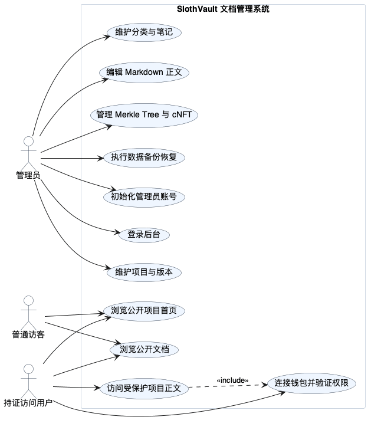
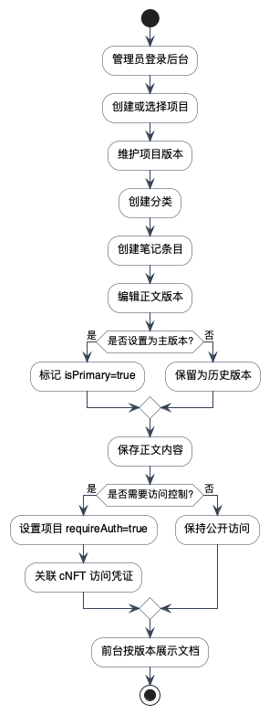
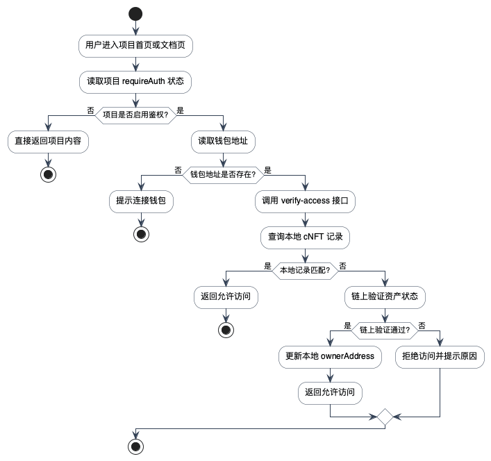
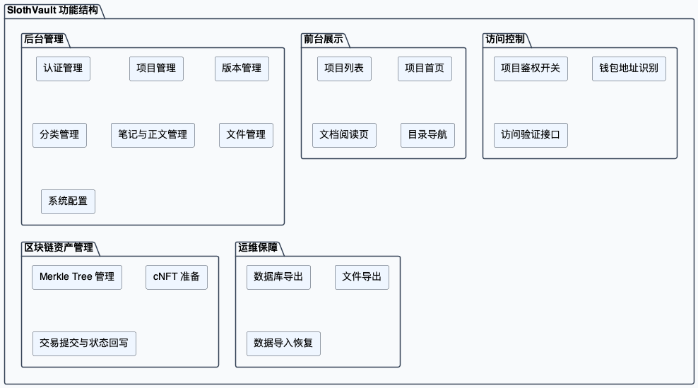
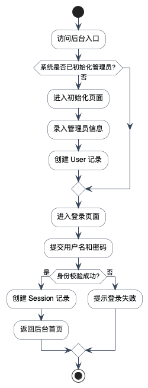
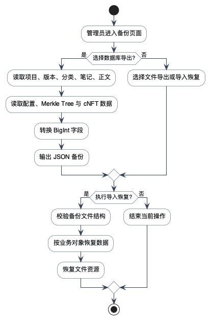

# 第2章 系统需求分析

## 2.1 系统建设目标

SlothVault 的建设目标不是单纯搭建一个 Markdown 编辑器，而是面向项目化文档发布场景，构建一个同时具备内容组织、版本管理、访问控制和资产凭证接入能力的综合平台。根据仓库现有功能，系统目标可以归纳为四点：第一，为管理员提供项目、版本、分类、笔记和正文内容的统一管理入口，使复杂文档可以按项目和版本分层组织；第二，为前台用户提供结构清晰的项目首页与文档阅读界面，使浏览过程能够维持目录导航与正文展示的一致性；第三，为需要保护的项目提供可配置的访问鉴权机制，使内容阅读不再完全依赖中心化账号体系；第四，为系统运维提供备份恢复和基础配置管理能力，降低系统运行风险。考虑到压缩 NFT 访问凭证、链上链下混合存储以及细粒度访问控制已经成为相关研究中的常见技术路径，本系统在需求层面对这些能力进行了重点约束[5][6][11][12]。

系统用户角色可分为管理员、普通访客和持证访问用户三类。管理员负责系统初始化、项目配置、文档录入、链上资产管理和备份恢复，是后台全部功能的操作者。普通访客可以浏览无需鉴权的项目内容，但无法访问启用保护的项目。持证访问用户在连接钱包并通过项目访问验证后，可以查看对应项目的首页和文档内容。系统角色边界如图2-1所示。

图2-1 系统用户角色与业务用例图

从业务视角看，三类角色之间并不存在横向协作关系，而是围绕同一套项目资源形成不同访问深度。管理员能够直接操作后台全部模块，负责内容的创建、修改与发布。普通访客只能读取公开项目的数据结果，不参与内容管理过程。持证访问用户虽然没有后台维护能力，但相较普通访客多出一层“凭证驱动的阅读权限”，这也是系统引入区块链访问控制的核心动因。角色边界的清晰划分有助于后续模块设计和测试用例编排。

### 2.1.1 业务场景约束

SlothVault 面向的并不是传统意义上的综合门户站点，而是围绕文档内容组织和分发构建的专用平台。系统中的项目既可以理解为一组课程资料，也可以理解为一个技术产品文档集合，还可以理解为一套需要基于数字资产进行权限划分的内容包。这意味着系统必须支持跨项目隔离、跨版本并行维护和细粒度阅读控制，而不能把所有内容平铺在单一目录中。根据源码中 `Project`、`ProjectVersion`、`Category`、`NoteInfo` 和 `NoteContent` 的层级关系可以看出，平台一开始就以“多项目、多版本、多笔记”的知识组织场景为目标；而围绕知识组织、权限边界与可信凭证协同的需求划分，也与现有区块链安全存储研究的结论保持一致[11][12][13]。

## 2.2 功能需求分析

### 2.2.1 管理后台功能需求

管理后台承担系统数据维护和业务配置职责，其功能需求主要包括以下方面。

1. 认证管理需求。系统首次运行时需要引导创建管理员账号，后续管理员通过登录接口建立会话。系统应支持会话校验与未授权拦截，保证后台接口只对合法管理员开放。
2. 项目管理需求。管理员需要创建和维护项目基础信息，包括项目名称、封面、排序权重、启用状态以及是否启用访问鉴权。项目是系统内容组织的顶层容器，也是区块链访问凭证的绑定对象。
3. 项目版本管理需求。单一项目存在多版本迭代时，系统应支持版本编号、版本说明、排序与状态管理，以便区分不同阶段的文档集合。
4. 分类与笔记管理需求。每个项目版本下需要建立分类，再在分类下挂接笔记条目，满足多级文档目录组织需求。
5. 笔记内容管理需求。单篇笔记需要支持多个正文版本，并允许指定主显示版本，保证历史修订和当前展示可以并存。
6. 文件与首页管理需求。系统需要管理上传文件、项目首页内容和系统首页内容，以支撑富媒体文档和前台展示页面。
7. 区块链资产管理需求。系统需要支持 Merkle Tree 的创建与维护、压缩 NFT 的准备和提交、配置读取和删除等操作，用于支撑项目访问凭证发行。
8. 备份恢复需求。管理员需要导出数据库业务数据与文件资源，并在必要时执行导入恢复或系统重置。

管理员发布文档内容的核心活动如图2-2所示。

图2-2 文档内容发布活动图

这一流程体现出后台内容维护的几个关键约束。首先，正文内容不是直接挂在项目根节点下，而是必须经过“项目 -> 版本 -> 分类 -> 笔记条目 -> 正文版本”的层次化组织。其次，正文版本支持主版本标识，这意味着前台读取逻辑并不会把每一次历史修改都直接暴露给终端用户，而是优先返回被选中的主显示版本。最后，当项目启用访问控制时，内容发布和凭证配置不再是完全独立的两件事，管理员需要同步考虑受保护项目的访问边界。

### 2.2.2 前台展示与访问需求

前台面向终端阅读用户，功能需求主要体现在以下几个方面。

1. 项目展示需求。系统应提供项目列表、项目首页和项目文档阅读入口，使用户能够根据项目和版本浏览内容。
2. 目录导航需求。系统应在文档阅读页展示分类导航与文档目录，支持用户快速切换不同笔记。
3. Markdown 预览需求。系统应把后台维护的 Markdown 内容以稳定方式渲染到前台页面，保持较好的阅读体验。
4. 访问鉴权需求。对于启用访问保护的项目，系统应在读取首页、侧边栏和正文内容前完成权限验证。未通过验证时，系统应阻止继续请求受保护内容。
5. 钱包关联需求。系统需要识别用户钱包地址，并把该地址作为访问验证的关键输入，用于判断是否持有对应项目的有效 cNFT 资产。

项目访问验证活动如图2-3所示。该流程体现出本系统与传统账号权限平台的差异：访问资格不由单一用户表决定，而是由项目配置、钱包地址和资产校验结果共同决定。这种把访问判断建立在可验证凭证而非单一中心化账号之上的需求设定，与区块链访问控制和零信任认证研究中的问题抽象是相通的[12][13]。

图2-3 项目访问验证活动图

从流程上看，系统首先依据项目本身是否开启 `requireAuth` 决定是否进入鉴权分支，而不是无条件要求所有用户完成钱包验证。这样设计的好处在于平台既能托管完全公开的项目，也能托管具有内容门槛的项目，不会因为引入区块链机制而损害普通文档平台的通用性。当项目需要保护时，服务端会优先检查本地 `CompressedNft` 记录，再根据需要发起链上验证，这种“本地优先、链上兜底”的思路既能降低访问延迟，也能避免过度依赖远程 RPC。

### 2.2.3 系统功能结构

结合页面路由和后端接口，系统整体功能可以归纳为六个一级模块：认证与会话管理、项目与文档管理、前台内容展示、访问鉴权、区块链资产管理和备份恢复。其功能结构如图2-4所示。

图2-4 系统功能结构图

六个一级模块之间并不是彼此独立的静态集合，而是围绕项目主数据形成协同。认证与会话管理保证后台接口的操作者合法；项目与文档管理决定前台能够呈现哪些内容；访问鉴权决定终端用户是否能读取这些内容；区块链资产管理提供访问凭证的数据来源；备份恢复模块则负责在系统演进过程中保证数据可迁移和可恢复。这样的功能结构能够将平台的通用内容管理能力与其特有的区块链访问控制能力统一到一套业务骨架中。

### 2.2.4 角色业务用例说明

为了使需求分析能够进一步落到后续模块设计和实现章节中，需要把角色需求转化为更具体的业务用例。管理员的核心用例不是单一的“维护数据”，而是围绕项目生命周期完成一系列连续动作，包括创建项目、组织版本、录入正文、配置访问控制和执行备份恢复；前台用户的核心用例则围绕浏览、验证和阅读展开。主要业务用例如表2-3所示。

表2-3 角色业务用例说明表

| 角色 | 业务用例 | 用例说明 |
| --- | --- | --- |
| 管理员 | 项目创建与维护 | 新建项目并维护名称、状态、排序和鉴权开关 |
| 管理员 | 版本结构维护 | 为项目建立版本并绑定描述信息 |
| 管理员 | 分类与笔记维护 | 建立分类树和文档条目 |
| 管理员 | 正文版本维护 | 编辑 Markdown 正文并设置主显示版本 |
| 管理员 | 资产管理 | 维护 Merkle Tree 与 cNFT 记录 |
| 管理员 | 备份恢复 | 导出或恢复业务数据与文件资源 |
| 普通访客 | 浏览公开项目 | 查看公开项目首页与文档内容 |
| 持证访问用户 | 受保护项目访问 | 连接钱包并通过鉴权后读取受保护正文 |

从表2-3 可以看出，后台用例以内容维护为主线，前台用例以内容消费为主线，而两条主线的交点在于项目对象本身。项目既是后台维护的主容器，也是前台访问控制的判断对象，因此它在后续数据库设计和接口设计中都必须保持中心地位。

## 2.3 非功能需求分析

### 2.3.1 安全性需求

系统的安全性不仅体现为常规后台登录保护，还体现在项目内容访问边界和链上资产操作安全上。后台应基于会话限制未授权接口访问；前台应在读取受保护项目内容前执行访问验证；链上操作应对参数合法性、会话有效性、签名完整性和交易异常进行处理。此外，由于系统保存了加密后的树权限私钥等敏感信息，部署时需要稳定的密钥环境变量和数据库隔离策略。

具体而言，后台接口中的项目、文件、备份和 Solana 管理逻辑都依赖统一的会话校验结果，未通过认证的请求不应继续进入业务层。前台鉴权场景则更加复杂，因为用户并不一定存在传统后台账号，而是通过钱包地址与链上资产建立身份关联。因此，系统在安全设计上同时存在“管理员会话安全”和“终端访问凭证安全”两条主线，二者分别服务于后台维护和前台阅读两个不同场景。

### 2.3.2 可维护性需求

系统采用 Nuxt 全栈结构和 Prisma ORM，对前后端模块、数据库模型和接口层进行了较明显的职责划分。前端页面按后台与前台场景拆分，后端接口按功能域组织，数据库采用多 schema 分区，有利于后续维护。系统还提供配置刷新、文件管理和备份恢复能力，进一步增强了可运维性。

代码结构的清晰性还体现在页面与接口的命名方式上。后台 API 基本以 `admin/mm` 和 `admin/solana` 两个前缀划分，前台访问接口则以 `project` 作为主域名，避免了混杂式路由组织。数据库层通过 Prisma 模型统一约束字段名称、外键关系和数据类型，使前端页面、服务端接口和持久化模型之间形成稳定的一一对应关系，这对于毕业设计后期的功能维护和问题定位十分关键。

### 2.3.3 可扩展性需求

项目、项目版本、分类和笔记的分层组织方式决定了平台能够持续扩展文档规模。访问鉴权开关设计允许系统对不同项目采用不同权限策略，不会强制所有项目全部接入链上验证。Merkle Tree 管理与 cNFT 记录独立建模，也为未来支持更多链上网络、更多资产类型或更复杂分发策略预留了空间。

从扩展路径上看，系统未来既可以在内容维度上继续增加新的项目类型、主题样式和导航层级，也可以在资产维度上支持不同网络环境、更多凭证生命周期管理策略以及更细粒度的授权组合。例如，当前模型已经为树优先级、容量和网络类型保留了字段，这说明项目后续有能力从单树策略逐步演进到多树冗余或多网络部署。

### 2.3.4 易用性需求

系统需要兼顾后台维护效率和前台阅读体验。后台应提供表格化管理、分页、筛选、弹窗编辑和版本切换等能力；前台应保持统一的文档阅读布局、目录导航和正文显示方式。Markdown 编辑与预览协同能够降低内容录入成本，提高知识库维护效率。角色权限需求如表2-1所示，非功能需求汇总如表2-2所示。

除了常见的人机交互需求外，系统还需要关注两类工程性易用性要求。第一，管理员在维护长篇文档时需要尽可能减少跳转成本，因此版本面板、分类筛选和正文编辑应形成连续工作流。第二，终端用户在阅读项目文档时需要快速判断自己当前所处的项目、版本和笔记位置，因此项目首页、侧边栏和目录组件需要在信息层级上保持一致。

表2-1 角色权限需求表

| 角色 | 主要权限 | 受限内容 |
| --- | --- | --- |
| 管理员 | 登录后台、维护项目和文档、管理链上资产、执行备份恢复 | 无 |
| 普通访客 | 浏览公开项目首页和文档 | 无法访问受保护项目 |
| 持证访问用户 | 浏览已通过校验的受保护项目内容 | 无后台管理权限 |

表2-2 非功能需求分析表

| 类别 | 需求说明 |
| --- | --- |
| 安全性 | 后台会话校验、受保护项目访问验证、链上交易参数校验 |
| 可维护性 | 前后端分层、Prisma 模型统一维护、多 schema 解耦 |
| 可扩展性 | 支持多项目、多版本、多分类、多笔记与可选鉴权 |
| 易用性 | Markdown 编辑预览、前台目录导航、后台表格化管理 |

为了保证需求分析与后续设计章节之间能够建立清晰映射，还需要对需求和功能模块之间的对应关系进行追踪。需求追踪关系如表2-4所示。

表2-4 需求与功能模块追踪表

| 需求类别 | 具体需求 | 对应模块 |
| --- | --- | --- |
| 认证需求 | 管理员初始化、登录、会话校验 | 认证与会话管理模块 |
| 内容需求 | 项目、版本、分类、笔记、正文维护 | 项目与文档管理模块 |
| 展示需求 | 项目首页、文档阅读页、目录导航 | 前台展示模块 |
| 鉴权需求 | 项目访问验证、钱包地址识别、权限分支控制 | 访问鉴权模块 |
| 资产需求 | Tree 管理、cNFT 准备与提交、状态回写 | 区块链资产管理模块 |
| 运维需求 | 数据导出、文件导出、导入恢复 | 备份恢复模块 |

表2-4 的意义在于说明系统设计并不是凭空划分模块，而是由具体需求驱动形成。当某一需求在后文中没有对应模块时，说明系统设计存在缺口；反之，如果出现无法回溯到需求的模块，也说明设计可能偏离实际业务范围。通过这种追踪关系，可以保证论文从需求到设计的逻辑链条更加完整。

## 2.4 业务流程分析

### 2.4.1 管理员初始化与登录流程

管理员初始化流程是后台的入口。首次访问系统时，管理员需要完成账号初始化，后续通过登录接口提交身份信息并建立会话。会话建立后，后台接口通过读取会话状态决定是否继续处理业务请求。该流程如图2-5所示。

图2-5 管理员初始化与登录流程图

初始化与登录流程虽然看起来简单，但它承担着后台全部管理能力的安全入口职责。系统在初始化阶段只允许创建首个管理员账号，后续所有后台请求均以会话为凭证继续执行。这种设计避免了后台接口被匿名调用，也保证了项目维护、资产管理和备份恢复等高风险操作拥有统一的身份判断前提。

### 2.4.2 数据备份与恢复流程

系统提供数据库业务数据和文件资源的导出与导入能力。数据库导出覆盖项目、版本、分类、笔记、正文、配置、Merkle Tree 与压缩 NFT 等业务数据，但不直接导出认证 schema。备份恢复流程如图2-6所示。

图2-6 数据备份恢复流程图

该流程的关键点在于区分“业务数据完整性”和“认证数据隔离”两个目标。对于毕业设计项目而言，项目内容、配置项和链上资产映射关系是系统最重要的业务成果，因此它们需要优先被备份和恢复；认证数据则涉及独立安全边界，是否导出应更加谨慎。源码中导出逻辑明确排除了 `auth` schema，也说明系统在备份策略上并没有简单地追求“一次导出全部数据”，而是采用了更符合实际运维边界的选择性方案。

### 2.4.3 业务规则约束

除显式功能流程外，系统还受到若干隐含业务规则约束，这些约束同样应在需求阶段加以明确。第一，项目是全部业务对象的根节点，版本、分类、笔记和正文都必须依附于某一项目存在。第二，正文展示依赖版本结构和主显示标记，不能在没有明确归属关系的情况下直接输出单篇内容。第三，受保护项目的访问资格必须建立在钱包地址与资产状态的共同验证之上，不能由前端页面单方面决定。第四，备份恢复需要把内容数据和资产映射视为同一业务整体，否则系统恢复后可能失去访问控制能力。

这些业务规则虽然不像页面按钮那样直观，但它们实际决定了系统是否能够长期稳定运行。若忽视这些规则，系统即便页面功能看似齐全，也可能在版本迭代、权限切换或数据迁移时出现结构断裂。因此，在毕业设计论文中明确写出这些约束，有助于说明系统并非简单拼装功能，而是围绕一组稳定业务规则进行实现。

### 2.4.4 需求分析结果归纳

综合前述功能需求、非功能需求和业务流程分析，可以将系统需求归纳为以下三类结果。其一，平台必须具备成熟的文档管理主线，包括项目、版本、分类、笔记和正文维护能力；其二，平台必须允许不同项目采用不同访问策略，从而兼顾公开阅读和受保护阅读两种场景；其三，平台必须具备较基本的运维能力，确保业务数据和资产映射关系可以被导出和恢复。只有在这三类需求同时成立的前提下，后续系统设计才具有完整意义。

## 2.5 本章小结

本章围绕系统建设目标、用户角色、功能需求、非功能需求和关键业务流程对 SlothVault 进行了分析。需求分析表明，该系统既包含传统文档平台所需的项目、版本、分类和正文管理能力，又包含基于钱包地址和压缩 NFT 的项目访问控制逻辑，因此后续系统设计必须同时处理内容组织效率和权限校验可信度两个核心问题。

进一步来看，第2章的分析结果还给后续设计章节提出了三个明确约束。第一，系统必须坚持以项目为核心组织全部业务对象，不能因为引入链上凭证而打散原有内容结构。第二，系统必须允许公开访问与受保护访问并行存在，从而兼顾普通文档站点的通用性与基于凭证的内容门槛控制。第三，系统必须在功能完整之外补充可维护性和可恢复性设计，否则即便前台页面能够正常展示，也难以支撑长期运行。正是这些需求层面的结论，决定了后续系统设计不只是功能罗列，而需要围绕模块边界、数据模型和访问流程进行一体化展开。
