# 第3章 系统设计

## 3.1 系统总体架构设计

为了兼顾内容管理效率和区块链访问控制的可验证性，系统采用“前台展示层、后台管理层、服务接口层、数据存储层、链上资产层”五层协同架构。浏览器侧既承担后台管理界面的交互，也承担前台项目首页和文档阅读页的渲染；服务端基于 Nuxt Server Routes 暴露后台管理、前台访问和 Solana 相关接口；数据库层使用 PostgreSQL 存储业务数据；区块链层负责 Merkle Tree 和压缩 NFT 的资产状态；对象存储层处理上传文件和资产元数据资源。系统总体架构如图3-1所示[7-10]。

图3-1 系统总体架构图

该架构的关键特点在于把文档正文、分类结构和项目元数据继续保留在链下数据库中，把访问凭证抽象为链上资产并与项目记录建立映射关系。这样既避免了全文内容直接上链带来的高成本，也让访问校验具备更强的独立验证能力。这种“链下存主体内容、链上存验证凭据”的总体思路，与压缩 NFT 的官方设计说明以及区块链安全存储研究中的混合存储路径是一致的[5][6][12]。

从分层职责看，浏览器端只负责交互呈现和用户输入采集，服务端负责统一编排接口、业务验证和数据库访问，链上交互被限制在专门的 Solana 资产管理服务中，没有把区块链调用散落到普通文档接口里。这样的职责划分降低了功能耦合度，使系统在关闭区块链访问控制时仍然能够以普通文档平台的形态稳定运行。当项目开启访问保护时，再由访问鉴权模块与资产管理模块协同完成额外校验。

系统部署结构如图3-2所示。前端用户通过浏览器访问 Nuxt 服务，Nuxt 同时承担 SSR/CSR 混合渲染与 API 处理；业务数据存储在 PostgreSQL 中；链上资产信息通过 Solana 网络及其相关 RPC 能力完成读写；图片和其他上传文件则保存在文件目录或对象存储服务中。

图3-2 系统部署结构图

在这一部署结构中，PostgreSQL 承担全部业务主数据的存储职责，适合处理项目、版本、正文和配置等更新频繁的数据；文件目录或对象存储处理图片与附件资源，更适合面向大对象进行读写；Solana 网络则只承担访问凭证相关资产状态的可信记录。三种存储/执行位置的分工，使系统能够在成本、可维护性与可验证性之间取得相对合理的平衡。从工程依据上看，这种分工也与 Nuxt 全栈组织、Prisma 模型维护以及链上链下协同存储的常见实践相吻合[1][2][5][12]。

## 3.2 功能模块设计

### 3.2.1 认证与会话管理模块

认证与会话管理模块主要服务于后台管理场景。系统通过管理员初始化页面创建首个管理员账号，在登录后生成会话记录。数据库中 `User` 实体保存用户名、密码和邮箱等基础信息，`Session` 实体保存令牌哈希、过期时间、撤销时间、登录 IP 和用户代理等会话属性。该模块的职责是保证只有合法管理员才能进入后台接口，同时为后续项目管理、Solana 管理和备份恢复提供统一鉴权入口。

这一模块的设计重点不是复杂的多角色后台体系，而是保持后台入口的稳定性和可验证性。系统把会话状态独立为表结构，而不是简单把登录状态保存在内存中，这为后续的会话失效、过期处理和异常审计提供了基础。对于毕业设计场景而言，这种设计说明项目已经具备了相对规范的后台安全边界，而不仅仅是示例式页面跳转。相关设计虽然服务于本地后台管理，但其“显式会话、统一校验、请求前拦截”的实现思路，与现代全栈框架和 ORM 驱动应用的一般工程方法一致[1][2][4][7]。

### 3.2.2 项目与文档管理模块

项目与文档管理模块是平台的核心业务模块。系统以 `Project` 作为顶层内容单元，每个项目可以继续挂接多个 `ProjectVersion`，每个版本下包含多个 `Category`，分类下再组织多个 `NoteInfo`，而每个笔记条目可关联多个 `NoteContent` 版本。该设计使系统能够同时支持多项目并行维护和单项目多版本长期演化，适合技术文档、课程材料和知识库类场景。

在这一结构下，项目相当于业务主题的承载者，版本相当于某一阶段的内容快照，分类相当于阅读入口层级，笔记条目相当于最终正文的逻辑容器，而正文版本则对应具体文本内容的历史演化。分层的好处在于管理员既可以从宏观层面对项目结构进行维护，也可以从微观层面对单篇笔记的正文版本进行迭代，不需要在扁平化目录中处理所有变更。

### 3.2.3 前台展示模块

前台展示模块包含项目列表、项目首页、版本文档导航与正文阅读。项目首页用于呈现项目介绍或导航性内容，文档阅读页通过左侧分类导航和右侧目录组件增强阅读效率。正文以 Markdown 形式存储，在前端统一渲染，保持内容生产与展示的一致性。

项目首页与文档阅读页采用不同职责定位。项目首页偏向于项目级说明、主题介绍和导航聚合，更适合作为用户进入某一文档集合的起点；文档阅读页则偏向于单篇正文的连续阅读，强调侧边栏导航和正文目录联动。源码中这两类页面分别绑定不同接口，也说明系统在展示层面并没有把所有内容塞入同一渲染模板，而是根据阅读场景进行了拆分。

### 3.2.4 访问鉴权模块

访问鉴权模块是本文系统与普通文档平台的主要差异点。系统为 `Project` 设置 `requireAuth` 标记，当项目启用访问保护后，前台在读取项目首页、分类侧边栏和正文内容前，需要根据钱包地址执行访问验证。服务端通过 `verifyProjectAccess` 逻辑判断当前项目是否开放、钱包地址是否有效以及用户是否持有关联项目的有效资产。项目访问验证时序如图3-3所示。

图3-3 项目访问验证时序图

### 3.2.5 区块链资产管理模块

区块链资产管理模块用于管理 Merkle Tree 和压缩 NFT。`MerkleTree` 实体记录链上树地址、树权限地址、加密后的树权限私钥、网络类型、容量、成本和状态等信息；`CompressedNft` 实体记录资产 ID、所属项目、叶子索引、所有者地址、元数据 CID、交易签名和状态。后台通过一组专用接口完成树的创建、成本估算、cNFT 铸造准备与交易提交流程。

这一模块的设计说明平台并不是简单调用第三方钱包组件完成前端签名后即结束，而是同时维护本地业务上下文和链上状态回写。尤其是 `CompressedNft` 与 `Project` 之间的映射关系，使系统能够把链上资产直接解释为“某一项目的访问凭证”，从而把原本通用的数字资产抽象转化为具体的内容访问控制能力。这一设计既符合压缩 NFT 的状态压缩和低成本凭证分发逻辑，也与区块链访问控制研究中“以可验证资产或链上记录承载访问资格”的思路保持一致[5][6][13]。

### 3.2.6 文件与备份恢复模块

文件管理模块负责保存上传文件的原始文件名、服务器文件名、相对路径、大小和业务类型。备份恢复模块则负责数据库业务数据的导出和导入。由于系统把文件资源和结构化业务数据分开管理，备份时能够分别处理数据层和文件层内容，降低整体恢复复杂度。

将文件元数据独立为 `FileManagement` 实体还有一个直接价值，即后台可以根据业务类型区分头像、正文附件和其他资源，不需要从文件路径或命名规则中反推业务用途。对于内容系统而言，这种显式建模方式比简单的本地目录堆积更适合长期维护和数据迁移。

## 3.3 数据库设计

### 3.3.1 数据库总体设计

系统使用 PostgreSQL 作为关系数据库，并在 Prisma 中按 `auth`、`collections`、`docs` 和 `public` 四个 schema 划分业务边界。认证相关数据集中在 `auth`；项目、版本、分类和首页等集合数据集中在 `collections`；文档标题与正文版本位于 `docs`；文件、系统配置、系统首页和区块链资产数据位于 `public`。这种划分方式有利于保持模型层次清晰，也方便后续权限控制和数据维护。

系统核心实体关系如图3-4所示。项目与项目版本是一对多关系，项目版本与分类是一对多关系，分类与笔记信息是一对多关系，笔记信息与笔记内容是一对多关系。区块链资产方面，Merkle Tree 与压缩 NFT 也是一对多关系，而每条压缩 NFT 记录通过 `projectId` 关联具体项目，形成“资产凭证绑定项目”的鉴权模型。

图3-4 系统核心实体关系图

### 3.3.2 认证实体设计

用户实体，用来存储管理员账号信息，用户实体结构图如图3-5所示。

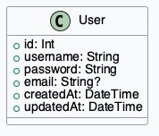

图3-5 用户实体结构图

`User` 实体字段数量不多，但足以支撑后台认证所需的核心信息。其中 `username` 和 `password` 用于登录识别，`email` 作为补充联系方式字段，`createdAt` 与 `updatedAt` 则便于记录账号生命周期。由于当前系统面向单管理员或少量管理员场景，该实体并未承担复杂的组织架构与权限矩阵职责，这也与项目规模相匹配。

表3-4 用户实体关键字段说明表

| 字段名 | 数据类型 | 说明 |
| --- | --- | --- |
| `id` | Int | 用户主键，自增生成 |
| `username` | String | 后台登录账号名，要求唯一 |
| `password` | String | 管理员密码的持久化字段 |
| `email` | String | 可选联系邮箱 |
| `createdAt` | DateTime | 账号创建时间 |
| `updatedAt` | DateTime | 账号最后更新时间 |

会话实体，用来存储后台登录会话信息，会话实体结构图如图3-6所示。

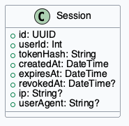

图3-6 会话实体结构图

`Session` 实体通过 `tokenHash`、`expiresAt` 与 `revokedAt` 等字段，把后台会话从简单的内存状态提升为可审计、可过期、可撤销的数据对象。对于需要长期运行的后台系统而言，这一设计比一次性 cookie 校验更稳健，也便于在异常登录或主动退出场景中执行清理。

表3-5 会话实体关键字段说明表

| 字段名 | 数据类型 | 说明 |
| --- | --- | --- |
| `id` | UUID | 会话主键 |
| `userId` | Int | 关联管理员账号 |
| `tokenHash` | String | 会话令牌哈希值 |
| `expiresAt` | DateTime | 会话失效时间 |
| `revokedAt` | DateTime | 会话主动撤销时间 |
| `ip` | String | 登录来源地址 |
| `userAgent` | String | 客户端代理信息 |

### 3.3.3 文档集合实体设计

项目实体，用来存储文档项目的基础元数据，项目实体结构图如图3-7所示。

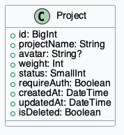

图3-7 项目实体结构图

`Project` 是整个平台的主实体。它既定义了一个文档集合的业务名称，也决定该集合是否启用访问保护。字段中的 `weight` 和 `status` 对应后台排序与启停控制，`avatar` 对应前台视觉展示，而 `requireAuth` 则把普通内容平台的项目对象与访问控制机制连接起来。

表3-6 项目实体关键字段说明表

| 字段名 | 数据类型 | 说明 |
| --- | --- | --- |
| `id` | BigInt | 项目主键 |
| `projectName` | String | 项目名称，前后台统一展示 |
| `avatar` | String | 项目封面图路径 |
| `weight` | Int | 列表排序权重 |
| `status` | SmallInt | 启用或停用状态 |
| `requireAuth` | Boolean | 是否启用项目访问鉴权 |
| `isDeleted` | Boolean | 软删除标记 |

项目版本实体，用来存储项目不同版本下的文档集合信息，项目版本实体结构图如图3-8所示。

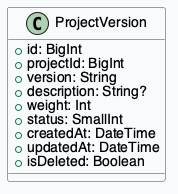

图3-8 项目版本实体结构图

通过在 `ProjectVersion` 中显式记录版本号与描述，系统能够把同一项目的不同阶段文档隔离开来，避免旧版本内容被新版本覆盖。这对于技术文档类场景十分重要，因为接口说明、部署说明和用户指南往往会随着软件版本迭代发生结构性变化。

表3-7 项目版本实体关键字段说明表

| 字段名 | 数据类型 | 说明 |
| --- | --- | --- |
| `id` | BigInt | 版本主键 |
| `projectId` | BigInt | 所属项目 ID |
| `version` | String | 版本号或版本名称 |
| `description` | Text | 版本说明 |
| `weight` | Int | 排序权重 |
| `status` | SmallInt | 版本状态 |
| `isDeleted` | Boolean | 软删除标记 |

分类实体，用来存储项目版本下的文档分类信息，分类实体结构图如图3-9所示。

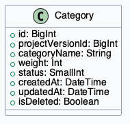

图3-9 分类实体结构图

`Category` 为前台侧边栏导航和后台分层筛选提供了直接支撑。分类并不承担正文内容存储职责，而是作为逻辑容器把同类笔记组织在一起，这种设计既有助于前台阅读时的扫描，也便于后台在大量笔记中快速定位内容。

表3-8 分类实体关键字段说明表

| 字段名 | 数据类型 | 说明 |
| --- | --- | --- |
| `id` | BigInt | 分类主键 |
| `projectVersionId` | BigInt | 所属项目版本 ID |
| `categoryName` | String | 分类名称 |
| `weight` | Int | 排序权重 |
| `status` | SmallInt | 分类状态 |
| `isDeleted` | Boolean | 软删除标记 |

笔记信息实体，用来存储文档标题、排序和状态信息，笔记信息实体结构图如图3-10所示。

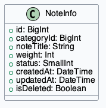

图3-10 笔记信息实体结构图

`NoteInfo` 与 `NoteContent` 的拆分是该系统较为典型的设计点。前者保存“这篇文档是什么”，后者保存“这篇文档当前写了什么”。这种分层既能支持多版本正文，也能使前台路由长期绑定稳定的笔记条目，而不需要因为正文版本变化频繁调整访问地址。

表3-9 笔记信息实体关键字段说明表

| 字段名 | 数据类型 | 说明 |
| --- | --- | --- |
| `id` | BigInt | 笔记主键 |
| `categoryId` | BigInt | 所属分类 ID |
| `noteTitle` | String | 笔记标题 |
| `weight` | Int | 排序权重 |
| `status` | SmallInt | 笔记状态 |
| `isDeleted` | Boolean | 软删除标记 |

笔记内容实体，用来存储文档正文版本内容，笔记内容实体结构图如图3-11所示。

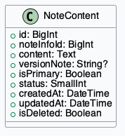

图3-11 笔记内容实体结构图

`NoteContent` 中的 `versionNote` 和 `isPrimary` 字段提供了正文版本管理所需的最小完备信息：管理员可以为一次更新留下修改说明，也可以指定哪一版内容作为默认展示版本。这样设计后，即便用户不直接看到所有历史版本，后台仍然保留了足够的内容演化轨迹。

表3-10 笔记内容实体关键字段说明表

| 字段名 | 数据类型 | 说明 |
| --- | --- | --- |
| `id` | BigInt | 正文版本主键 |
| `noteInfoId` | BigInt | 所属笔记 ID |
| `content` | Text | Markdown 正文内容 |
| `versionNote` | String | 本次版本说明 |
| `isPrimary` | Boolean | 是否为主显示版本 |
| `status` | SmallInt | 正文状态 |
| `isDeleted` | Boolean | 软删除标记 |

项目表关键字段设计如表3-1所示，文档内容表关键字段设计如表3-2所示。

表3-1 项目表关键字段设计表

| 字段名 | 含义 | 设计说明 |
| --- | --- | --- |
| `projectName` | 项目名称 | 作为前台展示与后台检索的主标识 |
| `avatar` | 项目封面 | 支持项目视觉展示 |
| `weight` | 排序权重 | 控制后台与前台排序 |
| `status` | 启用状态 | 区分上线与停用状态 |
| `requireAuth` | 是否需要鉴权 | 决定项目是否走 cNFT 访问控制 |

表3-2 文档内容表关键字段设计表

| 字段名 | 含义 | 设计说明 |
| --- | --- | --- |
| `noteInfoId` | 笔记条目 ID | 关联上层文档条目 |
| `content` | Markdown 正文 | 存储实际文档内容 |
| `versionNote` | 版本备注 | 说明该内容版本的修改意图 |
| `isPrimary` | 是否主版本 | 决定前台默认显示版本 |
| `status` | 内容状态 | 支撑启用与停用控制 |

### 3.3.4 公共配置与文件实体设计

文件管理实体，用来存储上传文件的元数据，文件管理实体结构图如图3-12所示。

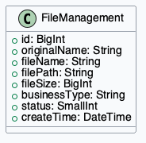

图3-12 文件管理实体结构图

`FileManagement` 以元数据方式管理上传资源，其关键在于既保留原始文件名，也保留服务器文件名和相对路径。这样既能为前台提供友好的文件展示名称，也能保证服务端实际存储路径不受用户上传命名干扰。

表3-11 文件管理实体关键字段说明表

| 字段名 | 数据类型 | 说明 |
| --- | --- | --- |
| `id` | BigInt | 文件主键 |
| `originalName` | String | 用户上传时的原始文件名 |
| `fileName` | String | 服务端保存文件名 |
| `filePath` | String | 文件相对路径 |
| `fileSize` | BigInt | 文件大小 |
| `businessType` | String | 文件所属业务类型 |
| `status` | SmallInt | 文件状态 |

系统配置实体，用来存储系统级键值配置，系统配置实体结构图如图3-13所示。

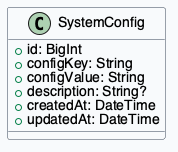

图3-13 系统配置实体结构图

`SystemConfig` 使用键值形式组织系统级参数，适合管理网络地址、功能开关和其他运行配置。相较把全部配置写死在代码中，这种实体化设计便于管理员后期在后台界面或维护工具中进行统一更新。

表3-12 系统配置实体关键字段说明表

| 字段名 | 数据类型 | 说明 |
| --- | --- | --- |
| `id` | BigInt | 配置主键 |
| `configKey` | String | 配置项名称 |
| `configValue` | String | 配置项值 |
| `description` | String | 配置说明 |
| `createdAt` | DateTime | 创建时间 |
| `updatedAt` | DateTime | 更新时间 |

系统首页实体，用来存储系统首页 Markdown 内容，系统首页实体结构图如图3-14所示。

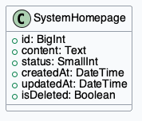

图3-14 系统首页实体结构图

`SystemHomepage` 与项目首页类似，都是把可编辑的 Markdown 内容作为数据落库，而不是把首页内容固化在前端模板中。这使系统具备了轻量内容运营能力，管理员可以在不改动代码的情况下更新系统入口页。

表3-13 系统首页实体关键字段说明表

| 字段名 | 数据类型 | 说明 |
| --- | --- | --- |
| `id` | BigInt | 系统首页主键 |
| `content` | Text | Markdown 正文内容 |
| `status` | SmallInt | 首页启用状态 |
| `createdAt` | DateTime | 创建时间 |
| `updatedAt` | DateTime | 更新时间 |
| `isDeleted` | Boolean | 软删除标记 |

### 3.3.5 区块链资产实体设计

Merkle Tree 实体，用来存储系统级压缩 NFT 树信息，Merkle Tree 实体结构图如图3-15所示。

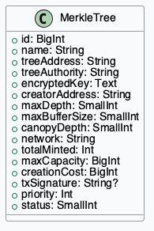

图3-15 Merkle Tree 实体结构图

`MerkleTree` 实体是区块链访问控制设计中的基础设施实体。它既保存链上地址和权限信息，也记录容量、成本、优先级和网络类型等运行属性。这些字段使系统能够在应用层面对树的可用性进行判断，而不是把所有链上状态都视为不可解释的外部黑盒。

表3-14 Merkle Tree 实体关键字段说明表

| 字段名 | 数据类型 | 说明 |
| --- | --- | --- |
| `id` | BigInt | 树记录主键 |
| `treeAddress` | String | 链上树地址 |
| `treeAuthority` | String | 树权限地址 |
| `encryptedKey` | Text | 加密后的树权限私钥 |
| `network` | String | 所属链网络 |
| `maxDepth` | SmallInt | 树深度 |
| `maxBufferSize` | SmallInt | 最大缓冲区大小 |
| `totalMinted` | Int | 当前已铸造数量 |
| `maxCapacity` | BigInt | 最大容量 |
| `status` | SmallInt | 树状态 |

压缩 NFT 实体，用来存储项目访问凭证资产信息，压缩 NFT 实体结构图如图3-16所示。

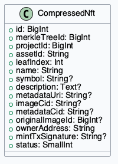

图3-16 压缩 NFT 实体结构图

`CompressedNft` 实体是链上凭证和本地项目之间的连接点。通过 `projectId`、`assetId`、`ownerAddress` 和 `status` 等字段，服务端可以把“用户是否持有某资产”翻译为“用户是否能访问某项目”。这正是系统访问鉴权逻辑成立的关键。

表3-15 压缩 NFT 实体关键字段说明表

| 字段名 | 数据类型 | 说明 |
| --- | --- | --- |
| `id` | BigInt | 资产记录主键 |
| `merkleTreeId` | BigInt | 所属树 ID |
| `projectId` | BigInt | 绑定项目 ID |
| `assetId` | String | 链上资产唯一标识 |
| `leafIndex` | Int | 叶子索引 |
| `ownerAddress` | String | 当前持有者地址 |
| `mintTxSignature` | String | 铸造交易签名 |
| `metadataUri` | String | 元数据 URI |
| `originalImageId` | BigInt | 原始图片文件 ID |
| `status` | SmallInt | 资产状态 |

区块链资产表关键字段设计如表3-3所示。

表3-3 区块链资产表关键字段设计表

| 字段名 | 含义 | 设计说明 |
| --- | --- | --- |
| `projectId` | 关联项目 ID | 决定资产对应哪一个受保护项目 |
| `assetId` | 链上资产标识 | 用于唯一定位压缩 NFT |
| `leafIndex` | 叶子索引 | 用于资产 ID 计算与链上证明 |
| `ownerAddress` | 当前持有者地址 | 参与项目访问校验 |
| `status` | 资产状态 | 区分铸造中、正常和失败状态 |

## 3.4 接口与模块协同设计

系统接口按后台管理、前台访问和 Solana 管理三个方向组织。后台项目管理接口负责项目及其附属资源的增删改查；前台访问接口负责项目首页、侧边栏和正文获取；Solana 管理接口负责树和压缩 NFT 的准备、提交和状态维护。接口层统一通过服务端读取数据库并返回结构化结果，前端页面只处理展示和交互，不直接访问数据库或区块链。

在模块协同方面，后台维护的项目是否鉴权配置会直接影响前台访问行为；区块链资产模块写入的项目绑定关系会影响 `verify-access` 接口返回结果；备份模块则需要覆盖项目、文档、配置和链上资产等多类数据对象。这种协同关系要求数据库结构、接口组织和页面交互保持稳定的名称体系和数据流边界。

### 3.4.1 后台管理接口设计

后台管理接口集中在 `admin/mm` 域下，其组织方式与后台页面结构基本一致。项目、版本、分类、笔记、正文、文件和首页等资源都拥有各自的接口集合，并统一依赖后台会话状态。这样的接口划分方式降低了页面与业务层的耦合，也便于在测试章节中针对不同资源对象进行分组验证。

表3-16 后台管理核心接口设计表

| 接口路径 | 方法 | 主要作用 |
| --- | --- | --- |
| `/api/admin/mm/project` | GET | 分页查询项目列表 |
| `/api/admin/mm/project` | POST | 创建项目 |
| `/api/admin/mm/project/[id]` | PUT | 更新项目信息 |
| `/api/admin/mm/project/[id]` | DELETE | 删除项目 |
| `/api/admin/mm/projectVersion/index` | GET/POST | 查询或创建项目版本 |
| `/api/admin/mm/category/index` | GET/POST | 查询或创建分类 |
| `/api/admin/mm/note/index` | GET/POST | 查询或创建笔记条目 |
| `/api/admin/mm/noteContent/index` | GET/POST | 查询或创建正文版本 |
| `/api/admin/mm/file/index` | GET/POST | 查询或上传文件 |
| `/api/admin/mm/home/index` | GET/POST | 查询或创建项目首页 |
| `/api/admin/mm/config/index` | GET/PUT | 读取或更新系统配置 |
| `/api/admin/mm/backup/database-export` | GET | 导出业务数据库快照 |

### 3.4.2 前台访问接口设计

前台访问接口以 `project` 域为主，核心职责是按项目与版本返回可展示的数据结果。与后台接口相比，前台接口并不暴露复杂的维护操作，而是重点处理项目列表、项目首页、侧边栏结构、正文内容以及访问鉴权请求。这种“读多写少”的接口设计更加符合文档平台的前台消费特征。

表3-17 前台访问核心接口设计表

| 接口路径 | 方法 | 主要作用 |
| --- | --- | --- |
| `/api/project/list` | GET | 获取公开项目列表 |
| `/api/project/[id]` | GET | 获取指定项目基础信息 |
| `/api/project/[id]/home` | GET | 获取项目首页正文 |
| `/api/project/[id]/versions` | GET | 获取项目版本列表 |
| `/api/project/[id]/menu` | GET | 获取项目导航菜单 |
| `/api/project/[id]/verify-access` | POST | 校验项目访问资格 |
| `/api/project/[id]/v/[versionId]/sidebar` | GET | 获取某版本下的分类与笔记树 |
| `/api/project/[id]/v/[versionId]/note/[noteId]` | GET | 获取具体笔记正文 |

### 3.4.3 链上资产接口设计

Solana 管理接口与普通文档接口保持隔离，是因为其入参与状态流转都更复杂。树创建需要容量和网络配置，cNFT 铸造需要准备会话和签名交易，交易提交还要处理确认状态与资产 ID 回写。因此，这部分接口在系统设计上被单独划出，避免其异常路径污染普通文档管理逻辑。

表3-18 Solana 资产管理核心接口设计表

| 接口路径 | 方法 | 主要作用 |
| --- | --- | --- |
| `/api/admin/solana/config` | GET/PUT | 读取或更新链上配置 |
| `/api/admin/solana/tree/index` | GET | 查询 Merkle Tree 列表 |
| `/api/admin/solana/tree/prepare` | POST | 准备树创建上下文 |
| `/api/admin/solana/tree/estimate` | POST | 估算树创建成本 |
| `/api/admin/solana/tree/submit` | POST | 提交树创建交易 |
| `/api/admin/solana/tree/[id]/delete` | DELETE | 删除树记录 |
| `/api/admin/solana/cnft/index` | GET | 查询压缩 NFT 列表 |
| `/api/admin/solana/cnft/prepare` | POST | 准备 cNFT 铸造上下文 |
| `/api/admin/solana/cnft/submit` | POST | 提交签名交易并回写资产状态 |
| `/api/admin/solana/cnft/[id]/delete` | DELETE | 删除资产记录 |

### 3.4.4 模块协同约束

系统模块协同需要满足三个约束。第一，项目主数据始终是前台访问、区块链资产绑定和备份恢复的共同锚点，任何附属模块都不能绕过项目直接形成独立业务单元。第二，正文读取必须服从版本结构和访问校验结果，不能因为前台页面快捷展示而跳过业务边界。第三，链上资产变化最终要能够回落到数据库记录中，否则前台访问验证无法保持稳定性能。

除了上述约束外，模块协同还表现为明显的数据流闭环。管理员在后台修改项目和正文后，变更结果会先落到数据库，再通过前台接口提供给终端用户读取；当项目启用访问鉴权时，链上资产记录会通过本地数据库映射回到项目对象，最终影响前台接口的返回结果；当执行备份恢复时，项目、正文、配置和资产映射又需要作为一体被导出和导入。由此可见，系统虽然表面上分为多个模块，但在数据层始终围绕项目主线形成统一闭环。

## 3.5 本章小结

本章从总体架构、功能模块、数据库设计和接口协同四个方面对系统进行了设计。设计结果表明，SlothVault 采用的是典型的“内容业务链下维护、访问凭证链上验证”的混合式体系结构，既保留了文档平台的可维护性，又为项目级访问控制提供了可验证的资产化机制，为后续系统实现奠定了结构基础。
