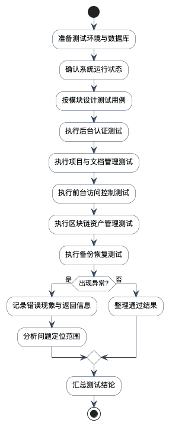

# 第5章 系统测试

## 5.1 测试目标与测试环境

系统测试的目标是验证后台认证、项目与文档管理、前台访问控制、区块链资产管理以及备份恢复等关键功能是否满足需求分析提出的业务目标。由于当前仓库以代码和页面为主要证据，本章在论述时将严格区分两类内容：一类是可以通过源码逻辑和接口分支直接确认的处理行为；另一类是需要在系统运行后通过页面操作或链上交互进一步补齐的执行结果。这样可以避免把尚未实际运行的结果写成既成事实。

测试环境建议采用 Node.js 运行 Nuxt 服务、PostgreSQL 作为数据库、浏览器作为前端访问终端，并根据项目配置准备可用的 Solana 开发网络环境。系统测试实施流程如图5-1所示。

图5-1 系统测试实施流程图

测试环境至少应满足以下条件：其一，Nuxt 服务能够正常启动并连接到 PostgreSQL；其二，数据库中存在用于验证项目、版本、分类和正文读取流程的基础测试数据；其三，区块链相关环境变量和 RPC 地址能够支持树与 cNFT 接口执行；其四，浏览器端能够访问后台登录页、后台管理页以及前台项目页。若其中任意一项缺失，则系统只能完成部分静态逻辑验证，而无法形成完整的运行级测试记录。

表5-0 测试环境配置表

| 项目 | 配置说明 |
| --- | --- |
| 应用运行环境 | Node.js + Nuxt 4 |
| 数据库环境 | PostgreSQL |
| 客户端环境 | Chrome 或同类现代浏览器 |
| 区块链环境 | Solana Devnet 或具备 DAS 能力的 RPC |
| 测试数据 | 项目、版本、分类、笔记、正文、树与 cNFT 记录 |

## 5.2 测试方法

本系统采用功能测试与异常处理测试相结合的方法。功能测试主要验证页面交互路径、接口入参与返回结构、数据库字段之间的业务对应关系是否满足需求；异常处理测试主要关注未授权访问、参数缺失、钱包地址格式错误、交易签名不完整、会话失效等场景。对于能够从源码直接观察到的接口逻辑，应优先以接口分支与返回码作为测试依据；对于需要用户界面和链上环境参与的流程，应通过用例设计明确预期结果并在后续运行环境中补充截图和执行记录。

此外，考虑到系统同时包含常规内容管理模块和区块链访问控制模块，测试方法还应兼顾“业务闭环验证”和“异常分支验证”两个层面。业务闭环验证强调管理员如何创建项目并最终让前台用户读取文档；异常分支验证则强调错误参数、失效会话、无效钱包地址和失败交易应当如何被系统拦截。二者结合后，才能较完整地评估该系统是否真正具备工程可用性。

## 5.3 功能测试用例设计

### 5.3.1 登录与会话测试

登录与会话测试主要验证后台认证入口是否可靠，包括管理员初始化后能否正常登录、会话失效后是否正确拦截后台接口、未登录访问时是否返回未授权状态等。测试用例如表5-1所示。

这组测试的关键不在于页面是否能展示一个登录框，而在于后台会话机制是否真正参与了资源保护。因为项目管理、文件管理、备份恢复和 Solana 管理都属于高权限操作，所以认证测试必须覆盖“登录成功后可操作”和“未授权时不能操作”两个方向。

表5-1 登录与会话测试用例表

| 测试编号 | 测试内容 | 预期结果 |
| --- | --- | --- |
| T-01 | 使用合法管理员账号登录后台 | 登录成功并建立会话 |
| T-02 | 未登录直接访问后台接口 | 返回未授权状态 |
| T-03 | 使用失效会话访问备份接口 | 返回未授权状态 |
| T-04 | 登录后访问项目管理页 | 正常展示项目列表 |

### 5.3.2 项目与文档管理测试

项目与文档管理测试主要验证项目、版本、分类、笔记和笔记内容能否按预期组织与保存。该部分的重点在于分层数据结构是否清晰，筛选联动是否正确，以及主显示内容是否能够和版本结构对应。测试用例如表5-2所示。

如果把这一组测试进一步展开，可以发现其实际验证的是系统内容模型是否自洽。项目新增成功并不代表平台就具备完整的内容维护能力，只有当版本、分类、笔记和正文版本都能围绕同一项目层层建立时，前台页面才可能呈现出稳定的导航关系。

表5-2 项目与文档管理测试用例表

| 测试编号 | 测试内容 | 预期结果 |
| --- | --- | --- |
| T-05 | 新增项目并设置 `requireAuth=false` | 项目保存成功并可在列表中查询 |
| T-06 | 为项目新增版本 | 版本记录正确关联项目 |
| T-07 | 在版本下新增分类和笔记 | 分类与笔记层级正确建立 |
| T-08 | 为笔记新增正文主版本 | 前台默认显示主版本内容 |

### 5.3.3 前台鉴权访问测试

前台访问测试主要验证公开项目和受保护项目在访问路径上的差异。对于公开项目，用户应可以直接读取项目首页和正文内容；对于受保护项目，若未提供钱包地址或未通过验证，则系统应阻止获取受保护资源。测试用例如表5-3所示。

这一组测试直接对应本课题的核心特色。若系统对公开项目和受保护项目不做区分，那么区块链访问控制模块就没有实际价值；反之，如果系统对所有项目都强制钱包验证，又会损害普通文档阅读的可用性。因此，测试中必须同时验证“无需鉴权的路径仍然顺畅”和“需要鉴权的路径确实被约束”。

表5-3 前台鉴权访问测试用例表

| 测试编号 | 测试内容 | 预期结果 |
| --- | --- | --- |
| T-09 | 访问未启用鉴权的项目首页 | 正常展示内容 |
| T-10 | 未携带有效钱包信息访问受保护项目 | 返回无访问权限提示 |
| T-11 | 调用访问验证接口并提供非法钱包地址 | 返回参数错误 |
| T-12 | 已持有有效资产的用户访问受保护正文 | 通过校验并显示内容 |

### 5.3.4 区块链资产管理测试

区块链测试主要关注树创建、cNFT 准备和交易提交流程中的参数校验、异常处理和状态回写能力。虽然最终链上执行结果依赖网络环境，但从源码可以直接确认系统对会话失效、签名缺失、余额不足和交易过期等异常已经进行了显式处理。测试用例如表5-4所示。

对于毕业设计论文而言，这组测试更强调工程边界的完备性，而不是单纯追求链上调用成功次数。原因在于区块链接口往往受外部网络、钱包环境和 RPC 状态影响较大，若只展示成功路径而忽略错误分支，反而不能说明系统的真实可用程度。当前源码已经将多类失败情形显式分类处理，这为后续运行级验证提供了较好的基础。

表5-4 区块链资产管理测试用例表

| 测试编号 | 测试内容 | 预期结果 |
| --- | --- | --- |
| T-13 | 准备 Merkle Tree 创建参数 | 返回合法的创建上下文 |
| T-14 | 提交缺少签名的 cNFT 交易 | 返回签名无效错误 |
| T-15 | 使用过期会话提交 cNFT 交易 | 返回会话过期错误 |
| T-16 | 交易成功后回写资产 ID | 记录更新为正常状态 |

### 5.3.5 备份恢复与异常处理测试

备份恢复测试主要验证导出范围是否覆盖系统关键业务对象，以及异常情况下接口是否能返回明确错误。测试用例如表5-5 和表5-6 所示。

从运维角度看，备份恢复能力决定了系统是否具备继续维护和迁移的基础。尤其是该平台同时管理文档结构数据、Markdown 正文数据、文件资源与区块链资产映射关系，如果缺少统一备份能力，后续任何一次部署调整都可能造成数据断裂。因此，这部分测试虽不直接面向终端用户，却是评估系统完整性的必要内容。

表5-5 备份恢复测试用例表

| 测试编号 | 测试内容 | 预期结果 |
| --- | --- | --- |
| T-17 | 导出数据库业务数据 | 返回项目、文档、配置和链上资产数据 |
| T-18 | 导出文件资源 | 返回可恢复的文件集合 |
| T-19 | 导入合法备份数据 | 业务数据能够恢复 |

表5-6 异常处理测试用例表

| 测试编号 | 测试内容 | 预期结果 |
| --- | --- | --- |
| T-20 | 缺少项目 ID 调用访问验证接口 | 返回 400 错误 |
| T-21 | 非法项目 ID 调用访问验证接口 | 返回 400 错误 |
| T-22 | 请求不存在项目 | 返回 404 错误 |
| T-23 | 数据导出过程中出现异常 | 返回导出失败提示 |

### 5.3.6 需求覆盖关系检查

为了避免测试章节只列出零散用例而无法说明系统是否真正覆盖了前文提出的需求，本文进一步将测试项与需求模块进行对应整理，结果如表5-7所示。

表5-7 测试项与需求覆盖关系表

| 需求模块 | 对应测试编号 | 说明 |
| --- | --- | --- |
| 认证与会话管理 | T-01 至 T-04 | 覆盖后台登录与会话控制 |
| 项目与文档管理 | T-05 至 T-08 | 覆盖内容结构维护 |
| 前台访问控制 | T-09 至 T-12 | 覆盖公开访问与受保护访问分支 |
| 区块链资产管理 | T-13 至 T-16 | 覆盖树与 cNFT 核心流程 |
| 备份恢复 | T-17 至 T-19 | 覆盖业务快照导入导出 |
| 异常处理 | T-20 至 T-23 | 覆盖典型错误入参与失败路径 |

表5-7 表明，测试体系已经能够和第2章中定义的主要需求模块形成一一对应关系。这样做的价值在于，测试结论不再只是“某些接口能用”，而是能够回答“系统是否对主要需求给出了验证路径”这一更关键的问题。

## 5.4 测试结果分析

从当前代码证据可以直接确认，系统已经在多个关键接口中建立了较明确的输入校验和错误处理逻辑。例如，访问验证接口会对项目 ID、钱包地址格式和项目存在性进行判断；后台备份导出接口会在读取会话后再处理数据库业务数据，并对异常统一返回失败结果；cNFT 提交接口会先检查会话状态，再验证交易反序列化结果和签名完整性，然后才进入链上发送和状态更新流程。这些实现说明系统在高风险操作上并不是直接串行执行，而是先通过条件校验缩小错误传播范围。

从模块覆盖范围看，当前测试设计已经能够对应系统的主要业务链条。后台认证测试覆盖了管理入口安全；项目与文档管理测试覆盖了内容结构是否可维护；前台鉴权访问测试覆盖了项目公开性与访问保护的分支差异；区块链资产管理测试覆盖了凭证发行与状态维护链路；备份恢复测试则覆盖了运维层的完整性要求。也就是说，测试体系并不是围绕单个页面堆叠，而是围绕业务闭环组织的。

为了进一步说明当前代码证据能够支撑的测试结论，可以将测试结果分为“已由源码逻辑直接支撑”和“需要运行环境补充证明”两类，见表5-8。

表5-8 测试结果证据类型表

| 测试内容 | 当前证据类型 | 说明 |
| --- | --- | --- |
| 参数合法性校验 | 已由源码直接支撑 | 接口存在明确的输入判断分支 |
| 会话未授权拦截 | 已由源码直接支撑 | 后台接口统一读取会话 |
| 项目访问控制分支 | 已由源码直接支撑 | `requireAuth` 与 `verify-access` 逻辑明确 |
| 正文版本主显示机制 | 已由源码直接支撑 | 存在 `isPrimary` 字段与内容读取逻辑 |
| 页面交互最终视觉效果 | 需运行环境补充 | 需要真实页面截图或录像证明 |
| cNFT 链上确认结果 | 需运行环境补充 | 需要真实链上交易与回写记录 |
| 备份恢复回放效果 | 需运行环境补充 | 需要在实际数据集上执行导入导出 |

同时也应看到，测试章节中仍有一部分结果需要在真实运行环境下补充，尤其是页面截图、链上交易成功后的界面反馈、不同钱包持有状态下的访问路径和备份恢复操作的完整回放。对于这些尚未附带实测记录的内容，本文只给出测试方案和预期结果，不把它们写成已经完成的性能或稳定性结论。这种保守写法更符合毕业论文对证据边界的要求。

在后续完善中，最值得优先补齐的证据包括三类。第一类是第4章所需的页面截图与对应测试路径，这能够把实现说明和测试记录连接起来；第二类是典型接口的真实返回结果，例如项目访问验证的成功与失败案例；第三类是链上交易成功后的数据库回写记录，这能够进一步增强“访问凭证绑定项目”的论证力度。只要这些材料能够在本地环境中补齐，系统测试章节就能从“代码证据驱动”进一步提升为“运行证据驱动”。

从论文写作角度看，采用这种分层结论方式还有一个优势，即可以最大程度避免“为了完整而过度推断”。毕业论文需要体现系统完成度，但完成度不应建立在未经证实的性能数字或虚构截图之上。通过把现有结论限定在源码和真实逻辑能够支撑的范围内，再把待补部分明确标记为运行级验证任务，整篇论文的可信度会更高，也更符合软件工程类项目的证据表达方式。

进一步地，测试章节所呈现的并不是一组彼此孤立的验证动作，而是对整个系统工程质量的综合观察。后台认证决定高权限操作是否可控，项目与文档管理决定业务数据结构是否稳定，前台访问控制决定内容开放边界是否清晰，区块链资产管理决定访问凭证路径是否成立，备份恢复则决定系统是否具备持续维护能力。只有当这五类测试能够共同成立时，系统才具备较完整的工程可信度。就当前项目而言，虽然仍需通过真实环境补齐部分运行证据，但源码已经说明其设计方向和实现边界具有较强的一致性。

## 5.5 本章小结

本章从测试目标、测试方法、测试用例和结果分析四个方面对系统测试进行了说明。现有证据表明，系统已经在后台认证、前台鉴权、区块链交易处理和备份恢复等关键路径上建立了较完整的逻辑边界与异常处理机制。后续只需在本地运行环境中补齐页面截图和执行记录，即可进一步完善测试证明材料。

从整章结论看，SlothVault 当前最突出的优点在于“关键业务路径已经清晰、异常处理边界已经建立、后续运行级验证目标也已经明确”。这意味着论文后续即使继续补充截图、交易记录和回放结果，也是在现有测试体系上做证据增强，而不是推翻已有设计重来。对于毕业设计项目而言，这种状态说明系统已经进入可以稳定打磨和完善的阶段，具备继续走向最终交付的基础。
